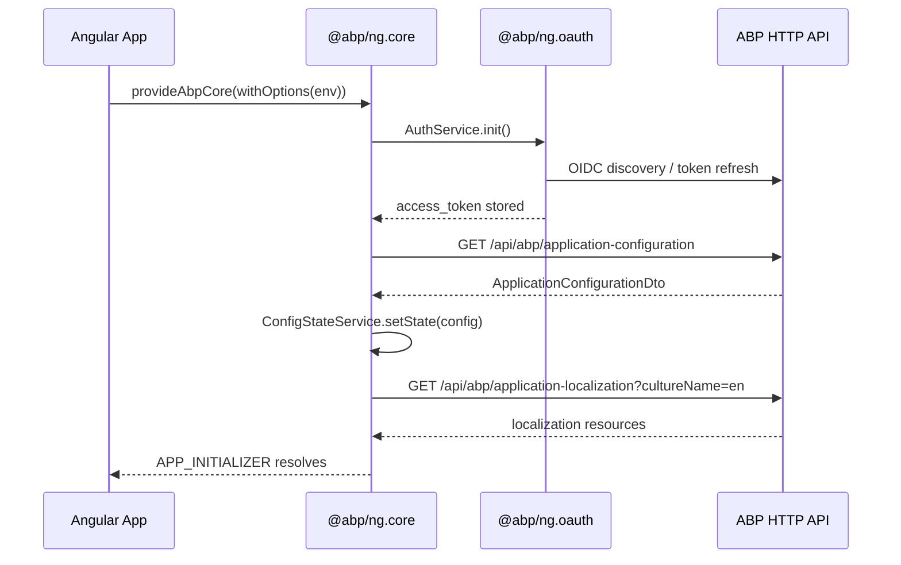

The `@abp/ng.core` package is the mandatory foundation of every ABP Angular application. It provides the application configuration pipeline, localization engine, permission and feature evaluation, lazy resource loading, and the HTTP client layer that all other `@abp/ng.*` packages depend on. Every downstream ABP Angular package declares a peer dependency on `@abp/ng.core`, making it the single source of truth for runtime state.

<Note>
  Version parity: `@abp/ng.core` follows the same version as the ABP NuGet packages. Pin all `@abp/ng.*` packages to the same semver range (e.g. `~10.5.0-rc.1`).
</Note>

## Package metadata

```json title="npm/ng-packs/packages/core/package.json"
{
  "name": "@abp/ng.core",
  "version": "10.5.0-rc.1",
  "dependencies": {
    "@abp/utils": "~10.5.0-rc.1",
    "just-clone": "^6.0.0",
    "just-compare": "^2.0.0",
    "ts-toolbelt": "^9.0.0",
    "tslib": "^2.0.0",
    "luxon": "^3.0.0"
  },
  "license": "LGPL-3.0"
}
```

Source lives in `npm/ng-packs/packages/core/`.

---

## Module architecture

`@abp/ng.core` exports three Angular module classes and a set of standalone provider functions.

| Export | Role |
|---|---|
| `CoreModule` | Public module — used in `AppModule.imports`. Deprecated `forRoot()` / `forChild()` statics delegate to provider functions. |
| `RootCoreModule` | Root-level module that configures XSRF token handling (`XSRF-TOKEN` / `RequestVerificationToken`). |
| `BaseCoreModule` | Shared base imported/exported by both root and child modules. Declares all directives, pipes, and components. |

```typescript title="core.module.ts — simplified"
@NgModule({
  exports: [BaseCoreModule],
  imports: [BaseCoreModule],
})
export class CoreModule {
  /** @deprecated use provideAbpCore() */
  static forRoot(options = {} as ABP.Root): ModuleWithProviders<RootCoreModule> {
    return {
      ngModule: RootCoreModule,
      providers: [provideAbpCore(withOptions(options))],
    };
  }

  /** @deprecated use provideAbpCoreChild() */
  static forChild(options = {} as ABP.Child): ModuleWithProviders<RootCoreModule> {
    return {
      ngModule: RootCoreModule,
      providers: [provideAbpCoreChild(options)],
    };
  }
}
```

<Tip>
  New projects should use the standalone `provideAbpCore(withOptions(...))` function in `app.config.ts` instead of `CoreModule.forRoot()`.
</Tip>

---

## Application configuration — `ABP.Root`

The `ABP.Root` interface (in `models/common.ts`) is the shape of the options object passed to `provideAbpCore`.

```typescript
export namespace ABP {
  export interface Root {
    environment: Partial<Environment>;
    registerLocaleFn: (locale: string) => Promise<any>;
    skipGetAppConfiguration?: boolean;   // skip initial /api/abp/application-configuration call
    skipInitAuthService?: boolean;
    sendNullsAsQueryParam?: boolean;
    tenantKey?: string;                  // cookie/header key for current tenant
    localizations?: Localization[];
    othersGroup?: string;
    dynamicLayouts?: Map<string, string>;
    disableProjectNameInTitle?: boolean;
    uiLocalization?: UILocalizationOptions;
  }
}
```

The `Environment` interface defines API base URLs, OAuth config, and application metadata:

```typescript title="models/environment.ts"
export interface Environment {
  apis: Apis;             // keyed by API name, "default" required
  application: ApplicationInfo;
  oAuthConfig?: AuthConfig & { impersonation?: Impersonation };
  production: boolean;
  remoteEnv?: RemoteEnv; // optional server-side env merge
}

export interface Apis {
  [key: string]: Partial<ApiConfig>;
  default: ApiConfig;   // must always be present
}

export interface ApiConfig extends Partial<HasAdditional> {
  url: string;
  rootNamespace?: string;
}
```

---

## Key services

<CardGroup cols={2}>
  <Card title="ConfigStateService" icon="database">
    Holds the full `ApplicationConfigurationDto` returned from `/api/abp/application-configuration`. All permission, feature, setting, and localization snapshots live here.
  </Card>
  <Card title="LocalizationService" icon="language">
    Resolves localization keys, manages culture switching, and merges backend resources with optional UI-side JSON files.
  </Card>
  <Card title="PermissionService" icon="lock">
    Evaluates grant policies from `ConfigStateService`. Supports `&&` and `||` combinators in policy keys.
  </Card>
  <Card title="LazyLoadService" icon="bolt">
    Loads external script/style assets at runtime using a `LoadingStrategy`, with retry and deduplication logic.
  </Card>
  <Card title="EnvironmentService" icon="gear">
    Reactive store for the `Environment` object. Exposes `getApiUrl(key)` and `getApiUrl$(key)` for deriving backend URLs.
  </Card>
  <Card title="RestService" icon="plug">
    Thin wrapper over Angular's `HttpClient` that resolves API URLs from `EnvironmentService` and handles ABP-specific error conventions.
  </Card>
</CardGroup>

### `ConfigStateService`

```typescript title="services/config-state.service.ts — key methods"
@Injectable({ providedIn: 'root' })
export class ConfigStateService {
  // Triggers a fresh GET /api/abp/application-configuration
  // and stores the result in an InternalStore
  private readonly store = new InternalStore({} as ApplicationConfigurationDto);

  setState(config: ApplicationConfigurationDto) {
    this.store.set(config);
  }

  get createOnUpdateStream() {
    return this.store.sliceUpdate;
  }
}
```

Internally it injects `AbpApplicationConfigurationService` (generated proxy from the server) and `AbpApplicationLocalizationService` to build the full state object.

### `PermissionService`

```typescript title="services/permission.service.ts — excerpt"
@Injectable({ providedIn: 'root' })
export class PermissionService {
  // Async stream — emits whenever the config state refreshes
  getGrantedPolicy$(key: string): Observable<boolean> { ... }

  // Synchronous snapshot read
  getGrantedPolicy(key: string | undefined): boolean { ... }

  // Filter a list of items that carry a requiredPolicy property
  filterItemsByPolicy$<T extends ABP.HasPolicy>(items: Array<T>): Observable<T[]> { ... }
}
```

Policy keys support `||` (OR) and `&&` (AND) combinators:

```typescript
permissionService.getGrantedPolicy('AbpIdentity.Users || AbpIdentity.Roles');
permissionService.getGrantedPolicy('AbpIdentity.Users && AbpIdentity.Users.Create');
```

### `LazyLoadService`

```typescript title="services/lazy-load.service.ts"
@Injectable({ providedIn: 'root' })
export class LazyLoadService {
  readonly loaded = new Map<string, HTMLScriptElement | HTMLLinkElement | null>();

  load(
    strategy: LoadingStrategy,  // ScriptLoadingStrategy | StyleLoadingStrategy
    retryTimes?: number,
    retryDelay?: number,
  ): Observable<Event> { ... }

  remove(path: string): boolean { ... }
}
```

---

## `AuthService` and `@abp/ng.oauth`

`@abp/ng.core` ships an abstract `AuthService` that prints a warning if called without a concrete implementation. The canonical concrete implementation is in `@abp/ng.oauth`.

```typescript title="abstracts/auth.service.ts — IAuthService interface"
export interface IAuthService {
  oidc: boolean;
  get isAuthenticated(): boolean;
  get isInternalAuth(): boolean;
  init(): Promise<any>;
  login(params: LoginParams): Observable<any>;
  logout(queryParams?: Params): Observable<any>;
  navigateToLogin(queryParams?: Params): void;
  loginUsingGrant(grantType: string, parameters: object, headers?: HttpHeaders): Promise<AbpAuthResponse>;
  getAccessTokenExpiration(): number;
  getAccessToken(): string;
  getRefreshToken(): string;
  refreshToken(): Promise<AbpAuthResponse | void>;
}
```

`@abp/ng.oauth` wraps `angular-oauth2-oidc` (^20.0.0) and provides a concrete `OAuthService`-backed implementation. It reads `oAuthConfig` from `EnvironmentService` and performs the OIDC/OAuth 2.0 code-flow or password-flow:

```json title="npm/ng-packs/packages/oauth/package.json (deps)"
{
  "name": "@abp/ng.oauth",
  "dependencies": {
    "@abp/ng.core": "~10.5.0-rc.1",
    "@abp/utils": "~10.5.0-rc.1",
    "angular-oauth2-oidc": "^20.0.0"
  }
}
```

---

## Directives and pipes

<Accordion title="Built-in directives">
  | Directive | Selector | Purpose |
  |---|---|---|
  | `PermissionDirective` | `[abpPermission]` | Shows/hides elements based on a policy key |
  | `ReplaceableTemplateDirective` | `[abpReplaceableTemplate]` | Swaps a component template at runtime |
  | `FormSubmitDirective` | `[abpSubmit]` | Validates and submits reactive forms |
  | `AutofocusDirective` | `[abpAutoFocus]` | Focuses an element after view init |
  | `ForDirective` | `[abpFor]` | Structural directive with index tracking |
  | `InputEventDebounceDirective` | `[abpDebounce]` | Debounces input events |
  | `InitDirective` | `[abpInit]` | Emits an event on `ngOnInit` |
  | `StopPropagationDirective` | `[abpStopPropagation]` | Stops click propagation |
</Accordion>

<Accordion title="Built-in pipes">
  | Pipe | Transform |
  |---|---|
  | `LocalizationPipe` | `'ResourceName::Key'` → localized string |
  | `AsyncLocalizationPipe` | Same as above but returns `Observable<string>` |
  | `LazyLocalizationPipe` | Loads the resource lazily before resolving |
  | `SafeHtmlPipe` | Bypasses DomSanitizer for trusted HTML |
  | `UtcToLocalPipe` | Converts UTC date string to local time |
  | `ShortDatePipe` / `ShortTimePipe` / `ShortDateTimePipe` | Culture-aware date/time formatting via Luxon |
  | `SortPipe` | Sorts arrays by a property path |
  | `ToInjectorPipe` | Converts a value to an `Injector`-compatible form |
</Accordion>

---

## Application startup flow



---

## Tokens reference

| Token | Default | Purpose |
|---|---|---|
| `APP_INIT_ERROR_HANDLERS` | `[]` | Functions called when `APP_INITIALIZER` throws |
| `INCUDE_LOCALIZATION_RESOURCES_TOKEN` | `false` | Fetches full localization in the config call |
| `PIPE_TO_LOGIN_FN_KEY` | — | Custom function called to redirect on 401 |
| `TENANT_KEY` | — | Cookie / query param name for current tenant |
| `COOKIE_LANGUAGE_KEY` | `'.AspNetCore.Culture'` | Cookie holding the selected language |
| `DYNAMIC_LAYOUTS_TOKEN` | `Map` | Maps layout names to component paths |

---

## Related pages

- [Angular Packages Overview](./ng-modules) — all `@abp/ng.*` packages
- [MVC npm Packs](../mvc-ui/npm-packs) — server-side JS/CSS bundles
- [ABP CLI](../tooling/abp-cli) — `generate-proxy` command that generates `@abp/ng.core` proxy files
