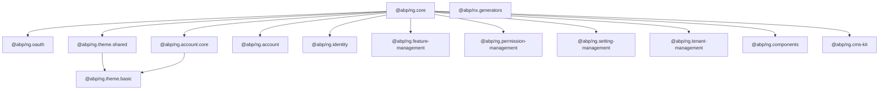

ABP's Angular UI is distributed as an Nx-managed monorepo under `npm/ng-packs/packages/`. Each package maps to a server-side ABP module and is published independently to npm under the `@abp` scope. All packages share the same version number and are released together.

<Note>
  The source for every package is at `npm/ng-packs/packages/<name>/`. Run `yarn` at the monorepo root to install; individual packages are linked by Nx's local-resolution.
</Note>

---

## Package map



---

## Packages

### `@abp/ng.core`

Foundation of all ABP Angular applications. Provides `ConfigStateService`, `LocalizationService`, `PermissionService`, `LazyLoadService`, `EnvironmentService`, `RestService`, and application bootstrap plumbing. All other packages depend on it.

→ See the dedicated [ng.core reference](./ng-core) for full documentation.

---

### `@abp/ng.oauth`

Implements OpenID Connect and OAuth 2.0 flows using `angular-oauth2-oidc` (^20.0.0). Provides the concrete `OAuthService` that overrides the abstract `AuthService` stub in `@abp/ng.core`.

```json
{
  "name": "@abp/ng.oauth",
  "dependencies": {
    "@abp/ng.core": "~10.5.0-rc.1",
    "@abp/utils": "~10.5.0-rc.1",
    "angular-oauth2-oidc": "^20.0.0"
  }
}
```

**Key responsibility:** Performs the authorization code flow, stores the access token, and triggers a token refresh on expiry. Reads `oAuthConfig` from `EnvironmentService`.

---

### `@abp/ng.theme.shared`

The theming foundation for all ABP Angular UIs. Provides Bootstrap 5, ng-bootstrap, ngx-datatable, and Font Awesome alongside ABP-specific components (confirmation modal, toast, loading indicator, breadcrumb, dynamic form).

```json
{
  "name": "@abp/ng.theme.shared",
  "dependencies": {
    "@abp/ng.core": "~10.5.0-rc.1",
    "@fortawesome/fontawesome-free": "^6.0.0",
    "@ng-bootstrap/ng-bootstrap": "~20.0.0",
    "@ngx-validate/core": "^0.2.0",
    "@popperjs/core": "~2.11.0",
    "@swimlane/ngx-datatable": "~22.0.0",
    "bootstrap": "^5.0.0"
  }
}
```

<CardGroup cols={2}>
  <Card title="AbpConfirmationService" icon="circle-question">
    Shows a confirmation dialog before destructive operations.
  </Card>
  <Card title="AbpToasterService" icon="bell">
    Displays success, error, warning, and info toasts.
  </Card>
  <Card title="ExtensionsService" icon="puzzle-piece">
    Registers column, action, and toolbar extensions for entity tables.
  </Card>
  <Card title="DynamicFormModule" icon="table-list">
    Renders server-defined form schemas with validation.
  </Card>
</CardGroup>

---

### `@abp/ng.theme.basic`

ABP's open-source Angular theme. Provides the application shell: top-nav bar, sidebar, footer, and login display component. Depends on both `@abp/ng.theme.shared` and `@abp/ng.account.core`.

```json
{
  "name": "@abp/ng.theme.basic",
  "dependencies": {
    "@abp/ng.account.core": "~10.5.0-rc.1",
    "@abp/ng.theme.shared": "~10.5.0-rc.1"
  }
}
```

<Note>
  LeptonX is the commercial ABP theme and is distributed separately. It replaces `@abp/ng.theme.basic` in commercial projects.
</Note>

---

### `@abp/ng.account.core`

Core account logic shared between `@abp/ng.account` (UI) and `@abp/ng.theme.basic`. Contains the login, register, two-factor, and external provider service layer without rendering any UI itself.

```json
{ "name": "@abp/ng.account.core", "version": "10.5.0-rc.1" }
```

**Provides:**
- `AuthenticateService` — login/logout/register orchestration
- `TwoFactorLoginComponent` — embedded by themes
- Route guards for authenticated/unauthenticated routes

---

### `@abp/ng.account`

Full account management UI package: login page, register page, forgot password, profile management, two-factor settings, linked accounts, and security logs. Lazy-loaded under the `/account` route prefix.

```json
{ "name": "@abp/ng.account", "version": "10.5.0-rc.1" }
```

**Lazy route integration example:**

```typescript
{
  path: 'account',
  loadChildren: () =>
    import('@abp/ng.account').then(m => m.AccountPublicModule.forLazy()),
}
```

---

### `@abp/ng.identity`

User and role management UI. Displays a paginated user list, create/edit user dialogs, role assignment dialogs, and a role list with permission management. Uses `@swimlane/ngx-datatable` (via `@abp/ng.theme.shared`).

```json
{ "name": "@abp/ng.identity", "version": "10.5.0-rc.1" }
```

**Lazy route integration:**

```typescript
{
  path: 'identity',
  loadChildren: () =>
    import('@abp/ng.identity').then(m => m.IdentityModule.forLazy()),
}
```

---

### `@abp/ng.feature-management`

Provides the feature management dialog/modal used inside Identity and Tenant Management UIs to toggle feature values per tenant. Consumed as a sub-module — not independently routed.

```json
{ "name": "@abp/ng.feature-management", "version": "10.5.0-rc.1" }
```

**Dialog trigger pattern:**

```typescript
import { FeatureManagementComponent } from '@abp/ng.feature-management';

// Open via AbpConfirmationService or ViewContainerRef
```

---

### `@abp/ng.permission-management`

Permission management dialog. Renders a tree of permissions grouped by module/provider, with checkboxes. Used by Identity's role and user management dialogs.

```json
{ "name": "@abp/ng.permission-management", "version": "10.5.0-rc.1" }
```

The dialog accepts a `providerName` (`'R'` for role, `'U'` for user) and `providerKey` (the role name or user ID).

---

### `@abp/ng.setting-management`

Provides the settings page UI (`/setting-management` route). Renders configurable setting groups returned by the server-side setting management module.

```json
{ "name": "@abp/ng.setting-management", "version": "10.5.0-rc.1" }
```

**Lazy route integration:**

```typescript
{
  path: 'setting-management',
  loadChildren: () =>
    import('@abp/ng.setting-management').then(m => m.SettingManagementModule.forLazy()),
}
```

---

### `@abp/ng.tenant-management`

Tenant management UI for SaaS/multi-tenancy. Lists tenants, allows creation/editing, and opens the Feature Management dialog per tenant.

```json
{ "name": "@abp/ng.tenant-management", "version": "10.5.0-rc.1" }
```

**Lazy route integration:**

```typescript
{
  path: 'tenant-management',
  loadChildren: () =>
    import('@abp/ng.tenant-management').then(m => m.TenantManagementModule.forLazy()),
}
```

---

### `@abp/ng.components`

Shared reusable UI components not tied to any specific ABP module. Includes paginator, table action list, expandable item, and other generic building blocks used by multiple feature modules.

```json
{ "name": "@abp/ng.components", "version": "10.5.0-rc.1" }
```

---

### `@abp/ng.cms-kit`

Angular UI for ABP CMS Kit. Covers public-facing CMS features: blog posts, comments, reactions, ratings, contact forms, FAQ, and newsletter widgets.

```json
{ "name": "@abp/ng.cms-kit", "version": "10.5.0-rc.1" }
```

CMS Kit has separate public and admin surfaces; the admin UI is part of commercial CMS Kit Pro.

---

### `@abp/nx.generators`

[Nx](https://nx.dev/) workspace generators (schematics) for ABP Angular projects. Automates creating new lazy-loaded feature modules, proxy service files, and page components conforming to ABP conventions.

```json
{ "name": "@abp/nx.generators", "version": "10.5.0-rc.1" }
```

**Use via Nx CLI:**

```bash
nx generate @abp/nx.generators:module my-feature
nx generate @abp/nx.generators:page my-list --module=my-feature
```

---

### `@abp/ng.schematics`

Angular CLI schematics (non-Nx). Used by the ABP CLI's `generate-proxy` and other code generation commands to scaffold Angular proxy services and module files.

```json
{ "name": "@abp/ng.schematics", "version": "10.5.0-rc.1" }
```

---

## Monorepo structure

```
npm/ng-packs/
├── packages/
│   ├── core/              # @abp/ng.core
│   ├── oauth/             # @abp/ng.oauth
│   ├── theme-shared/      # @abp/ng.theme.shared
│   ├── theme-basic/       # @abp/ng.theme.basic
│   ├── account-core/      # @abp/ng.account.core
│   ├── account/           # @abp/ng.account
│   ├── identity/          # @abp/ng.identity
│   ├── feature-management/
│   ├── permission-management/
│   ├── setting-management/
│   ├── tenant-management/
│   ├── components/
│   ├── cms-kit/
│   ├── generators/        # @abp/nx.generators
│   └── schematics/        # @abp/ng.schematics
├── publish-ng.ps1         # Angular publish script
├── lerna.version.json     # Lerna versioning config
└── lerna.publish.json     # Lerna publish config
```

`publish-ng.ps1` orchestrates the release:

```powershell
yarn update-version $Version
npm run publish-packages -- --nextVersion $Version --skipGit --registry $Registry --skipVersionValidation
```

---

## Adding a package to an app

<Steps>
  <Step title="Install">
    ```bash
    npm install @abp/ng.identity
    # or
    yarn add @abp/ng.identity
    ```
  </Step>
  <Step title="Register lazy route">
    Add a lazy route entry in your `app-routing.module.ts` (or `app.routes.ts` for standalone).
  </Step>
  <Step title="Add to ABP routes">
    Call `RoutesService.add(...)` in an `APP_INITIALIZER` or the module's constructor to register sidebar navigation entries.
  </Step>
  <Step title="Check permissions">
    The module automatically hides menu items when the user lacks the required policy. No extra configuration needed.
  </Step>
</Steps>

---

## Related pages

- [`@abp/ng.core` deep dive](./ng-core)
- [MVC npm packs](../mvc-ui/npm-packs)
- [ABP CLI — generate-proxy](../tooling/abp-cli)
