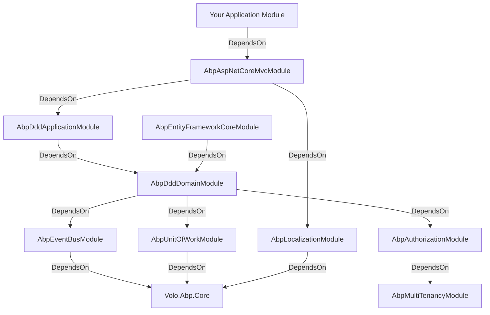
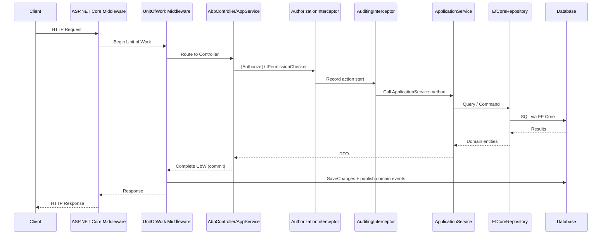
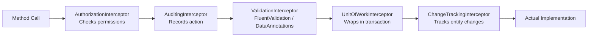

ABP organizes every concern into an `AbpModule` — a typed unit with explicit dependencies and a three-phase configuration lifecycle. At runtime, the framework builds a DAG of modules, resolves their order, and executes lifecycle hooks in dependency order. The result is a composable system where any team can replace or extend any subsystem by swapping a module dependency.

## Layered Architecture

ABP enforces the standard DDD layered architecture across every application module:

```
┌─────────────────────────────────────────────┐
│           Presentation Layer                │
│   (MVC Controllers / Razor Pages / Blazor)  │
└────────────────────┬────────────────────────┘
                     │ calls
┌────────────────────▼────────────────────────┐
│         Application Layer                   │
│   ApplicationService / CRUD App Services    │
│   DTOs, Validators, Object Mapping          │
└────────────────────┬────────────────────────┘
                     │ calls
┌────────────────────▼────────────────────────┐
│           Domain Layer                      │
│   AggregateRoot / Entity / Value Object     │
│   IRepository (interface only)              │
│   DomainService / DomainEvent               │
└────────────────────┬────────────────────────┘
                     │ implemented by
┌────────────────────▼────────────────────────┐
│         Infrastructure Layer                │
│   EfCoreRepository / MongoDbRepository      │
│   AbpDbContext / AbpMongoDbContext           │
│   External services, messaging, blob        │
└─────────────────────────────────────────────┘
```

Each layer lives in a separate NuGet package:

| Layer | Package suffix | Example |
|-------|---------------|---------|
| Domain.Shared | `.Domain.Shared` | `Volo.Abp.Identity.Domain.Shared` |
| Domain | `.Domain` | `Volo.Abp.Identity.Domain` |
| Application.Contracts | `.Application.Contracts` | `Volo.Abp.Identity.Application.Contracts` |
| Application | `.Application` | `Volo.Abp.Identity.Application` |
| EF Core | `.EntityFrameworkCore` | `Volo.Abp.Identity.EntityFrameworkCore` |
| HTTP API | `.HttpApi` | `Volo.Abp.Identity.HttpApi` |
| HTTP API Client | `.HttpApi.Client` | `Volo.Abp.Identity.HttpApi.Client` |
| Web (Razor Pages) | `.Web` | `Volo.Abp.Identity.Web` |

## Module Dependency Graph

The dependency graph is explicit, typed, and checked at startup:



## HTTP Request Lifecycle



## Cross-Cutting Concerns via Interceptors

ABP uses Autofac-based dynamic proxies to weave cross-cutting concerns around service calls without polluting business logic:



Each interceptor is registered in its module's `ConfigureServices` and activated by the `[DependsOn]` relationship graph.

## Key Design Patterns

| Pattern | Where used | Key type |
|---------|-----------|---------|
| Module dependency injection | All packages | `AbpModule`, `[DependsOn]` |
| Repository | Domain layer | `IRepository<T, TKey>`, `EfCoreRepository<TDbContext, T, TKey>` |
| Unit of Work | Transactional boundaries | `IUnitOfWork`, `IUnitOfWorkManager` |
| Dynamic Proxy / Interceptor | Cross-cutting concerns | `AbpInterceptorBase`, `IAbpMethodInvocation` |
| Conventional Controllers | Auto-API generation | `AbpConventionalControllerFeatureProvider` |
| Options Pattern | Configuration | `IOptions<T>`, `Configure<T>()`, `PreConfigure<T>()` |
| Inbox/Outbox | Distributed events | `InboxProcessor`, `OutboxSender` |
| Tenant resolution | Multi-tenancy | `ITenantResolveContributor`, `TenantResolver` |
| Specification | Query composition | `ISpecification<T>`, `AndSpecification`, `OrSpecification` |
| Blob provider | Object storage | `IBlobProvider`, `BlobContainer<T>` |

## Repository Structure

```
abp/
├── framework/src/          # 177 NuGet packages (Volo.Abp.*)
│   ├── Volo.Abp.Core/      # ABP kernel: AbpModule, DI, extensions
│   ├── Volo.Abp.Ddd.Domain/  # DDD: Entity, AggregateRoot, IRepository
│   ├── Volo.Abp.Ddd.Application/  # ApplicationService base
│   ├── Volo.Abp.EntityFrameworkCore/  # EF Core integration
│   ├── Volo.Abp.MongoDB/   # MongoDB integration
│   ├── Volo.Abp.EventBus/  # Event bus + Inbox/Outbox
│   ├── Volo.Abp.AspNetCore.Mvc/  # MVC integration hub
│   └── ...
├── modules/                # Pre-built application modules
│   ├── identity/           # Users, roles, permissions
│   ├── account/            # Login, registration, profile
│   ├── openiddict/         # OAuth2 / OIDC server
│   ├── tenant-management/  # Multi-tenant management UI
│   ├── cms-kit/            # Content management building blocks
│   └── ...
├── templates/              # Startup project templates
│   ├── app/                # Full app (Angular + ASP.NET Core)
│   ├── module/             # Reusable module template
│   ├── console/            # Console app
│   └── ...
├── npm/
│   ├── ng-packs/           # Angular packages (@abp/ng.*)
│   └── packs/              # MVC/Razor bundled JS assets
└── tools/                  # Dev tooling (CLI, changelog, localization sync)
```

## Related Pages

<CardGroup cols={2}>
  <Card title="Module System" icon="puzzle-piece" href="/module-system/abp-module">
    Deep dive into AbpModule and the dependency graph
  </Card>
  <Card title="DDD Building Blocks" icon="layer-group" href="/ddd/entities-and-aggregates">
    Entity, AggregateRoot, Repository internals
  </Card>
  <Card title="Unit of Work" icon="arrows-rotate" href="/ddd/unit-of-work">
    Transaction management and UoW middleware
  </Card>
  <Card title="Application Modules" icon="blocks" href="/modules/identity">
    Pre-built module reference implementations
  </Card>
</CardGroup>
