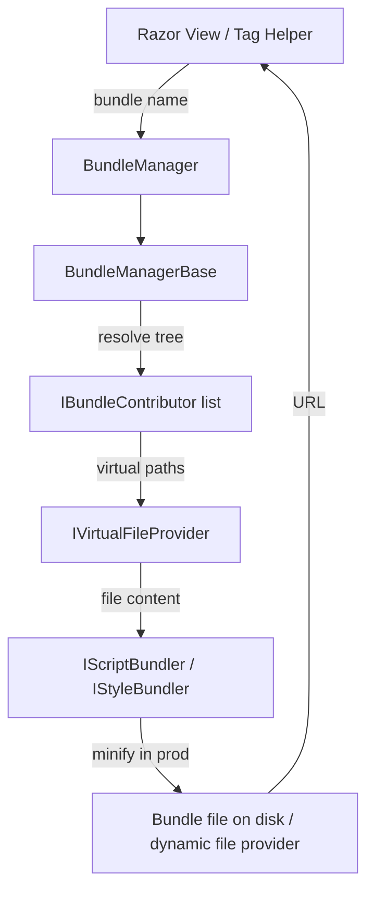

ABP's bundling system solves the fragmented asset problem that arises when many NuGet-packaged modules each want to contribute scripts and stylesheets. Instead of each module injecting individual `<script>` or `<link>` tags, modules register **contributors** against named bundles. At runtime (development) or deploy time (production), the `BundleManager` resolves the full contributor tree, reads files from the Virtual File System, and either serves them individually or concatenates and minifies them into a single bundle URL.

<CardGroup cols={2}>
  <Card title="IBundleManager" icon="layer-group">
    Resolves `StyleBundleFiles` and `ScriptBundleFiles` for a named bundle, honouring contributors and caching.
  </Card>
  <Card title="IBundleContributor" icon="puzzle-piece">
    Implemented by modules to add files or dynamically generated content to a bundle.
  </Card>
  <Card title="StandardBundles" icon="box">
    `Global` style and script bundles pre-registered by `AbpAspNetCoreMvcUiThemeSharedModule`.
  </Card>
  <Card title="Tag Helpers" icon="tag">
    `<abp-script-bundle>` and `<abp-style-bundle>` resolve and render bundle URLs in Razor views.
  </Card>
</CardGroup>

## Layered architecture



## IBundleManager

```csharp
// framework/src/Volo.Abp.AspNetCore.Bundling/Volo/Abp/AspNetCore/Bundling/IBundleManager.cs
namespace Volo.Abp.AspNetCore.Bundling;

public interface IBundleManager
{
    Task<IReadOnlyList<BundleFile>> GetStyleBundleFilesAsync(string bundleName);
    Task<IReadOnlyList<BundleFile>> GetScriptBundleFilesAsync(string bundleName);
}
```

`BundleManager` (the MVC-specific implementation in `Volo.Abp.AspNetCore.Mvc.UI.Bundling`) extends `BundleManagerBase` and adds:

- **Request-scoped deduplication** via `IWebRequestResources`, ensuring a file requested multiple times in a page renders only one `<script>`/`<link>` tag.
- **Mode-aware file serving**: in `BundlingMode.None` (Development default), each file is served individually; in `BundlingMode.BundleAndMinify` (Production default), a single hashed bundle URL is emitted.

## IBundleContributor

A bundle contributor is the extension point that modules use to add assets. Implement `BundleContributor` (abstract base) or `IBundleContributor` directly:

```csharp
public class MyModuleScriptContributor : BundleContributor
{
    public override void ConfigureBundle(BundleConfigurationContext context)
    {
        // Add a Virtual File System path
        context.Files.AddIfNotContains("/libs/my-module/my-module.js");
    }

    public override void ConfigureDynamicResources(BundleConfigurationContext context)
    {
        // Add dynamically generated script files (e.g., inline localisation)
        // Use context.Files.Add(new BundleFile(...)) with a dynamic file provider
        // or resolve services via context.ServiceProvider.
    }
}
```

### Dependency ordering

Contributors declare dependencies by overriding `GetDependencies()`. The bundle manager performs a topological sort so that Bootstrap's CSS always loads before theme overrides, for example:

```csharp
public override IEnumerable<Type> GetDependencies()
{
    yield return typeof(BootstrapScriptContributor);
}
```

## StandardBundles

`StandardBundles` (in `Volo.Abp.AspNetCore.Mvc.UI.Theme.Shared`) defines the two canonical bundle names every ABP MVC UI page uses:

```csharp
// framework/src/Volo.Abp.AspNetCore.Mvc.UI.Theme.Shared/Bundling/StandardBundles.cs
public class StandardBundles
{
    public static class Styles
    {
        public static string Global = "Global";
    }

    public static class Scripts
    {
        public static string Global = "Global";
    }
}
```

`AbpAspNetCoreMvcUiThemeSharedModule` pre-registers these bundles:

```csharp
Configure<AbpBundlingOptions>(options =>
{
    options.StyleBundles
        .Add(StandardBundles.Styles.Global, bundle =>
        {
            bundle.AddContributors(typeof(SharedThemeGlobalStyleContributor));
        });

    options.ScriptBundles
        .Add(StandardBundles.Scripts.Global, bundle =>
        {
            bundle.AddContributors(typeof(SharedThemeGlobalScriptContributor));
        });
});
```

Themes and modules append their own contributors on top:

```csharp
Configure<AbpBundlingOptions>(options =>
{
    options.ScriptBundles
        .Configure(StandardBundles.Scripts.Global, bundle =>
        {
            bundle.AddContributors(typeof(MyThemeGlobalScriptContributor));
        });
});
```

## AbpBundlingOptions

`AbpBundlingOptions` is the central configuration object. It lives in `Volo.Abp.AspNetCore.Mvc.UI.Bundling`:

```csharp
// Key members (simplified)
// framework/src/Volo.Abp.AspNetCore.Mvc.UI.Bundling.Abstractions/.../AbpBundlingOptions.cs
public class AbpBundlingOptions
{
    public BundleConfigurationCollection StyleBundles { get; }
    public BundleConfigurationCollection ScriptBundles { get; }

    /// <summary>
    /// Default: Auto (None in Development, BundleAndMinify in Production).
    /// </summary>
    public BundlingMode Mode { get; set; } = BundlingMode.Auto;

    public HashSet<string> MinificationIgnoredFiles { get; }
    public bool DeferScriptsByDefault { get; set; }
    public List<string> DeferScripts { get; }
    public bool PreloadStylesByDefault { get; set; }
    public List<string> PreloadStyles { get; }
}
```

`BundlingMode` values: `None` (no bundling or minification), `Auto` (environment-based), `Bundle` (bundled but not minified), `BundleAndMinify`.

<Tip>
Override the bundling mode when debugging a production deployment:
```csharp
Configure<AbpBundlingOptions>(options =>
{
    options.Mode = BundlingMode.None;
});
```
</Tip>

## MinifyGeneratedScript

`AbpAspNetCoreMvcOptions.MinifyGeneratedScript` controls minification of **dynamically generated** JavaScript (e.g., the ABP JS proxy script emitted by `/Abp/ApplicationConfigurationScript`). It defaults to `null`, inheriting the environment default (minified in Production).

## Bundling Tag Helpers

### \<abp-script-bundle\> and \<abp-style-bundle\>

These tag helpers resolve a named bundle through `IBundleManager` and render the appropriate HTML tags:

```html
<!-- _Layout.cshtml -->
<abp-style-bundle name="@StandardBundles.Styles.Global" />
<abp-script-bundle name="@StandardBundles.Scripts.Global" />
```

In Development the output is multiple individual `<link>`/`<script>` tags. In Production a single hashed URL is emitted:

```html
<!-- Production output -->
<link href="/bundles/Global.abc123de.css" rel="stylesheet" />
<script src="/bundles/Global.abc123de.js"></script>
```

### Inline file lists

For page-specific assets that do not need a named contributor, use the inline syntax:

```html
<abp-script-bundle>
    <abp-script src="/Pages/Books/index.js" />
</abp-script-bundle>
```

### \<abp-script\> and \<abp-style\>

Single-file variants that still go through the Virtual File System resolution and request-deduplication machinery:

```html
<abp-script src="/libs/chart.js/chart.min.js" />
<abp-style src="/Pages/Dashboard/dashboard.css" />
```

## Virtual File System integration

ABP bundles read files from the ABP Virtual File System (`IVirtualFileProvider`), not directly from `wwwroot`. This means:

1. A NuGet package can embed a `.js` file as an embedded resource.
2. The host application can **override** it by placing a physical file at the same virtual path.
3. The bundle manager resolves the effective file through the layered file provider, so the override wins transparently.

```csharp
// Module registering an embedded JS file
Configure<AbpVirtualFileSystemOptions>(options =>
{
    options.FileSets.AddEmbedded<MyModule>(
        baseNamespace: "MyCompany.MyModule");
});
```

## Module-level contributor pattern

The recommended pattern is to create one contributor class per module per bundle, inherit from `BundleContributor`, and register it in the module:

```csharp
public class MyModuleScriptContributor : BundleContributor
{
    public override void ConfigureBundle(BundleConfigurationContext context)
    {
        context.Files.AddIfNotContains(
            "/libs/my-module/my-module.js");
    }

    public override IEnumerable<Type> GetDependencies()
    {
        yield return typeof(JQueryScriptContributor);
    }
}

// In your AbpModule.ConfigureServices:
Configure<AbpBundlingOptions>(options =>
{
    options.ScriptBundles
        .Configure(StandardBundles.Scripts.Global, bundle =>
        {
            bundle.AddContributors(typeof(MyModuleScriptContributor));
        });
});
```

## Production caching

In Production, the bundle manager serialises the concatenated and minified content to a dynamic file served at a content-hash URL. The hash changes whenever any contributing file changes, providing automatic cache busting. The `CachedBundleDynamicFileProvider` in `Volo.Abp.AspNetCore.Mvc.UI.Bundling` stores bundles in memory between requests.

<Note>
CDN integration: configure `AbpBundlingOptions.Parameters` or use a custom `IBundleContributor` to rewrite resource URLs when serving assets from a CDN.
</Note>

## See also

- [UI Themes](./ui-themes) — how themes contribute to `StandardBundles.Scripts.Global` and `StandardBundles.Styles.Global`
- [MVC Controllers](./mvc-controllers) — `MinifyGeneratedScript` option lives in `AbpAspNetCoreMvcOptions`
