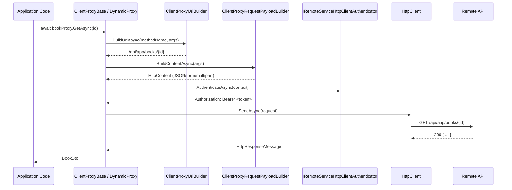

ABP provides two complementary strategies for calling a remote application service over HTTP without writing raw `HttpClient` code: **static proxies** (generated at build time from a `generate-proxy.json` descriptor) and **dynamic proxies** (generated at runtime via Castle DynamicProxy). Both share the same `ClientProxyBase<TService>` infrastructure for authentication, URL building, and payload serialisation.

<CardGroup cols={2}>
  <Card title="Static Proxy" icon="file-code">
    Source-generated class extends `ClientProxyBase<TService>`. Fast; no runtime reflection.
  </Card>
  <Card title="Dynamic Proxy" icon="bolt">
    `DynamicHttpProxyInterceptor<TService>` wraps any `IRemoteService` interface at runtime.
  </Card>
  <Card title="Authentication" icon="key">
    `IRemoteServiceHttpClientAuthenticator` + `IAbpAccessTokenProvider` attach bearer tokens.
  </Card>
  <Card title="Configuration" icon="gear">
    `AbpHttpClientOptions` maps service types to named remote service configurations.
  </Card>
</CardGroup>

## Architecture overview



## ClientProxyBase\<TService\>

All generated static proxies inherit from `ClientProxyBase<TService>`. The base class resolves all dependencies lazily through `IAbpLazyServiceProvider` so that instances can be created without triggering full DI resolution:

```csharp
// framework/src/Volo.Abp.Http.Client/Volo/Abp/Http/Client/ClientProxying/ClientProxyBase.cs
public class ClientProxyBase<TService> : ITransientDependency
{
    public IAbpLazyServiceProvider LazyServiceProvider { get; set; } = default!;

    protected IClientProxyApiDescriptionFinder ClientProxyApiDescriptionFinder => ...;
    protected IRemoteServiceHttpClientAuthenticator ClientAuthenticator => ...;
    protected ClientProxyRequestPayloadBuilder ClientProxyRequestPayloadBuilder => ...;
    protected ClientProxyUrlBuilder ClientProxyUrlBuilder => ...;
    protected IOptions<AbpHttpClientOptions> ClientOptions => ...;

    protected virtual async Task<T> RequestAsync<T>(
        string methodName,
        ClientProxyRequestTypeValue? arguments = null)
    {
        return await RequestAsync<T>(
            BuildHttpProxyClientProxyContext(methodName, arguments));
    }

    protected virtual async IAsyncEnumerable<T> RequestAsyncEnumerable<T>(
        string methodName,
        ClientProxyRequestTypeValue? arguments = null)
    { ... } // Streams JSON arrays as IAsyncEnumerable
}
```

A generated static proxy looks like:

```csharp
[Dependency(ReplaceServices = true)]
public class BookAppServiceClientProxy
    : ClientProxyBase<IBookAppService>, IBookAppService
{
    public virtual Task<BookDto> GetAsync(Guid id)
        => RequestAsync<BookDto>(nameof(GetAsync),
            new ClientProxyRequestTypeValue
            {
                { typeof(Guid), id }
            });

    public virtual Task<PagedResultDto<BookDto>> GetListAsync(
        GetBooksInput input)
        => RequestAsync<PagedResultDto<BookDto>>(nameof(GetListAsync),
            new ClientProxyRequestTypeValue
            {
                { typeof(GetBooksInput), input }
            });
}
```

## Static vs dynamic proxy comparison

<Tabs>
  <Tab title="Static Proxy">
    **Registration** — scan an assembly for all `IRemoteService`-implementing interfaces:

    ```csharp
    // framework/src/Volo.Abp.Http.Client/.../ServiceCollectionHttpClientProxyExtensions.cs
    public static IServiceCollection AddStaticHttpClientProxies(
        this IServiceCollection services,
        Assembly assembly,
        string remoteServiceConfigurationName = RemoteServiceConfigurationDictionary.DefaultName,
        ApplicationServiceTypes applicationServiceTypes = ApplicationServiceTypes.All)
    ```

    Call it from your module:
    ```csharp
    context.Services.AddStaticHttpClientProxies(
        typeof(MyApplicationContractsModule).Assembly,
        remoteServiceConfigurationName: "MyService");
    ```

    **Advantages**: AOT-friendly, debuggable, no Castle DynamicProxy dependency.

    **How it works**: The ABP CLI or build task inspects the running API and writes a `generate-proxy.json` embedded resource alongside the generated `.cs` files. `ClientProxyApiDescriptionFinder` reads this JSON to map method names to HTTP actions.
  </Tab>
  <Tab title="Dynamic Proxy">
    **Registration** — uses Castle DynamicProxy to intercept all calls:

    ```csharp
    public static IServiceCollection AddHttpClientProxies(
        this IServiceCollection services,
        Assembly assembly,
        string remoteServiceConfigurationName = RemoteServiceConfigurationDictionary.DefaultName,
        ApplicationServiceTypes applicationServiceTypes = ApplicationServiceTypes.All)
    ```

    **Interceptor**: `DynamicHttpProxyInterceptor<TService>` intercepts `IInvocation` and delegates to `DynamicHttpProxyInterceptorClientProxy<TService>`, which in turn calls `ClientProxyBase.RequestAsync`.

    **API description discovery**: `ApiDescriptionFinder` calls the remote `/api/abp/api-definition` endpoint and caches the response in `ApiDescriptionCache`. Method resolution matches by action name, HTTP method, and parameter shape.

    **When to use**: Rapid prototyping, or when you do not want to run a code-generation step. Has a cold-start cost for the first call to each service.
  </Tab>
</Tabs>

## generate-proxy.json embedded resource

The static proxy generator writes API metadata to a JSON file embedded inside the `.HttpApi.Client` project:

```json
{
  "rootNamespace": "Acme.BookStore",
  "remoteServiceName": "Default",
  "modules": {
    "bookStore": {
      "rootPath": "app",
      "remoteServiceName": "Default",
      "controllers": {
        "acme.bookStore.books.bookAppService": {
          "controllerName": "Book",
          "type": "Acme.BookStore.Books.IBookAppService",
          "actions": {
            "getAsyncByIdGuid": {
              "uniqueName": "GetAsyncByIdGuid",
              "name": "GetAsync",
              "httpMethod": "GET",
              "url": "api/app/books/{id}",
              "parametersOnMethod": [...]
            }
          }
        }
      }
    }
  }
}
```

`ClientProxyApiDescriptionFinder` loads this JSON at startup and provides `ActionApiDescriptionModel` instances to `ClientProxyUrlBuilder` and `ClientProxyRequestPayloadBuilder`.

## ClientProxyUrlBuilder

`ClientProxyUrlBuilder` converts method arguments to a fully-qualified URL by processing each parameter:

- **Path parameters** — substituted directly into the URL template (e.g., `{id}` → `Guid`).
- **Query parameters** — appended as `?key=value` for GET/DELETE operations.
- **Custom converters** — `AbpHttpClientProxyingOptions.QueryStringConverts` maps complex types to `IObjectToQueryString<T>` implementations. Likewise `FormDataConverts` and `PathConverts` handle multipart and path-parameter conversions.

```csharp
// Register a custom query-string converter for a complex filter type:
Configure<AbpHttpClientProxyingOptions>(options =>
{
    options.QueryStringConverts[typeof(MyFilterInput)] =
        typeof(MyFilterInputQueryStringConverter);
});
```

## ClientProxyRequestPayloadBuilder

Converts method arguments to the request body:

| Condition | Result |
|---|---|
| Method has `[FromBody]` or is POST/PUT/PATCH | JSON serialised via `IJsonSerializer` |
| Contains `IFormFile` | `multipart/form-data` |
| Contains `IRemoteStreamContent` | Streaming upload |
| GET/DELETE with object param | Delegated to `ClientProxyUrlBuilder` |

## Authentication

### IAbpAccessTokenProvider

```csharp
public interface IAbpAccessTokenProvider
{
    Task<string?> GetTokenAsync();
}
```

The default implementation is `NullAbpAccessTokenProvider`. Install `Volo.Abp.Http.Client.IdentityModel` to replace it with `IdentityModelAbpAccessTokenProvider`, which uses the OpenID Connect client credentials flow to obtain a bearer token from the identity server.

### IRemoteServiceHttpClientAuthenticator

```csharp
public interface IRemoteServiceHttpClientAuthenticator
{
    Task Authenticate(RemoteServiceHttpClientAuthenticateContext context);
}
```

`RemoteServiceHttpClientAuthenticateContext` carries:

- `ClientName` — the named HTTP client matching the remote service
- `RemoteService` — the resolved `RemoteServiceConfiguration`
- `Request` — the outgoing `HttpRequestMessage` to mutate

The default implementation calls `IAbpAccessTokenProvider.GetTokenAsync()` and sets `Authorization: Bearer <token>`.

## AbpHttpClientOptions

```csharp
// framework/src/Volo.Abp.Http.Client/Volo/Abp/Http/Client/AbpHttpClientOptions.cs
public class AbpHttpClientOptions
{
    // Maps service interface types to their proxy configuration
    public Dictionary<Type, HttpClientProxyConfig> HttpClientProxies { get; set; }

    // Hooks run before each HTTP send, keyed by remote service name
    public Dictionary<string, List<Action<HttpClientProxyConfig,
        ClientProxyRequestContext, HttpClient>>> ProxyHttpClientPreSendActions { get; }

    public AbpHttpClientOptions AddPreSendAction(
        string remoteServiceName,
        Action<HttpClientProxyConfig, ClientProxyRequestContext, HttpClient> action);
}
```

## AbpHttpClientBuilderOptions

`AbpHttpClientBuilderOptions` is the lower-level hook into the named `HttpClient` configuration pipeline:

```csharp
public class AbpHttpClientBuilderOptions
{
    // Called once per client name during IHttpClientBuilder configuration
    public List<Action<string, IHttpClientBuilder>> ProxyClientBuildActions { get; }

    // Called at request time to mutate the HttpClient instance
    public List<Action<string, IServiceProvider, HttpClient>> ProxyClientActions { get; }

    // Called at request time to mutate the HttpClientHandler
    public List<Action<string, IServiceProvider, HttpClientHandler>> ProxyClientHandlerActions { get; }
}
```

Example — add a custom header to all calls targeting the `"Inventory"` remote service:

```csharp
Configure<AbpHttpClientBuilderOptions>(options =>
{
    options.ProxyClientActions.Add((clientName, sp, client) =>
    {
        if (clientName == "Inventory")
        {
            client.DefaultRequestHeaders.Add("X-Internal-Key", "secret");
        }
    });
});
```

## IdentityModel integration

Add the `Volo.Abp.Http.Client.IdentityModel` package and depend on `AbpHttpClientIdentityModelModule`. This replaces `NullAbpAccessTokenProvider` with an implementation that:

1. Reads `IdentityClients` configuration from `appsettings.json`.
2. Calls the token endpoint using the configured grant type (typically `client_credentials` for service-to-service, or `password` for testing).
3. Caches the token until its `exp` claim.

```json
{
  "IdentityClients": {
    "Default": {
      "GrantType": "client_credentials",
      "ClientId": "my-service",
      "ClientSecret": "...",
      "Authority": "https://auth.example.com",
      "Scope": "InventoryService"
    }
  }
}
```

## See also

- [MVC Controllers](./mvc-controllers) — how the server-side API is constructed
- [Identity Module](../modules/identity) — user/role services commonly consumed via HTTP proxies
- [OpenIddict Module](../modules/openiddict) — token issuance for client credentials flows
