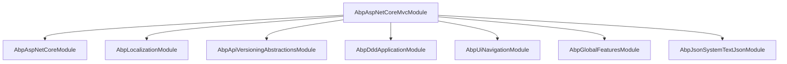

`AbpAspNetCoreMvcModule` is the central integration hub that connects ABP's DDD application-service layer to ASP.NET Core's MVC/API infrastructure. It registers feature providers, convention wrappers, action descriptor providers, and anti-forgery filters so that any class implementing `IApplicationService` can automatically surface as a RESTful endpoint — without a hand-written controller.

<CardGroup cols={2}>
  <Card title="Conventional Controllers" icon="wand-magic-sparkles">
    Application services are promoted to API controllers via `AbpConventionalControllerFeatureProvider`
  </Card>
  <Card title="Route Conventions" icon="route">
    `AbpServiceConvention` + `ConventionalRouteBuilder` derive HTTP methods and URL segments from method names
  </Card>
  <Card title="Anti-Forgery" icon="shield-halved">
    `AbpAutoValidateAntiforgeryTokenAttribute` is applied globally; AJAX calls are exempt automatically
  </Card>
  <Card title="API Versioning" icon="code-branch">
    `ConventionalControllerSetting.ApiVersions` integrates with `Asp.Versioning` per assembly
  </Card>
</CardGroup>

## Module dependency graph



## AbpController and AbpControllerBase

All hand-written controllers in an ABP solution should extend one of the two base classes:

| Class | Purpose |
|---|---|
| `AbpController` | Extends `Controller`; for MVC/Razor controllers returning views |
| `AbpControllerBase` | Extends `ControllerBase`; for pure API controllers |

Both expose common ABP services — `CurrentUser`, `CurrentTenant`, `Logger`, `Clock`, `L()` localisation helper — via lazy-loaded properties backed by `IAbpLazyServiceProvider`.

## Conventional controllers

### AbpConventionalControllerFeatureProvider

`AbpConventionalControllerFeatureProvider` overrides `ControllerFeatureProvider.IsController()` to return `true` for any type registered in `AbpAspNetCoreMvcOptions.ConventionalControllers`:

```csharp
// framework/src/Volo.Abp.AspNetCore.Mvc/Volo/Abp/AspNetCore/Mvc/Conventions/
//   AbpConventionalControllerFeatureProvider.cs
public class AbpConventionalControllerFeatureProvider : ControllerFeatureProvider
{
    private readonly IAbpApplication _application;

    protected override bool IsController(TypeInfo typeInfo)
    {
        if (_application.ServiceProvider == null)
            return false;

        var configuration = _application.ServiceProvider
            .GetRequiredService<IOptions<AbpAspNetCoreMvcOptions>>().Value
            .ConventionalControllers
            .ConventionalControllerSettings
            .GetSettingOrNull(typeInfo.AsType());

        return configuration != null;
    }
}
```

### Registering an assembly

Call `options.ConventionalControllers.Create(assembly, ...)` inside any module's `ConfigureServices`:

```csharp
Configure<AbpAspNetCoreMvcOptions>(options =>
{
    options.ConventionalControllers.Create(
        typeof(MyApplicationModule).Assembly,
        settings =>
        {
            settings.RootPath = "my-app";
            settings.RemoteServiceName = "Default";
            settings.UseV3UrlStyle = true;
            settings.ApiVersions.Add(new ApiVersion(1, 0));
        });
});
```

### ConventionalControllerSetting properties

```csharp
// framework/src/Volo.Abp.AspNetCore.Mvc/Volo/Abp/AspNetCore/Mvc/Conventions/
//   ConventionalControllerSetting.cs
public class ConventionalControllerSetting
{
    public Assembly Assembly { get; }
    public string RootPath { get; set; }           // URL prefix, e.g. "app"
    public string RemoteServiceName { get; set; }   // matches AbpRemoteServiceOptions
    public bool? UseV3UrlStyle { get; set; }
    public Func<Type, bool>? TypePredicate { get; set; }
    public ApplicationServiceTypes ApplicationServiceTypes { get; set; } = ApplicationServiceTypes.All;
    public Action<ControllerModel>? ControllerModelConfigurer { get; set; }
    public Func<UrlControllerNameNormalizerContext, string>? UrlControllerNameNormalizer { get; set; }
    public Func<UrlActionNameNormalizerContext, string>? UrlActionNameNormalizer { get; set; }
    public List<ApiVersion> ApiVersions { get; }
}
```

### AbpServiceConventionWrapper

`AbpServiceConventionWrapper` is an `IApplicationModelConvention` that lazily resolves `IAbpServiceConvention` from DI and delegates `Apply(ApplicationModel)` to it. This indirection is necessary because the convention needs services that are not available at the point `ConfigureServices` runs:

```csharp
[DisableConventionalRegistration]
public class AbpServiceConventionWrapper : IApplicationModelConvention
{
    private readonly Lazy<IAbpServiceConvention> _convention;

    public AbpServiceConventionWrapper(IServiceCollection services)
    {
        _convention = services.GetRequiredServiceLazy<IAbpServiceConvention>();
    }

    public void Apply(ApplicationModel application)
    {
        _convention.Value.Apply(application);
    }
}
```

`AbpServiceConvention` (the real implementation of `IAbpServiceConvention`) is responsible for:

1. Setting the controller name from the service class name (stripping `AppService`, `Service` suffixes).
2. Computing the HTTP method from the action name prefix (`Get*` → GET, `Create*`/`Post*` → POST, `Delete*` → DELETE, etc.).
3. Building the route template via `ConventionalRouteBuilder`.
4. Applying `ApiExplorerSettings.GroupName` when `ChangeControllerModelApiExplorerGroupName` is `true`.

## AbpAspNetCoreMvcOptions

```csharp
// framework/src/Volo.Abp.AspNetCore.Mvc/Volo/Abp/AspNetCore/Mvc/AbpAspNetCoreMvcOptions.cs
public class AbpAspNetCoreMvcOptions
{
    public bool? MinifyGeneratedScript { get; set; }
    public AbpConventionalControllerOptions ConventionalControllers { get; }
    public HashSet<Type> IgnoredControllersOnModelExclusion { get; }
    public HashSet<Type> ControllersToRemove { get; }
    public bool ExposeIntegrationServices { get; set; } = false;
    public bool ExposeClientProxyServices { get; set; } = false;
    public bool AutoModelValidation { get; set; }               // default: true
    public bool ChangeControllerModelApiExplorerGroupName { get; set; } // default: true
}
```

<Note>
`ExposeIntegrationServices` is `false` by default. Set it to `true` only in inter-service communication scenarios where other micro-services consume `[IntegrationService]`-decorated app services directly.
</Note>

## AbpConventionalControllerOptions

```csharp
public class AbpConventionalControllerOptions
{
    public ConventionalControllerSettingList ConventionalControllerSettings { get; }
    public List<Type> FormBodyBindingIgnoredTypes { get; }
    // IFormFile and IRemoteStreamContent are pre-registered

    public bool UseV3UrlStyle { get; set; } // default: false
    public string[] IgnoredUrlSuffixesInControllerNames { get; set; }
    // default: new[] { "Integration" }
}
```

<Tip>
Set `UseV3UrlStyle = true` to opt-in to the kebab-case, slash-separated URL pattern (`/api/app/book-store/books`) instead of the older dot-separated pattern.
</Tip>

## Route building

`ConventionalRouteBuilder` constructs route templates following the pattern:

```
/api/{rootPath}/{controllerName}/{id?}/{actionName?}
```

- The controller name is derived from the class name minus the `AppService` suffix, then kebab-cased.
- The action name suffix is stripped when it matches common CRUD verbs (`GetList`, `Create`, `Update`, `Delete`, `Get`).
- The `{id}` segment is inserted when the first method parameter is named `id`.

### V3 URL style example

| Method | Route |
|---|---|
| `GetListAsync(GetBooksInput input)` | `GET /api/app/books` |
| `GetAsync(Guid id)` | `GET /api/app/books/{id}` |
| `CreateAsync(CreateBookDto input)` | `POST /api/app/books` |
| `UpdateAsync(Guid id, UpdateBookDto input)` | `PUT /api/app/books/{id}` |
| `DeleteAsync(Guid id)` | `DELETE /api/app/books/{id}` |

## Anti-forgery

`AbpAutoValidateAntiforgeryTokenAttribute` is registered as a global MVC filter. It validates anti-forgery tokens for non-GET/HEAD/OPTIONS/TRACE requests **unless**:

- The request carries an `Authorization: Bearer` header (API clients).
- The request originates from a non-browser HTTP client (detected via `User-Agent`).

This means Razor Pages and MVC forms are protected automatically while REST API calls from HTTP clients are not broken.

## API versioning integration

ABP integrates with `Asp.Versioning` (formerly `Microsoft.AspNetCore.Mvc.Versioning`). Version information is surfaced in three ways:

1. **Per-setting**: `ConventionalControllerSetting.ApiVersions` adds versions to all controllers in the assembly.
2. **Per-controller**: Decorate the application service class with `[ApiVersion("2.0")]`.
3. **Global defaults**: Configure `ApiVersioningOptions` via the standard `Asp.Versioning` configuration API.

## AddControllersAsServices

`AbpAspNetCoreMvcModule` calls `AddControllersAsServices()` internally. This ensures that when MVC resolves a controller type it goes through the DI container, which in turn lets ABP's interceptors (validation, auditing, authorization) wrap the controller/app-service the same way they wrap any other transient service.

## DynamicJavaScriptProxyOptions

When `ExposeClientProxyServices` is `true`, ABP generates a JavaScript proxy bundle so that browser clients can call application service methods without writing fetch/axios boilerplate. The script generation is controlled by `DynamicJavaScriptProxyOptions`:

```csharp
Configure<DynamicJavaScriptProxyOptions>(options =>
{
    options.EnabledModules.Add("app"); // rootPath
});
```

The generated JavaScript calls `/api/abp/api-definition` at startup to discover available services, then wraps each one in a promise-based proxy accessible via `abp.services.<namespace>.<serviceName>.<methodName>(args)`.

## AbpMvcActionDescriptorProvider

`AbpMvcActionDescriptorProvider` runs during MVC's action-descriptor build phase and prunes controllers listed in `AbpAspNetCoreMvcOptions.ControllersToRemove`. Use this when a module ships a default controller that you want to replace entirely:

```csharp
Configure<AbpAspNetCoreMvcOptions>(options =>
{
    options.ControllersToRemove.Add(typeof(DefaultProductsController));
});
```

## AbpCultureRouteConstraint

The constraint `{culture:abpCulture}` is registered by `AbpAspNetCoreMvcModule`. It validates that a culture segment in a URL matches one of the cultures configured via `AbpLocalizationOptions`. Used by localization middleware to derive the active culture from the request path.

## See also

- [HTTP Client Proxies](./http-client-proxies) — consuming conventional API endpoints from other services
- [Bundling & Minification](./bundling-minification) — packaging JavaScript proxies with other scripts
