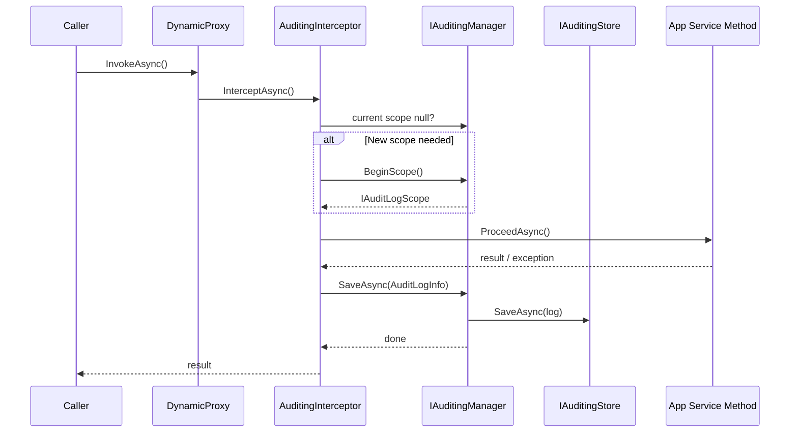

ABP's auditing subsystem automatically records who did what and when — covering HTTP requests, application service method invocations, and fine-grained entity property changes. All of this flows through a single `AuditLogInfo` object that accumulates data during a request and is flushed to `IAuditingStore` at the end of the scope.

<CardGroup cols={2}>
  <Card title="AuditingInterceptor" icon="bolt">
    Dynamic proxy interceptor that wraps application service calls, opens a new `AuditLogScope` when needed, and persists the log on completion.
  </Card>
  <Card title="AuditLogScope" icon="layer-group">
    Ambient context object that accumulates actions and entity changes for the lifetime of a logical operation.
  </Card>
  <Card title="IAuditPropertySetter" icon="pen">
    Sets `CreatorId`, `LastModifierId`, `DeleterId`, and version stamp on entities automatically via the EF Core change tracker.
  </Card>
  <Card title="AuditLogContributor" icon="puzzle-piece">
    Extension point for enriching the `AuditLogInfo` before and after it is saved.
  </Card>
</CardGroup>

## Configuration: AbpAuditingOptions

All auditing behaviour is controlled through `AbpAuditingOptions`, configured in `ConfigureServices`:

```csharp
Configure<AbpAuditingOptions>(options =>
{
    options.IsEnabled                       = true;   // master switch
    options.IsEnabledForAnonymousUsers      = true;   // log unauthenticated requests
    options.IsEnabledForGetRequests         = false;  // skip HTTP GET by default
    options.AlwaysLogOnException            = true;   // force log when exception occurs
    options.IsEnabledForIntegrationServices = false;  // skip integration service calls
    options.ApplicationName                 = "BookStore.HttpApi.Host";
    options.DisableLogActionInfo            = false;  // include method-level action records
    options.SaveEntityHistoryWhenNavigationChanges = true;

    // Selectively track entity changes
    options.EntityHistorySelectors.AddAllEntities(); // or per-type selectors
});
```

| Option | Default | Effect |
|--------|---------|--------|
| `IsEnabled` | `true` | Global on/off switch |
| `IsEnabledForAnonymousUsers` | `true` | Audit anonymous requests |
| `AlwaysLogOnException` | `true` | Persist log even when the request fails |
| `IsEnabledForGetRequests` | `false` | Opt-in to auditing read endpoints |
| `HideErrors` | `true` | Swallow exceptions from `IAuditingStore` |
| `DisableLogActionInfo` | `false` | Omit per-method `AuditLogActionInfo` records |

## AuditLogInfo Structure

`AuditLogInfo` is the root data object collected for each auditable request:

```csharp
[Serializable]
public class AuditLogInfo : IHasExtraProperties
{
    public string?  ApplicationName         { get; set; }
    public Guid?    UserId                  { get; set; }
    public string?  UserName                { get; set; }
    public Guid?    TenantId                { get; set; }
    public string?  TenantName              { get; set; }
    public Guid?    ImpersonatorUserId      { get; set; }
    public Guid?    ImpersonatorTenantId    { get; set; }
    public string?  ImpersonatorUserName    { get; set; }
    public string?  ImpersonatorTenantName  { get; set; }
    public DateTime ExecutionTime           { get; set; }
    public int      ExecutionDuration       { get; set; }  // milliseconds
    public string?  ClientId                { get; set; }
    public string?  CorrelationId           { get; set; }
    public string?  ClientIpAddress         { get; set; }
    public string?  ClientName              { get; set; }
    public string?  BrowserInfo             { get; set; }
    public string?  HttpMethod              { get; set; }
    public int?     HttpStatusCode          { get; set; }
    public string?  Url                     { get; set; }

    public List<AuditLogActionInfo>  Actions         { get; set; }
    public List<Exception>           Exceptions      { get; }
    public ExtraPropertyDictionary   ExtraProperties { get; }
    public List<EntityChangeInfo>    EntityChanges   { get; }
    public List<string>              Comments        { get; set; }
}
```

### AuditLogActionInfo

Each application service method call appended to `AuditLogInfo.Actions`:

```csharp
[Serializable]
public class AuditLogActionInfo : IHasExtraProperties
{
    public string   ServiceName       { get; set; }   // fully qualified type name
    public string   MethodName        { get; set; }
    public string   Parameters        { get; set; }   // JSON-serialized args
    public DateTime ExecutionTime     { get; set; }
    public int      ExecutionDuration { get; set; }   // milliseconds
    public ExtraPropertyDictionary ExtraProperties { get; }
}
```

## Entity Change Tracking

Entity changes flow through `EntityChangeInfo` and `EntityPropertyChangeInfo`:

```csharp
[Serializable]
public class EntityChangeInfo : IHasExtraProperties
{
    public DateTime        ChangeTime          { get; set; }
    public EntityChangeType ChangeType         { get; set; } // Created/Updated/Deleted
    public Guid?           EntityTenantId      { get; set; }
    public string?         EntityId            { get; set; }
    public string?         EntityTypeFullName  { get; set; }
    public List<EntityPropertyChangeInfo> PropertyChanges { get; set; }
}

public class EntityPropertyChangeInfo
{
    public const int MaxValueLength = 512;

    public string? NewValue      { get; set; }
    public string? OriginalValue { get; set; }
    public string  PropertyName  { get; set; } = default!;
    public string  PropertyTypeFullName { get; set; } = default!;
}
```

### EntityHistorySelectorList

By default, **no** entity types are tracked. You opt in through selectors:

```csharp
Configure<AbpAuditingOptions>(options =>
{
    // All entities that implement IAuditedObject
    options.EntityHistorySelectors.AddAllEntities();

    // Or specific types:
    options.EntityHistorySelectors.Add(
        new NamedTypeSelector("MySelector",
            t => typeof(IMyTrackedEntity).IsAssignableFrom(t)));
});
```

`[Audited]` on an entity class or property overrides the selector to **always** track, and `[DisableAuditing]` opts out a type or property even when a selector would include it.

## Auditing Interceptor Pipeline



The interceptor checks `AbpCrossCuttingConcerns.IsApplied` to avoid double-auditing when the same service is called recursively within an existing scope.

```csharp
public class AuditingInterceptor : AbpInterceptor, ITransientDependency
{
    public override async Task InterceptAsync(IAbpMethodInvocation invocation)
    {
        using var scope = _serviceScopeFactory.CreateScope();
        var auditingHelper  = scope.ServiceProvider.GetRequiredService<IAuditingHelper>();
        var auditingOptions = scope.ServiceProvider
            .GetRequiredService<IOptions<AbpAuditingOptions>>().Value;

        if (!ShouldIntercept(invocation, auditingOptions, auditingHelper))
        {
            await invocation.ProceedAsync();
            return;
        }

        var auditingManager = scope.ServiceProvider.GetRequiredService<IAuditingManager>();
        if (auditingManager.Current != null)
        {
            // Join existing scope
            await ProceedByLoggingAsync(invocation, auditingOptions,
                auditingHelper, auditingManager.Current);
        }
        else
        {
            // Open a brand-new scope
            await ProcessWithNewAuditingScopeAsync(
                invocation, auditingOptions, ...);
        }
    }
}
```

## IAuditPropertySetter

`IAuditPropertySetter` is called by the EF Core `AbpDbContext` change tracker to stamp audit fields on domain entities:

```csharp
public interface IAuditPropertySetter
{
    void SetCreationProperties(object targetObject);    // CreatorId, CreationTime
    void SetModificationProperties(object targetObject); // LastModifierId, LastModificationTime
    void SetDeletionProperties(object targetObject);     // DeleterId, DeletionTime, IsDeleted
    void IncrementEntityVersionProperty(object targetObject); // ConcurrencyStamp / Version
}
```

The concrete `AuditPropertySetter` implementation reads the current user's ID from `ICurrentUser` and the current time from `IClock`.

## AuditLogContributor

Contribute custom data to every audit log entry by subclassing `AuditLogContributor`:

```csharp
public abstract class AuditLogContributor
{
    public virtual void PreContribute(AuditLogContributionContext context)  { }
    public virtual void PostContribute(AuditLogContributionContext context) { }
}

// Registration:
Configure<AbpAuditingOptions>(options =>
{
    options.Contributors.Add(new MyAuditLogContributor());
});

// Example contributor — appending deployment metadata:
public class DeploymentAuditLogContributor : AuditLogContributor
{
    public override void PreContribute(AuditLogContributionContext context)
    {
        context.AuditInfo.ExtraProperties["DeploymentVersion"] = "2.5.1";
    }
}
```

`PreContribute` runs before the action executes; `PostContribute` runs after — both receive the mutable `AuditLogInfo` via the `context`.

## Attributes

| Attribute | Scope | Behaviour |
|-----------|-------|-----------|
| `[Audited]` | Class or method | Force auditing on, overrides options |
| `[DisableAuditing]` | Class, method, or property | Opt out of auditing / entity-history tracking |

```csharp
[Audited]
public class BookAppService : ApplicationService, IBookAppService
{
    [DisableAuditing]
    public Task<List<BookDto>> GetListAsync() { ... } // not logged
}
```

## IAuditingStore

The default implementation `SimpleLogAuditingStore` writes to the application logger. Production setups replace this with a database-backed store (provided by the `Volo.Abp.AuditLogging` module):

```csharp
public interface IAuditingStore
{
    Task SaveAsync(AuditLogInfo auditInfo);
}
```

## Related Pages

- [Authorization](./authorization-permissions) — `UserId` / roles in `AuditLogInfo` come from the auth system
- [Exception Handling](./exception-handling) — exceptions are captured in `AuditLogInfo.Exceptions`
- [Settings](./settings) — configure `AbpAuditingOptions` values from settings
