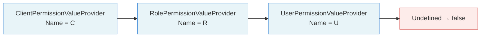
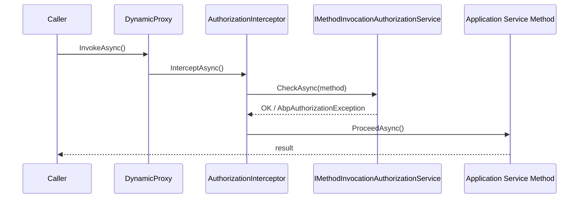

ABP's authorization layer sits on top of ASP.NET Core's policy-based authorization and extends it with a structured permission definition system. Permissions are first-class citizens — they are defined in code, optionally extended from a database, checked via an ordered chain of value providers, and automatically enforced on application service methods through a dynamic proxy interceptor.

<CardGroup cols={2}>
  <Card title="IPermissionChecker" icon="shield-check">
    Central API for checking whether the current or an arbitrary principal holds a named permission.
  </Card>
  <Card title="PermissionDefinitionManager" icon="list-tree">
    Merges static (code) and dynamic (database) permission stores into a single queryable surface.
  </Card>
  <Card title="AuthorizationInterceptor" icon="bolt">
    Castle DynamicProxy interceptor that enforces `[Authorize]` attributes before any application service method runs.
  </Card>
  <Card title="AbpAuthorizationPolicyProvider" icon="key">
    Bridges ASP.NET Core policies to ABP permissions so every permission name becomes a valid policy name.
  </Card>
</CardGroup>

## Permission Definition

Permissions are organised into groups. Each group contains one or more `PermissionDefinition` objects which can themselves have children (hierarchical permissions). Definitions are registered through `IPermissionDefinitionProvider`.

```csharp
// BookStorePermissions.cs
public static class BookStorePermissions
{
    public const string GroupName = "BookStore";

    public static class Books
    {
        public const string Default = GroupName + ".Books";
        public const string Create  = Default + ".Create";
        public const string Edit    = Default + ".Edit";
        public const string Delete  = Default + ".Delete";
    }
}

// BookStorePermissionDefinitionProvider.cs
public class BookStorePermissionDefinitionProvider : PermissionDefinitionProvider
{
    public override void Define(IPermissionDefinitionContext context)
    {
        var group = context.AddGroup(
            BookStorePermissions.GroupName,
            L("Permission:BookStore"));

        var books = group.AddPermission(
            BookStorePermissions.Books.Default,
            L("Permission:Books"));

        books.AddChild(BookStorePermissions.Books.Create, L("Permission:Books.Create"));
        books.AddChild(BookStorePermissions.Books.Edit,   L("Permission:Books.Edit"));
        books.AddChild(BookStorePermissions.Books.Delete, L("Permission:Books.Delete"));
    }

    private static LocalizableString L(string name) =>
        LocalizableString.Create<BookStoreResource>(name);
}
```

<Note>
`PermissionDefinitionProvider` implementations are auto-discovered via DI — ABP scans all registered types that derive from it.
</Note>

## Static vs Dynamic Stores

`PermissionDefinitionManager` aggregates two stores:

| Store | Interface | Purpose |
|-------|-----------|---------|
| Static | `IStaticPermissionDefinitionStore` | In-memory store populated from `IPermissionDefinitionProvider` implementations at startup |
| Dynamic | `IDynamicPermissionDefinitionStore` | Optionally backed by a database (e.g. the ABP Permission Management module). `NullDynamicPermissionDefinitionStore` is the no-op default. |

```csharp
// PermissionDefinitionManager — core lookup logic
public virtual async Task<PermissionDefinition?> GetOrNullAsync(string name)
{
    return await _staticStore.GetOrNullAsync(name) ??
           await _dynamicStore.GetOrNullAsync(name);
}
```

Static definitions always win when both stores contain the same name.

## IPermissionChecker

`IPermissionChecker` is the main public API for runtime checks:

```csharp
public class PermissionChecker : IPermissionChecker, ITransientDependency
{
    public virtual async Task<bool> IsGrantedAsync(string name)
        => await IsGrantedAsync(PrincipalAccessor.Principal, name);

    public virtual async Task<bool> IsGrantedAsync(
        ClaimsPrincipal? claimsPrincipal, string name)
    {
        var permission = await PermissionDefinitionManager.GetOrNullAsync(name);
        if (permission == null || !permission.IsEnabled) return false;

        // SimpleStateCheckers (e.g. RequireAuthenticatedSimpleStateChecker) run first
        if (!await StateCheckerManager.IsEnabledAsync(permission)) return false;

        // Walk the provider chain
        var context = new PermissionValueCheckContext(permission, claimsPrincipal);
        foreach (var provider in PermissionValueProviderManager.ValueProviders)
        {
            var result = await provider.CheckAsync(context);
            if (result == PermissionGrantResult.Granted)   return true;
            if (result == PermissionGrantResult.Prohibited) return false;
        }
        return false;
    }
}
```

`IsGrantedAsync` short-circuits on the first `Granted` or `Prohibited` result. `Undefined` means the provider abstains and the chain continues.

## Permission Value Provider Chain



<Tabs>
  <Tab title="ClientPermissionValueProvider">
    Reads `AbpClaimTypes.ClientId` from the principal and checks `IPermissionStore` against provider name `"C"`. Always switches to host tenant context to avoid tenant-scoped client grants leaking.

    ```csharp
    public class ClientPermissionValueProvider : PermissionValueProvider
    {
        public const string ProviderName = "C";
        public override string Name => ProviderName;

        public override async Task<PermissionGrantResult> CheckAsync(
            PermissionValueCheckContext context)
        {
            var clientId = context.Principal?
                .FindFirst(AbpClaimTypes.ClientId)?.Value;
            if (clientId == null) return PermissionGrantResult.Undefined;

            using (CurrentTenant.Change(null)) // always host scope
            {
                return await PermissionStore.IsGrantedAsync(
                    context.Permission.Name, Name, clientId)
                    ? PermissionGrantResult.Granted
                    : PermissionGrantResult.Undefined;
            }
        }
    }
    ```
  </Tab>
  <Tab title="RolePermissionValueProvider">
    Extracts role claims (`AbpClaimTypes.Role`) and checks each role against `IPermissionStore` with provider name `"R"`. Grant wins if any role has the permission.
  </Tab>
  <Tab title="UserPermissionValueProvider">
    Checks `IPermissionStore` with the current user's `sub` claim and provider name `"U"`. Supports per-user grant overrides.
  </Tab>
</Tabs>

## Authorization Interceptor

`AuthorizationInterceptor` is a Castle DynamicProxy interceptor registered automatically for every application service (classes that implement `IApplicationService` or are decorated with `[Authorize]`).

```csharp
public class AuthorizationInterceptor : AbpInterceptor, ITransientDependency
{
    private readonly IMethodInvocationAuthorizationService _authService;

    public override async Task InterceptAsync(IAbpMethodInvocation invocation)
    {
        await AuthorizeAsync(invocation);   // throws AbpAuthorizationException on failure
        await invocation.ProceedAsync();    // call actual method
    }

    protected virtual async Task AuthorizeAsync(IAbpMethodInvocation invocation)
    {
        await _authService.CheckAsync(
            new MethodInvocationAuthorizationContext(invocation.Method));
    }
}
```



`AuthorizationInterceptorRegistrar` registers the interceptor for any service method that has at least one `[Authorize]` or `[AllowAnonymous]` attribute anywhere in its type hierarchy.

## Policy-Based vs Permission-Based Authorization

ABP's `AbpAuthorizationPolicyProvider` extends `DefaultAuthorizationPolicyProvider`. When ASP.NET Core requests a policy by name and no matching policy exists in `AuthorizationOptions`, the provider checks whether the name corresponds to a known `PermissionDefinition`. If so, it dynamically builds a policy with a `PermissionRequirement`:

```csharp
public override async Task<AuthorizationPolicy?> GetPolicyAsync(string policyName)
{
    // 1. Try explicitly registered policies first
    var policy = await base.GetPolicyAsync(policyName);
    if (policy != null) return policy;

    // 2. Treat permission names as implicit policies
    var permission = await _permissionDefinitionManager.GetOrNullAsync(policyName);
    if (permission != null)
    {
        var builder = new AuthorizationPolicyBuilder(Array.Empty<string>());
        builder.Requirements.Add(new PermissionRequirement(policyName));
        return builder.Build();
    }
    return null;
}
```

This means `[Authorize("BookStore.Books.Create")]` works without any explicit policy registration.

## Attribute Usage

```csharp
// On a controller or application service method:
[Authorize(BookStorePermissions.Books.Create)]
public async Task<BookDto> CreateAsync(CreateBookInput input) { ... }

// Programmatic check via IPermissionChecker:
if (!await _permissionChecker.IsGrantedAsync(BookStorePermissions.Books.Delete))
{
    throw new AbpAuthorizationException("...");
}

// Fluent extension from IAbpAuthorizationService:
await _authorizationService.CheckAsync(BookStorePermissions.Books.Edit);
```

<Warning>
`[Authorize]` on a non-virtual method in a class registered as a transient/scoped service will **not** be intercepted by `AuthorizationInterceptor` because Castle DynamicProxy can only intercept virtual members. Mark methods `virtual` or use the `IApplicationService` interface approach.
</Warning>

## AbpSettingOptions for Permissions

Extend `AbpPermissionOptions` (in the Authorization module) to add custom value providers or tweak provider ordering:

```csharp
Configure<AbpPermissionOptions>(options =>
{
    // Insert a custom provider before the role provider
    options.ValueProviders.Insert(0, typeof(MyCustomPermissionValueProvider));
});
```

## Related Pages

- [Settings](./settings) — similar provider-chain pattern for configuration values
- [Features](./features) — per-tenant feature flags that complement permissions
- [Auditing](./auditing) — records which user performed which authorized action
- [Exception Handling](./exception-handling) — `AbpAuthorizationException` HTTP mapping
