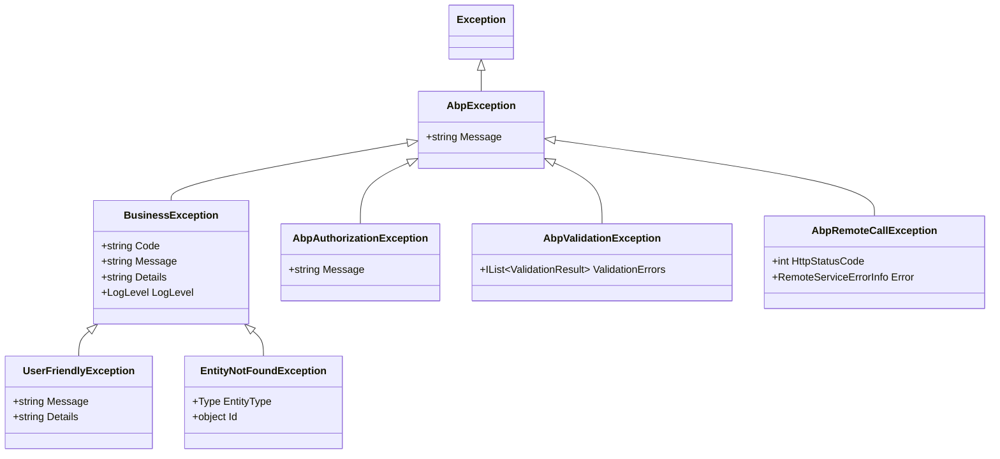
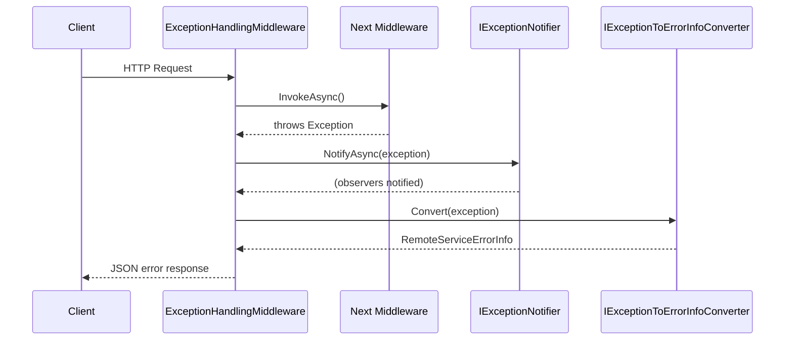

ABP provides a structured exception hierarchy so that every thrown exception carries a machine-readable code, optional user-facing message, and known HTTP status code. The middleware pipeline catches all unhandled exceptions, maps them to the uniform `RemoteServiceErrorResponse` JSON format, and notifies `IExceptionSubscriber` implementations for side effects like alerting or logging.

<CardGroup cols={2}>
  <Card title="BusinessException" icon="triangle-exclamation">
    Base class for domain-layer errors. Carries a structured error code and localizable message.
  </Card>
  <Card title="IExceptionToErrorInfoConverter" icon="arrows-turn-right">
    Converts an exception to `RemoteServiceErrorInfo`, with optional stack-trace inclusion.
  </Card>
  <Card title="IExceptionSubscriber" icon="bell">
    Observer pattern — gets notified for every exception before the HTTP response is written.
  </Card>
  <Card title="RemoteServiceErrorResponse" icon="file-code">
    The canonical JSON error envelope sent to API clients with `error.code`, `error.message`, and validation details.
  </Card>
</CardGroup>

## Exception Hierarchy



### BusinessException

Use `BusinessException` for expected domain errors. The `Code` follows a reverse-DNS convention and is used for client-side mapping and localization:

```csharp
public class BusinessException : AbpException, IHasErrorCode, IHasErrorDetails, IHasLogLevel
{
    public string?   Code    { get; set; }
    public string?   Details { get; set; }
    public LogLevel  LogLevel { get; set; } = LogLevel.Warning;

    // Fluent builder:
    public BusinessException WithData(string name, object value)
    {
        Data[name] = value;
        return this;
    }
}

// Usage:
throw new BusinessException("BookStore:010042")
    .WithData("name", bookTitle);
```

### UserFriendlyException

A `BusinessException` subtype whose `Message` is shown directly to the user without further localization lookup:

```csharp
throw new UserFriendlyException("This book is already checked out.");
```

### EntityNotFoundException

Thrown by repository `GetAsync` when the entity doesn't exist. Automatically maps to HTTP 404:

```csharp
throw new EntityNotFoundException(typeof(Book), id);
// Produces: "There is no Book with id = ..."
```

## HTTP Status Code Mapping

`AbpExceptionHttpStatusCodeFinder` maps exception types to HTTP status codes:

| Exception Type | Default HTTP Status |
|---------------|---------------------|
| `AbpAuthorizationException` | 403 Forbidden (401 if anonymous) |
| `AbpValidationException` | 400 Bad Request |
| `EntityNotFoundException` | 404 Not Found |
| `NotImplementedException` | 501 Not Implemented |
| `IHasHttpStatusCode` (any) | Uses `HttpStatusCode` property |
| Any other `Exception` | 500 Internal Server Error |

You can add custom mappings:

```csharp
Configure<AbpExceptionHttpStatusCodeOptions>(options =>
{
    options.Map<MyCustomException>(HttpStatusCode.Conflict);
});
```

## ExceptionHandlingMiddleware Pipeline



`ExceptionHandlingMiddleware` is registered by `app.UseAbpExceptionHandling()` and must be placed before `UseRouting()` to catch all middleware exceptions.

## RemoteServiceErrorResponse Format

The JSON envelope sent on any unhandled exception:

```csharp
[Serializable]
public class RemoteServiceErrorInfo
{
    public string?  Code    { get; set; }   // e.g. "BookStore:010042"
    public string?  Message { get; set; }   // human-readable (possibly localized)
    public string?  Details { get; set; }   // optional extra context
    public IDictionary? Data { get; set; }  // arbitrary key-value pairs
    public RemoteServiceValidationErrorInfo[]? ValidationErrors { get; set; }
}

public class RemoteServiceErrorResponse
{
    public RemoteServiceErrorInfo Error { get; set; }
}
```

Example response body:

```json
{
  "error": {
    "code":    "BookStore:010042",
    "message": "Book 'Clean Code' is already checked out.",
    "details": "Return date: 2024-03-15",
    "data":    { "name": "Clean Code" },
    "validationErrors": null
  }
}
```

For `AbpValidationException`, `validationErrors` is populated:

```json
{
  "error": {
    "code":    "AbpValidation",
    "message": "Your request is not valid.",
    "validationErrors": [
      { "message": "Name is required.", "members": ["name"] },
      { "message": "Price must be positive.", "members": ["price"] }
    ]
  }
}
```

## Exception Localization

Map a `BusinessException` error code to a localizable message via `AbpExceptionLocalizationOptions`:

```csharp
Configure<AbpExceptionLocalizationOptions>(options =>
{
    options.MapCodeNamespace(
        "BookStore",                  // matches error codes starting with "BookStore:"
        typeof(BookStoreResource));   // localization resource to look up
});
```

Then add the key to your JSON resource files:

```json
// en.json
{ "Texts": { "BookStore:010042": "Book '{name}' is already checked out." } }
```

`DefaultExceptionToErrorInfoConverter` resolves the localizer from `AbpExceptionLocalizationOptions`, formats the message with `IStringLocalizer`, and sets `RemoteServiceErrorInfo.Message` on the response.

## IExceptionSubscriber and IExceptionNotifier

Subscribe to exceptions for logging, alerting, or telemetry side-effects:

```csharp
public interface IExceptionSubscriber
{
    Task HandleAsync(ExceptionNotificationContext context);
}

// Registration:
[Dependency(ReplaceServices = false)]
public class ElasticExceptionSubscriber : IExceptionSubscriber, ITransientDependency
{
    public async Task HandleAsync(ExceptionNotificationContext context)
    {
        if (context.Exception is BusinessException) return; // skip expected errors

        await _elastic.IndexAsync(new {
            context.Exception.Message,
            context.Exception.StackTrace,
            HandledByMiddleware = context.Handled
        });
    }
}
```

`IExceptionNotifier` is called by the middleware and collects all `IExceptionSubscriber` implementations from DI, calling `HandleAsync` on each in order.

## AbpExceptionHandlingOptions

```csharp
Configure<AbpExceptionHandlingOptions>(options =>
{
    options.SendExceptionsDetailsToClients = false; // hide stack traces in production
    options.SendStackTraceToClients        = false;
});
```

<Warning>
Never set `SendExceptionsDetailsToClients = true` in production. Stack traces expose internal implementation details that can aid attackers.
</Warning>

## Related Pages

- [Validation](./validation) — `AbpValidationException` is thrown before method execution
- [Authorization](./authorization-permissions) — `AbpAuthorizationException` maps to 403
- [Localization](./localization) — localize `BusinessException` messages via code namespaces
- [Auditing](./auditing) — exceptions are captured in `AuditLogInfo.Exceptions`
