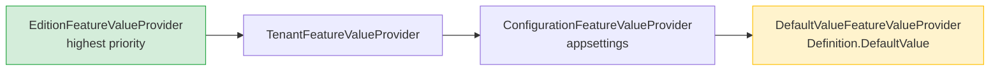

ABP has two orthogonal feature systems that are often confused but serve different purposes. **Per-tenant features** (`Volo.Abp.Features`) are runtime flags resolved per SaaS tenant through a value provider chain — think subscription plan capabilities. **Global features** (`Volo.Abp.GlobalFeatures`) are compile/startup-time switches that enable entire module capabilities for a deployment — think enabling the invoicing module for all tenants or disabling it entirely.

<CardGroup cols={2}>
  <Card title="IFeatureChecker" icon="toggle-on">
    Runtime check of a named feature value for the current tenant, with interceptor enforcement.
  </Card>
  <Card title="FeatureDefinitionManager" icon="list-tree">
    Merges static code-defined and dynamic database-persisted feature definitions.
  </Card>
  <Card title="GlobalFeatureManager" icon="puzzle-piece">
    Singleton that tracks which global module features are enabled for this deployment.
  </Card>
  <Card title="RequireGlobalFeaturesSimpleStateChecker" icon="shield-check">
    Simple state checker that gates permission/feature definitions on global feature enablement.
  </Card>
</CardGroup>

## Per-Tenant Features

### FeatureDefinition

```csharp
public class FeatureDefinition : ICanCreateChildFeature
{
    public string             Name             { get; }
    public ILocalizableString DisplayName      { get; set; }
    public ILocalizableString? Description     { get; set; }
    public FeatureDefinition? Parent           { get; }       // hierarchical features
    public string?            DefaultValue     { get; set; }
    public bool               IsVisibleToClients { get; set; } // default: true
    public bool               IsAvailableToHost  { get; set; } // default: true
    public List<string>       AllowedProviders   { get; }     // empty = all providers

    // IStringValueType — governs UI rendering (bool toggle, select, numeric, etc.)
    public IStringValueType   ValueType        { get; set; }
}
```

`FeatureDefinition` supports a parent-child hierarchy: a child feature can only be enabled if its parent is also enabled. This models plan tier containment ("Advanced Plan" requires "Basic Plan").

### FeatureDefinitionProvider

```csharp
public class BookStoreFeatureDefinitionProvider : FeatureDefinitionProvider
{
    public override void Define(IFeatureDefinitionContext context)
    {
        var group = context.AddGroup(
            BookStoreFeatureNames.GroupName,
            L("Feature:BookStore"));

        group.AddFeature(
            BookStoreFeatureNames.MaxBookCount,
            defaultValue: "10",
            displayName: L("Feature:MaxBookCount"),
            valueType: new FreeTextStringValueType(
                new NumericValueValidator(minimum: 0, maximum: 10000)));

        var pdfExport = group.AddFeature(
            BookStoreFeatureNames.PdfExport,
            defaultValue: "false",
            displayName: L("Feature:PdfExport"),
            valueType: new ToggleStringValueType());

        // Child — only meaningful when PdfExport is true:
        pdfExport.CreateChild(
            BookStoreFeatureNames.PdfExportWithWatermark,
            defaultValue: "true",
            valueType: new ToggleStringValueType());
    }
}

// Register in AbpFeatureOptions:
Configure<AbpFeatureOptions>(options =>
{
    options.DefinitionProviders.Add<BookStoreFeatureDefinitionProvider>();
});
```

### IFeatureChecker

```csharp
// Check if a boolean feature is enabled:
var isPdfEnabled = await _featureChecker.IsEnabledAsync(BookStoreFeatureNames.PdfExport);

// Read a value feature:
var maxCount = await _featureChecker.GetAsync(BookStoreFeatureNames.MaxBookCount);
var limit    = int.Parse(maxCount ?? "10");

// Throw FeatureNotEnabledException if not enabled:
await _featureChecker.CheckEnabledAsync(BookStoreFeatureNames.PdfExport);
```

### Feature Value Provider Chain

`FeatureChecker` iterates `IFeatureValueProviderManager.ValueProviders` in **reverse** order (highest priority first) until a non-null value is found:



```csharp
public class FeatureChecker : FeatureCheckerBase
{
    public override async Task<string?> GetOrNullAsync(string name)
    {
        var featureDefinition = await FeatureDefinitionManager.GetOrNullAsync(name);
        if (featureDefinition == null) return null;

        // Reversed = highest priority first
        var providers = FeatureValueProviderManager.ValueProviders.Reverse();

        if (featureDefinition.AllowedProviders.Any())
        {
            providers = providers.Where(
                p => featureDefinition.AllowedProviders.Contains(p.Name));
        }

        return await GetOrNullValueFromProvidersAsync(providers, featureDefinition);
    }
}
```

### FeatureInterceptor

`FeatureInterceptor` is a dynamic proxy interceptor that enforces `[RequiresFeature]` attributes on application service methods:

```csharp
public class FeatureInterceptor : AbpInterceptor, ITransientDependency
{
    public override async Task InterceptAsync(IAbpMethodInvocation invocation)
    {
        if (AbpCrossCuttingConcerns.IsApplied(
            invocation.TargetObject, AbpCrossCuttingConcerns.FeatureChecking))
        {
            await invocation.ProceedAsync();
            return;
        }

        await CheckFeaturesAsync(invocation);
        await invocation.ProceedAsync();
    }
}
```

```csharp
// Attribute usage:
[RequiresFeature(BookStoreFeatureNames.PdfExport)]
public async Task<byte[]> ExportToPdfAsync(Guid bookId) { ... }

// Multiple features (all required by default):
[RequiresFeature(BookStoreFeatureNames.PdfExport,
                 BookStoreFeatureNames.PdfExportWithWatermark)]
public async Task<byte[]> ExportWatermarkedPdfAsync(Guid bookId) { ... }
```

---

## Global Features

### What Are Global Features?

Global features are **deployment-time** switches. They are enabled or disabled at application startup (in `PreConfigureServices` / `Program.cs`) and affect the entire instance — all tenants see the same global feature state. They are used by ABP modules to conditionally register services, controllers, and database tables.

Think of them as module capability flags:

| Setting | Use |
|---------|-----|
| Per-tenant feature | "Tenant A has PDF export; Tenant B does not" |
| Global feature | "This deployment has the invoicing module compiled in and activated" |

### GlobalFeatureManager

`GlobalFeatureManager.Instance` is a singleton accessible statically and via DI:

```csharp
public class GlobalFeatureManager
{
    public static GlobalFeatureManager Instance { get; }

    public GlobalModuleFeaturesDictionary Modules { get; }
    protected HashSet<string> EnabledFeatures { get; }

    public virtual bool IsEnabled<TFeature>() => IsEnabled(typeof(TFeature));
    public virtual bool IsEnabled(string featureName)
        => EnabledFeatures.Contains(featureName);

    public virtual void Enable<TFeature>()
        => Enable(GlobalFeatureNameAttribute.GetName(typeof(TFeature)));

    public virtual void Disable<TFeature>()
        => Disable(GlobalFeatureNameAttribute.GetName(typeof(TFeature)));
}
```

Enable global features during startup, typically in `PreConfigureServices`:

```csharp
public override void PreConfigureServices(ServiceConfigurationContext context)
{
    GlobalFeatureManager.Instance.Modules.Invoicing().Enable();

    // Or enable by type:
    GlobalFeatureManager.Instance.Enable<InvoicingFeature>();
}
```

### GlobalModuleFeatures

Each ABP module that exposes global features provides a `GlobalModuleFeatures` subclass accessible through `GlobalFeatureManager.Instance.Modules`:

```csharp
public abstract class GlobalModuleFeatures
{
    public GlobalFeatureManager FeatureManager { get; }

    public virtual void Enable<TFeature>()  where TFeature : GlobalFeature
        => GetFeature<TFeature>().Enable();

    public virtual void Disable<TFeature>() where TFeature : GlobalFeature
        => GetFeature<TFeature>().Disable();
}

// GlobalModuleFeaturesDictionary is a Dictionary<string, GlobalModuleFeatures>
// accessed by module name.
```

### RequireGlobalFeaturesSimpleStateChecker

Gate a permission or per-tenant feature definition on a global feature being enabled. This prevents the permission from even appearing in management UIs when the module is disabled globally:

```csharp
public class RequireGlobalFeaturesSimpleStateChecker<TState>
    : ISimpleStateChecker<TState>
    where TState : IHasSimpleStateCheckers<TState>
{
    public string[] GlobalFeatureNames { get; }
    public bool     RequiresAll        { get; }

    public Task<bool> IsEnabledAsync(SimpleStateCheckerContext<TState> context)
    {
        var isEnabled = RequiresAll
            ? GlobalFeatureNames.All(x  => GlobalFeatureManager.Instance.IsEnabled(x))
            : GlobalFeatureNames.Any(x  => GlobalFeatureManager.Instance.IsEnabled(x));

        return Task.FromResult(isEnabled);
    }
}
```

```csharp
// Example: gate a permission on a global module feature
var permission = group.AddPermission("Invoicing.Invoices");
permission.StateCheckers.Add(
    new RequireGlobalFeaturesSimpleStateChecker<PermissionDefinition>(
        typeof(InvoicingFeature)));
```

### [RequiresGlobalFeature] Attribute

```csharp
[RequiresGlobalFeature(typeof(InvoicingFeature))]
public class InvoiceAppService : ApplicationService, IInvoiceAppService
{
    // Every method here throws AbpGlobalFeatureNotEnabledException
    // if the global feature is not enabled.
}
```

`GlobalFeatureInterceptor` enforces this attribute — it runs before `AuthorizationInterceptor` and throws `AbpGlobalFeatureNotEnabledException` (HTTP 404 by default) when the feature is off.

---

## Comparison: Per-Tenant vs Global Features

| Dimension | Per-Tenant Feature | Global Feature |
|-----------|-------------------|----------------|
| Scope | Per SaaS tenant | Whole deployment |
| When resolved | Runtime, per request | Startup / compile time |
| Storage | Database (via feature management) | In-memory (code) |
| Typical use | Subscription plan capabilities | Module on/off switch |
| API | `IFeatureChecker.IsEnabledAsync()` | `GlobalFeatureManager.IsEnabled()` |
| Interceptor | `FeatureInterceptor` | `GlobalFeatureInterceptor` |
| Attribute | `[RequiresFeature]` | `[RequiresGlobalFeature]` |

## Related Pages

- [Authorization](./authorization-permissions) — `RequirePermissionsSimpleStateChecker` mirrors `RequireGlobalFeaturesSimpleStateChecker`
- [Settings](./settings) — settings follow the same value provider chain pattern
- [Exception Handling](./exception-handling) — `FeatureNotEnabledException` and `AbpGlobalFeatureNotEnabledException` HTTP mapping
- [Caching](./caching) — feature values are cached after resolution to reduce database round-trips
