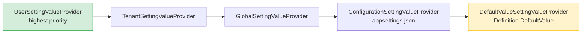

ABP's setting system provides a hierarchical key-value store where every setting has a typed definition with a default value, and runtime values are resolved through an ordered chain of `ISettingValueProvider` implementations. A higher-priority provider (user scope) shadows a lower one (global scope), and any provider can delegate upward by returning `null`. The same pattern that governs permission value providers also governs setting value providers.

<CardGroup cols={2}>
  <Card title="ISettingProvider" icon="sliders">
    Main API for reading setting values — resolves through the full provider chain for the current context.
  </Card>
  <Card title="SettingDefinition" icon="file-lines">
    Declares a setting's name, default value, visibility, allowed providers, and optional encryption flag.
  </Card>
  <Card title="ISettingValueProvider chain" icon="layer-group">
    Ordered list of providers: Default → Configuration → Global → Tenant → User, each shadowing the previous.
  </Card>
  <Card title="AbpSettingOptions" icon="gear">
    Registers `ISettingDefinitionProvider` and `ISettingValueProvider` types; controls encryption fallback behaviour.
  </Card>
</CardGroup>

## SettingDefinition

Each setting is described by a `SettingDefinition` registered in an `ISettingDefinitionProvider`:

```csharp
public class SettingDefinition
{
    public string              Name              { get; }
    public ILocalizableString  DisplayName       { get; set; }
    public ILocalizableString? Description       { get; set; }
    public string?             DefaultValue      { get; set; }
    public bool                IsVisibleToClients { get; set; } // default: false
    public bool                IsInherited       { get; set; } // default: true
    public bool                IsEncrypted       { get; set; } // default: false
    public List<string>        Providers         { get; }      // empty = all providers allowed
    public Dictionary<string, object> Properties { get; }
}
```

`IsVisibleToClients = true` exposes the value via the `/api/abp/application-configuration` endpoint. `IsEncrypted = true` stores and reads through `ISettingEncryptionService`.

## Defining Settings

```csharp
// Constant names:
public static class EmailSettingNames
{
    public const string DefaultFromAddress = "Email.DefaultFromAddress";
    public const string SmtpHost           = "Email.Smtp.Host";
    public const string SmtpPort           = "Email.Smtp.Port";
    public const string SmtpPassword       = "Email.Smtp.Password";
}

// Provider:
public class EmailSettingDefinitionProvider : SettingDefinitionProvider
{
    public override void Define(ISettingDefinitionContext context)
    {
        context.Add(
            new SettingDefinition(
                EmailSettingNames.DefaultFromAddress,
                defaultValue: "noreply@example.com",
                displayName: L("Setting:Email.DefaultFromAddress"),
                isVisibleToClients: false
            ),
            new SettingDefinition(
                EmailSettingNames.SmtpPassword,
                displayName: L("Setting:Email.SmtpPassword"),
                isEncrypted: true  // stored encrypted in DB
            )
        );
    }

    private static LocalizableString L(string name) =>
        LocalizableString.Create<BookStoreResource>(name);
}
```

Register the provider in `AbpSettingOptions`:

```csharp
Configure<AbpSettingOptions>(options =>
{
    options.DefinitionProviders.Add<EmailSettingDefinitionProvider>();
});
```

## ISettingProvider

The primary read API — returns `null` if no provider resolves a value (the definition's `DefaultValue` is used as last resort by `DefaultValueSettingValueProvider`):

```csharp
public interface ISettingProvider
{
    Task<string?> GetOrNullAsync(string name);
    Task<List<SettingValue>> GetAllAsync(string[] names);
    Task<List<SettingValue>> GetAllAsync();
}

// Usage:
public class EmailSender : IEmailSender, ITransientDependency
{
    private readonly ISettingProvider _settings;

    public async Task SendAsync(string to, string subject, string body)
    {
        var host     = await _settings.GetOrNullAsync(EmailSettingNames.SmtpHost);
        var port     = await _settings.GetOrNullAsync(EmailSettingNames.SmtpPort);
        var password = await _settings.GetOrNullAsync(EmailSettingNames.SmtpPassword);
        // ...
    }
}
```

## Value Provider Chain

`SettingProvider` iterates `AbpSettingOptions.ValueProviders` in registration order. The first provider that returns a non-null value wins:



| Provider | Name | Source |
|----------|------|--------|
| `DefaultValueSettingValueProvider` | `"D"` | `SettingDefinition.DefaultValue` |
| `ConfigurationSettingValueProvider` | `"C"` | `IConfiguration` (appsettings.json, env vars) |
| `GlobalSettingValueProvider` | `"G"` | Database, host scope |
| `TenantSettingValueProvider` | `"T"` | Database, per-tenant (if multi-tenancy enabled) |
| `UserSettingValueProvider` | `"U"` | Database, per-user |

Providers implement:

```csharp
public interface ISettingValueProvider
{
    string Name { get; }
    Task<string?>             GetOrNullAsync(SettingDefinition setting);
    Task<List<SettingValue>>  GetAllAsync(SettingDefinition[] settings);
}
```

### Restricting Providers

Set `SettingDefinition.Providers` to limit which providers are consulted:

```csharp
new SettingDefinition("Theme.Color")
    .WithProviders(GlobalSettingValueProvider.ProviderName)
// Only the "G" (global) provider is consulted; user/tenant overrides are ignored.
```

### IsInherited

When `IsInherited = true` (default), a tenant that has not explicitly set a value inherits the host's global value. Set `IsInherited = false` to block inheritance — each tenant must define its own value.

## AbpSettingOptions

```csharp
public class AbpSettingOptions
{
    public ITypeList<ISettingDefinitionProvider> DefinitionProviders { get; }
    public ITypeList<ISettingValueProvider>      ValueProviders      { get; }
    public HashSet<string>                       DeletedSettings     { get; }

    // When true, returns the unencrypted stored value if decryption fails
    // instead of throwing — useful when rotating encryption keys.
    public bool ReturnOriginalValueIfDecryptFailed { get; set; } // default: true
}
```

Reorder or replace the default provider chain:

```csharp
Configure<AbpSettingOptions>(options =>
{
    // Insert a custom provider at position 0 (highest priority)
    options.ValueProviders.Insert(0, typeof(MyCustomSettingValueProvider));

    // Remove the user-level provider (no per-user overrides)
    options.ValueProviders.Remove<UserSettingValueProvider>();
});
```

## ISettingDefinitionManager

`ISettingDefinitionManager` merges static (code-registered) and dynamic (database) definitions, mirroring the pattern used by permissions:

```csharp
public interface ISettingDefinitionManager
{
    Task<SettingDefinition>             GetAsync(string name);
    Task<SettingDefinition?>            GetOrNullAsync(string name);
    Task<IReadOnlyList<SettingDefinition>> GetAllAsync();
}
```

The `IDynamicSettingDefinitionStore` allows additional settings to be loaded from a database at runtime (provided by the ABP Setting Management module). `NullDynamicSettingDefinitionStore` is the no-op default.

## Encryption

When `SettingDefinition.IsEncrypted = true`, values are automatically passed through `ISettingEncryptionService` on read and write. The built-in implementation uses AES symmetric encryption; the key is read from `IConfiguration["Settings:Encryption:Key"]`.

```csharp
// Reading an encrypted setting is transparent:
var password = await _settingProvider.GetOrNullAsync(EmailSettingNames.SmtpPassword);
// "password" is already decrypted here.
```

<Warning>
If you change `IsEncrypted` from `false` to `true` on an existing definition after data has already been stored in plain text, set `ReturnOriginalValueIfDecryptFailed = true` (the default) so the system gracefully returns the unencrypted value rather than throwing during the transition period.
</Warning>

## SettingManagement Module

The `Volo.Abp.SettingManagement` module provides the database storage and management API for global/tenant/user settings. It exposes:

- `ISettingManager` — read/write settings for a specific scope
- HTTP API endpoints for managing settings from a UI

```csharp
// Write a setting value for the current tenant:
await _settingManager.SetForCurrentTenantAsync(
    EmailSettingNames.SmtpHost, "smtp.example.com");

// Write a setting for a specific user:
await _settingManager.SetForUserAsync(
    userId, EmailSettingNames.DefaultFromAddress, "alice@example.com");
```

## Related Pages

- [Features](./features) — per-tenant feature flags follow a similar provider chain pattern
- [Authorization](./authorization-permissions) — permissions also use a multi-provider chain
- [Caching](./caching) — setting values are cached to avoid repeated database reads
- [Localization](./localization) — `SettingDefinition.DisplayName` is an `ILocalizableString`
