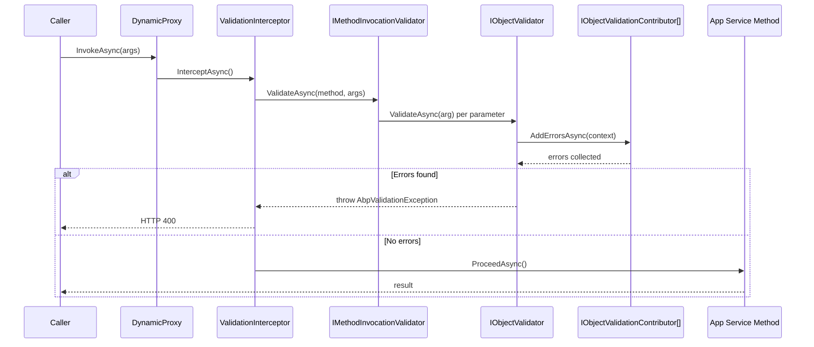

ABP validates every application service method input automatically through a `ValidationInterceptor` that runs before the method body executes. The validation pipeline is composable — multiple `IObjectValidationContributor` implementations (data annotations, FluentValidation, custom) are all invoked, their errors are collected, and a single `AbpValidationException` is thrown if any errors exist, which the exception handling middleware converts to an HTTP 400 response.

<CardGroup cols={2}>
  <Card title="ValidationInterceptor" icon="shield">
    Dynamic proxy interceptor that validates all non-primitive parameters before a service method runs.
  </Card>
  <Card title="IObjectValidator" icon="check-circle">
    Core validation interface: calls all registered `IObjectValidationContributor` instances and throws on error.
  </Card>
  <Card title="DataAnnotationObjectValidationContributor" icon="tag">
    Validates objects recursively using `System.ComponentModel.DataAnnotations` attributes up to depth 8.
  </Card>
  <Card title="AbpValidationException" icon="circle-xmark">
    Carries a list of `ValidationResult` errors; maps to HTTP 400 with structured validation error details.
  </Card>
</CardGroup>

## Validation Interceptor Pipeline



## IObjectValidator

`IObjectValidator` is the central validation interface. `ObjectValidator` is its default implementation and orchestrates all registered `IObjectValidationContributor` types:

```csharp
public interface IObjectValidator
{
    // Throws AbpValidationException if errors are found
    Task ValidateAsync(object? validatingObject,
        string? name = null, bool allowNull = false);

    // Returns errors without throwing
    Task<List<ValidationResult>> GetErrorsAsync(object? validatingObject,
        string? name = null, bool allowNull = false);
}
```

```csharp
public class ObjectValidator : IObjectValidator, ITransientDependency
{
    public virtual async Task<List<ValidationResult>> GetErrorsAsync(
        object? validatingObject, string? name = null, bool allowNull = false)
    {
        // ...
        var context = new ObjectValidationContext(validatingObject);

        using var scope = ServiceScopeFactory.CreateScope();
        foreach (var contributorType in Options.ObjectValidationContributors)
        {
            var contributor = (IObjectValidationContributor)
                scope.ServiceProvider.GetRequiredService(contributorType);
            await contributor.AddErrorsAsync(context);
        }
        return context.Errors;
    }
}
```

## DataAnnotationObjectValidationContributor

The built-in contributor validates objects recursively (up to depth 8) using .NET's standard validation attributes:

```csharp
public class DataAnnotationObjectValidationContributor
    : IObjectValidationContributor, ITransientDependency
{
    public const int MaxRecursiveParameterValidationDepth = 8;

    public Task AddErrorsAsync(ObjectValidationContext context)
    {
        ValidateObjectRecursively(context.Errors,
            context.ValidatingObject, currentDepth: 1);
        return Task.CompletedTask;
    }
}
```

Supported annotations include `[Required]`, `[StringLength]`, `[Range]`, `[EmailAddress]`, `[RegularExpression]`, `[MaxLength]`, and any custom `ValidationAttribute` subclass.

```csharp
public class CreateBookInput
{
    [Required]
    [StringLength(128, MinimumLength = 2)]
    public string Name { get; set; } = default!;

    [Range(0, 999.99)]
    public decimal Price { get; set; }

    [Required]
    public BookType Type { get; set; }

    // Nested objects are also validated recursively:
    [Required]
    public AuthorAssignmentInput Author { get; set; } = default!;
}
```

<Note>
Nested object validation traverses `IEnumerable` collections but stops at primitive types and `IQueryable`. ABP does **not** validate `IQueryable` properties to avoid triggering database queries.
</Note>

## FluentValidation Integration

Add `Volo.Abp.FluentValidation` to your module and depend on `AbpFluentValidationModule`:

```csharp
[DependsOn(typeof(AbpFluentValidationModule))]
public class BookStoreApplicationModule : AbpModule { }
```

Write standard `AbstractValidator<T>` classes — ABP auto-discovers them via DI and registers a `FluentObjectValidationContributor`:

```csharp
public class CreateBookInputValidator : AbstractValidator<CreateBookInput>
{
    private readonly IBookRepository _bookRepo;

    public CreateBookInputValidator(IBookRepository bookRepo)
    {
        _bookRepo = bookRepo;

        RuleFor(x => x.Name)
            .NotEmpty()
            .MaximumLength(128)
            .MustAsync(async (name, ct) =>
                !await _bookRepo.AnyAsync(b => b.Name == name))
            .WithMessage("A book with this name already exists.");

        RuleFor(x => x.Price)
            .GreaterThanOrEqualTo(0)
            .LessThanOrEqualTo(999.99m);
    }
}
```

FluentValidation errors are merged with data annotation errors before the single `AbpValidationException` is thrown.

## AbpValidationOptions

```csharp
public class AbpValidationOptions
{
    public List<Type>                          IgnoredTypes               { get; }
    public ITypeList<IObjectValidationContributor> ObjectValidationContributors { get; set; }
}
```

Add contributors or ignore specific types:

```csharp
Configure<AbpValidationOptions>(options =>
{
    // Add a custom contributor
    options.ObjectValidationContributors.Add<MyCustomValidationContributor>();

    // Skip validation for a specific DTO
    options.IgnoredTypes.Add(typeof(RawEventDto));
});
```

## Controlling Validation with Attributes

| Attribute | Scope | Behaviour |
|-----------|-------|-----------|
| `[DisableValidation]` | Class or method | Bypass `ValidationInterceptor` entirely |
| `[EnableValidation]` | Method | Force validation on a method in a class that has `[DisableValidation]` |

```csharp
[DisableValidation]
public class RawDataAppService : ApplicationService
{
    [EnableValidation]
    public Task<ProcessedDto> ProcessImportantAsync(ImportInput input)
        => ...; // validation runs only here

    public Task IngestRawAsync(string raw) => ...; // validation skipped
}
```

## IAbpValidationResult

`IAbpValidationResult` is the internal accumulator passed through the contributor chain:

```csharp
public interface IAbpValidationResult
{
    List<ValidationResult> Errors { get; }
}
```

`AbpValidationResult` is the default implementation. After all contributors finish, if `Errors` is non-empty, `ObjectValidator.ValidateAsync` throws:

```csharp
public virtual async Task ValidateAsync(
    object? validatingObject, string? name = null, bool allowNull = false)
{
    var errors = await GetErrorsAsync(validatingObject, name, allowNull);
    if (errors.Any())
    {
        throw new AbpValidationException(
            "Object state is not valid! See ValidationErrors for details.",
            errors);
    }
}
```

## HTTP 400 Surface

`AbpValidationException` maps to HTTP 400. The `DefaultExceptionToErrorInfoConverter` serializes `ValidationErrors` into the standard `RemoteServiceErrorResponse` envelope:

```json
{
  "error": {
    "code":    "AbpValidation",
    "message": "Your request is not valid!",
    "validationErrors": [
      { "message": "Name is required.",             "members": ["name"] },
      { "message": "Price must be between 0-1000.", "members": ["price"] }
    ]
  }
}
```

## Related Pages

- [Exception Handling](./exception-handling) — `AbpValidationException` HTTP mapping and error response format
- [Authorization](./authorization-permissions) — validation runs before authorization in the interceptor stack
- [Auditing](./auditing) — exceptions including validation errors are captured in the audit log
