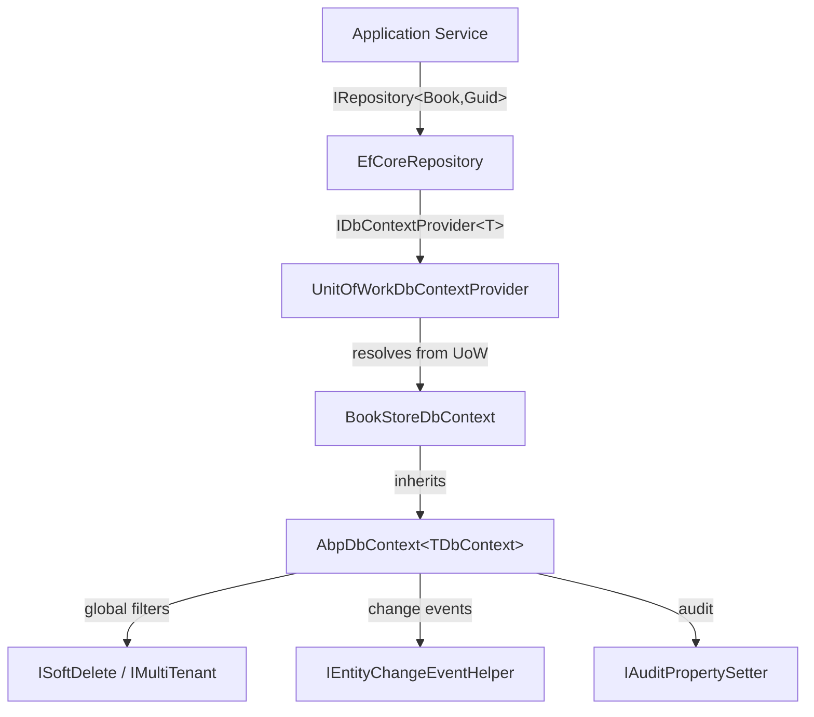

ABP's Entity Framework Core integration lives in `Volo.Abp.EntityFrameworkCore` and provides a rich base layer on top of standard EF Core. It wires up soft-delete and multi-tenant global query filters automatically, emits domain events through the change tracker, handles concurrency stamps, stores extra properties as JSON, and integrates fully with ABP's [Unit of Work](/ddd/unit-of-work) and [Repository](/ddd/repositories) abstractions — all without you writing any cross-cutting boilerplate.

<CardGroup cols={2}>
  <Card title="AbpDbContext" icon="database" href="#abpdbcontexttdbcontext">
    Base class with auto-filters, audit properties, and event publishing
  </Card>
  <Card title="EfCoreRepository" icon="code" href="#efcorerepository">
    Generic repository backed by a typed DbContext and DbSet
  </Card>
  <Card title="DI Registration" icon="plug" href="#registering-a-dbcontext">
    AddAbpDbContext, DbContextOptionsFactory, connection strings
  </Card>
  <Card title="Multi-Provider" icon="server" href="#database-provider-support">
    SQL Server, PostgreSQL, MySQL, SQLite, Oracle
  </Card>
</CardGroup>

---

## Module

`AbpEntityFrameworkCoreModule` (in `Volo/Abp/EntityFrameworkCore/AbpEntityFrameworkCoreModule.cs`) is the root module. Add it as a dependency in your data-layer module:

```csharp
[DependsOn(typeof(AbpEntityFrameworkCoreModule))]
public class MyAppEntityFrameworkCoreModule : AbpModule { }
```

The module pre-configures `AbpDbContextOptions` to suppress the `LazyLoadOnDisposedContextWarning`, registers `UnitOfWorkDbContextProvider<>` as the default `IDbContextProvider<>`, and wires up the distributed-event inbox/outbox infrastructure.

---

## `AbpDbContext<TDbContext>`

**File:** `Volo/Abp/EntityFrameworkCore/AbpDbContext.cs`

`AbpDbContext<TDbContext>` extends `Microsoft.EntityFrameworkCore.DbContext` and implements `IAbpEfCoreDbContext`. Every ABP application database context inherits from it:

```csharp
public abstract class AbpDbContext<TDbContext> : DbContext, IAbpEfCoreDbContext, ITransientDependency
    where TDbContext : DbContext
{
    public IAbpLazyServiceProvider LazyServiceProvider { get; set; } = default!;

    protected virtual bool IsMultiTenantFilterEnabled =>
        DataFilter?.IsEnabled<IMultiTenant>() ?? false;

    protected virtual bool IsSoftDeleteFilterEnabled =>
        DataFilter?.IsEnabled<ISoftDelete>() ?? false;

    public IDataFilter DataFilter =>
        LazyServiceProvider.LazyGetRequiredService<IDataFilter>();

    public ICurrentTenant CurrentTenant =>
        LazyServiceProvider.LazyGetRequiredService<ICurrentTenant>();
}
```

Services are resolved via `LazyServiceProvider` so the context remains constructable by EF Core tooling (migrations, design-time factories) without a full DI container.

### Global Query Filters

`AbpDbContext` registers EF Core global query filters for every entity type that implements `ISoftDelete` or `IMultiTenant`. The filters are generated inside `ConfigureBaseProperties<TEntity>` during `OnModelCreating`:

```csharp
// ISoftDelete filter (simplified)
Expression<Func<TEntity, bool>> softDeleteFilter =
    e => !IsSoftDeleteFilterEnabled || !EF.Property<bool>(e, softDeletePropertyName);

// IMultiTenant filter
Expression<Func<TEntity, bool>> multiTenantFilter =
    e => !IsMultiTenantFilterEnabled
         || EF.Property<Guid>(e, multiTenantPropertyName) == CurrentTenantId;
```

The evaluated values (`IsSoftDeleteFilterEnabled`, `IsMultiTentFilterEnabled`, `CurrentTenantId`) are instance properties, so EF Core re-evaluates them on every query — enabling per-request filter toggling via `IDataFilter`.

<Note>
ABP also supports a DB-function-based filter mode (`AbpEfCoreGlobalFilterOptions.UseDbFunction = true`) for databases that benefit from stable query plans.
</Note>

### Model Configuration

Override `OnModelCreating` to configure your entities and call `base.OnModelCreating(modelBuilder)`:

```csharp
public class BookStoreDbContext : AbpDbContext<BookStoreDbContext>
{
    public DbSet<Book> Books { get; set; }

    public BookStoreDbContext(DbContextOptions<BookStoreDbContext> options)
        : base(options) { }

    protected override void OnModelCreating(ModelBuilder modelBuilder)
    {
        base.OnModelCreating(modelBuilder); // Must call base first

        modelBuilder.Entity<Book>(b =>
        {
            b.ToTable("Books");
            b.Property(x => x.Name).IsRequired().HasMaxLength(128);
        });
    }
}
```

`base.OnModelCreating` iterates every entity type registered in the model and calls `ConfigureBaseProperties<TEntity>`, which:

- Applies soft-delete and multi-tenant global query filters
- Configures value converters for `ExtraProperties` (stored as JSON)
- Sets up concurrency stamps
- Wires up `ConcurrencyStamp` columns

### `AbpModelBuilderExtensions`

**File:** `Microsoft/EntityFrameworkCore/AbpModelBuilderExtensions.cs`

Adds annotation helpers used by `ConfigureBaseProperties`:

| Method | Purpose |
|--------|---------|
| `SetDatabaseProvider(EfCoreDatabaseProvider)` | Tags the model with the active provider |
| `SetMultiTenancySide(MultiTenancySides)` | Marks schema as Host, Tenant, or Both |
| `IsHostDatabase()` / `IsTenantDatabase()` | Query the tenancy side |

---

## `EfCoreRepository<TDbContext, TEntity, TKey>`

**File:** `Volo/Abp/Domain/Repositories/EntityFrameworkCore/EfCoreRepository.cs`

`EfCoreRepository<TDbContext, TEntity>` extends `RepositoryBase<TEntity>` and implements `IEfCoreRepository<TEntity>`. The keyed variant `EfCoreRepository<TDbContext, TEntity, TKey>` additionally implements `IRepository<TEntity, TKey>`.

```csharp
public class EfCoreRepository<TDbContext, TEntity> : RepositoryBase<TEntity>, IEfCoreRepository<TEntity>
    where TDbContext : IEfCoreDbContext
    where TEntity : class, IEntity
{
    private readonly IDbContextProvider<TDbContext> _dbContextProvider;

    public EfCoreRepository(IDbContextProvider<TDbContext> dbContextProvider)
        : base(AbpEfCoreConsts.ProviderName)
    {
        _dbContextProvider = dbContextProvider;
    }

    protected virtual Task<TDbContext> GetDbContextAsync()
    {
        if (!EntityHelper.IsMultiTenant<TEntity>())
        {
            using (CurrentTenant.Change(null))
                return _dbContextProvider.GetDbContextAsync();
        }
        return _dbContextProvider.GetDbContextAsync();
    }

    protected async Task<DbSet<TEntity>> GetDbSetAsync()
        => (await GetDbContextAsync()).Set<TEntity>();
}
```

<Note>
Always use `GetDbContextAsync()` and `GetDbSetAsync()` in custom repositories. The synchronous `DbContext` and `DbSet` properties are marked `[Obsolete]`.
</Note>

### `IEfCoreRepository<TEntity, TKey>`

**File:** `Volo/Abp/Domain/Repositories/EntityFrameworkCore/IEfCoreRepository.cs`

```csharp
public interface IEfCoreRepository<TEntity> : IRepository<TEntity>
    where TEntity : class, IEntity
{
    Task<DbContext> GetDbContextAsync();
    Task<DbSet<TEntity>> GetDbSetAsync();
}

public interface IEfCoreRepository<TEntity, TKey>
    : IEfCoreRepository<TEntity>, IRepository<TEntity, TKey>
    where TEntity : class, IEntity<TKey>
{ }
```

Inject `IEfCoreRepository<Book, Guid>` when you need direct `DbContext` or `DbSet` access beyond the standard `IRepository` contract.

### `IEfCoreBulkOperationProvider`

**File:** `Volo/Abp/Domain/Repositories/EntityFrameworkCore/IEfCoreBulkOperationProvider.cs`

Provides extension points for provider-specific bulk insert/update/delete (e.g. EFCore.BulkExtensions):

```csharp
public interface IEfCoreBulkOperationProvider
{
    Task InsertManyAsync<TDbContext, TEntity>(
        IEfCoreRepository<TEntity> repository,
        IEnumerable<TEntity> entities,
        bool autoSave,
        CancellationToken cancellationToken)
        where TDbContext : IEfCoreDbContext
        where TEntity : class, IEntity;

    Task UpdateManyAsync<TDbContext, TEntity>(...);
    Task DeleteManyAsync<TDbContext, TEntity>(...);
}
```

Register a custom implementation in DI to override the default `SaveChanges`-based bulk path.

---

## Registering a DbContext

### `services.AddAbpDbContext<TMyDbContext>()`

**File:** `Microsoft/Extensions/DependencyInjection/AbpEfCoreServiceCollectionExtensions.cs`

```csharp
public override void ConfigureServices(ServiceConfigurationContext context)
{
    context.Services.AddAbpDbContext<BookStoreDbContext>(options =>
    {
        options.AddDefaultRepositories();           // IRepository<T>, IRepository<T,TKey>
        options.AddRepository<Book, BookRepository>(); // custom repository
    });
}
```

Internally this:
1. Creates `AbpDbContextRegistrationOptions`
2. Scans for `[ReplaceDbContext]` attributes
3. Registers `DbContextOptionsFactory.Create<TDbContext>` as a transient factory
4. Runs `EfCoreRepositoryRegistrar` to wire up repository interfaces

### `DbContextOptionsFactory`

**File:** `Volo/Abp/EntityFrameworkCore/DependencyInjection/DbContextOptionsFactory.cs`

Reads `AbpDbContextOptions` (pre-configure + configure actions) and resolves the connection string from `IConnectionStringResolver`. Handles `[IgnoreMultiTenancy]` on the context class to always use the host connection string.

### Connection Strings

Configure connection strings in `appsettings.json`:

```json
{
  "ConnectionStrings": {
    "Default": "Server=localhost;Database=BookStore;...",
    "AbpPermissionManagement": "Server=localhost;Database=Permissions;..."
  }
}
```

Use `[ConnectionStringName("MyDb")]` on your `DbContext` class to override the resolved name. Connection string resolution is handled by `IConnectionStringResolver` (default: `DefaultConnectionStringResolver`), which supports per-tenant overrides when combined with [multi-tenancy](/infrastructure/multi-tenancy).

### `AbpDbContextOptions`

**File:** `Volo/Abp/EntityFrameworkCore/AbpDbContextOptions.cs`

Global options bag that stores pre-configure and configure actions:

```csharp
Configure<AbpDbContextOptions>(options =>
{
    options.PreConfigure(ctx =>
    {
        ctx.DbContextOptions.UseQueryTrackingBehavior(QueryTrackingBehavior.NoTracking);
    });

    options.Configure<BookStoreDbContext>(ctx =>
    {
        ctx.DbContextOptions.UseSqlServer(ctx.ConnectionString);
    });
});
```

---

## Database Provider Support

ABP ships a separate NuGet package for each supported provider. Install the one you need and call the corresponding `Use*` extension:

<Tabs>
  <Tab title="SQL Server">
```csharp
// Volo.Abp.EntityFrameworkCore.SqlServer
options.Configure(ctx =>
    ctx.DbContextOptions.UseSqlServer(ctx.ConnectionString));
```
  </Tab>
  <Tab title="PostgreSQL">
```csharp
// Volo.Abp.EntityFrameworkCore.PostgreSql
options.Configure(ctx =>
    ctx.DbContextOptions.UseNpgsql(ctx.ConnectionString));
```
  </Tab>
  <Tab title="MySQL">
```csharp
// Volo.Abp.EntityFrameworkCore.MySQL
options.Configure(ctx =>
    ctx.DbContextOptions.UseMySql(ctx.ConnectionString,
        ServerVersion.AutoDetect(ctx.ConnectionString)));
```
  </Tab>
  <Tab title="SQLite">
```csharp
// Volo.Abp.EntityFrameworkCore.Sqlite
options.Configure(ctx =>
    ctx.DbContextOptions.UseSqlite(ctx.ConnectionString));
```
  </Tab>
  <Tab title="Oracle">
```csharp
// Volo.Abp.EntityFrameworkCore.Oracle
options.Configure(ctx =>
    ctx.DbContextOptions.UseOracle(ctx.ConnectionString));
```
  </Tab>
</Tabs>

Use `modelBuilder.SetDatabaseProvider(EfCoreDatabaseProvider.SqlServer)` in `OnModelCreating` to let entity configurations branch on the active provider.

---

## Change Trackers

### `AbpEfCoreNavigationHelper`

**File:** `Volo/Abp/EntityFrameworkCore/ChangeTrackers/AbpEfCoreNavigationHelper.cs`

A transient service subscribed to `ChangeTracker.Tracked` and `ChangeTracker.StateChanged` events. It tracks navigation property states to supplement EF Core's own change detection — working around [dotnet/efcore#24076](https://github.com/dotnet/efcore/issues/24076) for navigation helpers not yet natively supported.

### `AbpEntityEntry`

**File:** `Volo/Abp/EntityFrameworkCore/ChangeTrackers/AbpEntityEntry.cs`

Wraps `EntityEntry` with ABP-specific helpers for reading and comparing original vs. current values of ABP entity properties.

---

## Replacing a DbContext (`ReplaceDbContextAttribute`)

Modular ABP solutions let a downstream module supply a richer `DbContext` in place of a module's default one:

```csharp
[ReplaceDbContext(typeof(IIdentityDbContext))]
[ReplaceDbContext(typeof(ITenantManagementDbContext))]
public class MyAppDbContext : AbpDbContext<MyAppDbContext>,
    IIdentityDbContext, ITenantManagementDbContext
{
    // Merge tables from multiple module DbContexts
}
```

`AddAbpDbContext` reads `[ReplaceDbContext]` attributes and calls `options.ReplaceDbContext(...)` automatically, so the DI container serves `MyAppDbContext` wherever `IIdentityDbContext` is injected.

---

## Architecture Overview



<Tip>
Custom repositories should extend `EfCoreRepository<TDbContext, TEntity, TKey>` directly and inject `IDbContextProvider<TDbContext>` — not `TDbContext` itself — so they participate correctly in the Unit of Work.
</Tip>

---

## Related Pages

- [Repositories (DDD)](/ddd/repositories) — `IRepository<T>` abstraction and default CRUD operations
- [Unit of Work](/ddd/unit-of-work) — transaction boundary and `IDbContextProvider<T>` lifecycle
- [Data Filtering](/data/data-filtering) — `IDataFilter`, `ISoftDelete`, `IMultiTenant` filter system
- [Multi-Tenancy](/infrastructure/multi-tenancy) — per-tenant connection strings and `ICurrentTenant`
