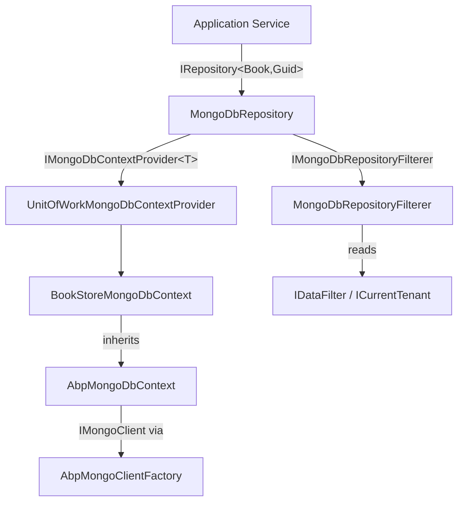

ABP's MongoDB integration lives in `Volo.Abp.MongoDB` and offers a first-class alternative to the EF Core provider. It wraps the official MongoDB .NET driver with ABP's [Repository](/ddd/repositories) and [Unit of Work](/ddd/unit-of-work) abstractions, applies soft-delete and multi-tenant filters through `IMongoDbRepositoryFilterer`, and handles BSON serialization quirks (GUIDs, DateTimes, extra properties) automatically. The programming model deliberately mirrors the EF Core integration so teams can switch providers with minimal application-layer changes.

<CardGroup cols={2}>
  <Card title="AbpMongoDbContext" icon="database" href="#abpmongodbcontext">
    Base context wrapping IMongoDatabase and IMongoClient
  </Card>
  <Card title="MongoDbRepository" icon="code" href="#mongodbrepository">
    Generic repository with filter, aggregate, and queryable support
  </Card>
  <Card title="BSON Serializers" icon="file-code" href="#bson-serializers">
    Guid, DateTime, and ExtraProperties handling
  </Card>
  <Card title="DI Registration" icon="plug" href="#registering-a-mongodb-context">
    AddMongoDbContext, connection strings, client factory
  </Card>
</CardGroup>

---

## Module

`AbpMongoDbModule` (in `Volo/Abp/MongoDB/AbpMongoDbModule.cs`) is the root module. Depend on it from your data-layer module:

```csharp
[DependsOn(typeof(AbpMongoDbModule))]
public class MyAppMongoDbModule : AbpModule { }
```

The module's static constructor resets the default `Guid` BSON serializer and registers `GuidSerializer(GuidRepresentation.Standard)` and `AbpGuidCustomBsonTypeMapper` globally. `ConfigureServices` registers `UnitOfWorkMongoDbContextProvider<>` as `IMongoDbContextProvider<>` and enumerates the `IMongoDbRepositoryFilterer<>` implementations.

---

## `AbpMongoDbContext`

**File:** `Volo/Abp/MongoDB/AbpMongoDbContext.cs`

`AbpMongoDbContext` implements `IAbpMongoDbContext` and is the base class for all ABP MongoDB contexts. It is registered as `ITransientDependency`:

```csharp
public abstract class AbpMongoDbContext : IAbpMongoDbContext, ITransientDependency
{
    public IAbpLazyServiceProvider LazyServiceProvider { get; set; } = default!;
    public IMongoModelSource ModelSource { get; set; } = default!;

    public IMongoClient Client { get; private set; } = default!;
    public IMongoDatabase Database { get; private set; } = default!;
    public IClientSessionHandle? SessionHandle { get; private set; }

    public virtual void InitializeDatabase(
        IMongoDatabase database,
        IMongoClient client,
        IClientSessionHandle? sessionHandle)
    {
        Database = database;
        Client = client;
        SessionHandle = sessionHandle;
    }

    public virtual IMongoCollection<T> Collection<T>()
        => Database.GetCollection<T>(GetCollectionName<T>());

    protected internal virtual void CreateModel(IMongoModelBuilder modelBuilder) { }
}
```

Override `CreateModel` to map entity types to collection names and configure indexes:

```csharp
public class BookStoreMongoDbContext : AbpMongoDbContext
{
    public IMongoCollection<Book> Books =>
        Collection<Book>();

    protected override void CreateModel(IMongoModelBuilder modelBuilder)
    {
        base.CreateModel(modelBuilder);

        modelBuilder.Entity<Book>(b =>
        {
            b.CollectionName = "Books";
        });
    }
}
```

### `AbpMongoModelBuilderConfigurationOptions`

**File:** `Volo/Abp/MongoDB/AbpMongoModelBuilderConfigurationOptions.cs`

Provides a `CollectionPrefix` used by module-level model configuration to namespace collection names:

```csharp
public class AbpMongoModelBuilderConfigurationOptions
{
    public string CollectionPrefix { get; set; }

    public AbpMongoModelBuilderConfigurationOptions(string collectionPrefix = "")
    {
        CollectionPrefix = collectionPrefix;
    }
}
```

Module authors set this in their `MongoDbContextModelBuilderExtensions` helper so all module collections share the same prefix (e.g., `"Identity"`).

---

## `MongoDbRepository<TMongoDbContext, TEntity, TKey>`

**File:** `Volo/Abp/Domain/Repositories/MongoDB/MongoDbRepository.cs`

`MongoDbRepository<TMongoDbContext, TEntity>` extends `RepositoryBase<TEntity>` and implements `IMongoDbRepository<TEntity>`. The keyed variant additionally implements `IRepository<TEntity, TKey>`:

```csharp
public class MongoDbRepository<TMongoDbContext, TEntity>
    : RepositoryBase<TEntity>, IMongoDbRepository<TEntity>
    where TMongoDbContext : IAbpMongoDbContext
    where TEntity : class, IEntity
{
    protected Task<TMongoDbContext> GetDbContextAsync(
        CancellationToken cancellationToken = default)
    {
        if (!EntityHelper.IsMultiTenant<TEntity>())
        {
            using (CurrentTenant.Change(null))
                return DbContextProvider.GetDbContextAsync(cancellationToken);
        }
        return DbContextProvider.GetDbContextAsync(cancellationToken);
    }

    public virtual async Task<IMongoCollection<TEntity>> GetCollectionAsync(
        CancellationToken cancellationToken = default)
    {
        return (await GetDbContextAsync(cancellationToken)).Collection<TEntity>();
    }
}
```

### `IMongoDbRepository<TEntity, TKey>`

**File:** `Volo/Abp/Domain/Repositories/MongoDB/IMongoDbRepository.cs`

```csharp
public interface IMongoDbRepository<TEntity> : IRepository<TEntity>
    where TEntity : class, IEntity
{
    [Obsolete("Use GetDatabaseAsync method.")]
    IMongoDatabase Database { get; }

    Task<IMongoDatabase> GetDatabaseAsync(CancellationToken cancellationToken = default);

    [Obsolete("Use GetCollectionAsync method.")]
    IMongoCollection<TEntity> Collection { get; }

    Task<IMongoCollection<TEntity>> GetCollectionAsync(CancellationToken cancellationToken = default);

    Task<IQueryable<TEntity>> GetQueryableAsync(
        CancellationToken cancellationToken = default,
        AggregateOptions? options = null);

    Task<IAggregateFluent<TEntity>> GetAggregateAsync(
        CancellationToken cancellationToken = default,
        AggregateOptions? options = null);
}
```

Inject `IMongoDbRepository<Book, Guid>` in domain services that need raw `IMongoCollection<T>` or fluent aggregate access beyond standard CRUD.

---

## Data Filter Support

### `IMongoDbRepositoryFilterer`

**File:** `Volo/Abp/Domain/Repositories/MongoDB/IMongoDbRepositoryFilterer.cs`

Because MongoDB has no EF Core-style global query filters, ABP implements filtering at the repository level via `IMongoDbRepositoryFilterer<TEntity>`:

```csharp
public interface IMongoDbRepositoryFilterer<TEntity> where TEntity : class, IEntity
{
    Task AddGlobalFiltersAsync(List<FilterDefinition<TEntity>> filters);
    TQueryable FilterQueryable<TQueryable>(TQueryable query)
        where TQueryable : IQueryable<TEntity>;
}
```

The default implementation, `MongoDbRepositoryFilterer<TEntity>`, adds a `Builders<T>.Filter.Eq(e => ((ISoftDelete)e).IsDeleted, false)` filter when `ISoftDelete` is active, and a `TenantId` equality filter when `IMultiTenant` is active:

```csharp
public virtual Task AddGlobalFiltersAsync(List<FilterDefinition<TEntity>> filters)
{
    if (typeof(ISoftDelete).IsAssignableFrom(typeof(TEntity))
        && DataFilter.IsEnabled<ISoftDelete>())
    {
        filters.Add(Builders<TEntity>.Filter
            .Eq(e => ((ISoftDelete)e).IsDeleted, false));
    }

    if (typeof(IMultiTenant).IsAssignableFrom(typeof(TEntity)))
    {
        var tenantId = CurrentTenant.Id;
        filters.Add(Builders<TEntity>.Filter
            .Eq(e => ((IMultiTenant)e).TenantId, tenantId));
    }

    return Task.CompletedTask;
}
```

`IMongoDbRepositoryFilterer<TEntity, TKey>` additionally exposes methods to build `FilterDefinition<T>` for single entities, lists of entities, and lists of IDs — used internally by `InsertAsync`, `UpdateAsync`, and `DeleteAsync`.

<Note>
Because filters are applied inside the repository rather than at the EF Core query-pipeline level, they respect `IDataFilter.Disable<ISoftDelete>()` scopes the same way the EF Core integration does. See [Data Filtering](/data/data-filtering).
</Note>

---

## BSON Serializers

### `AbpBsonSerializer`

**File:** `Volo/Abp/MongoDB/AbpBsonSerializer.cs`

A static utility that exposes the internal `BsonSerializer` cache, allowing ABP to remove the default `Guid` serializer before registering its own:

```csharp
public static class AbpBsonSerializer
{
    public static void RemoveSerializer<T>()
    {
        Cache.TryRemove(typeof(T), out _);
    }
}
```

Called in `AbpMongoDbModule`'s static constructor to ensure `GuidSerializer(GuidRepresentation.Standard)` takes precedence.

### `AbpGuidCustomBsonTypeMapper`

**File:** `Volo/Abp/MongoDB/AbpGuidCustomBsonTypeMapper.cs`

Implements `ICustomBsonTypeMapper` so that `Guid` values are written as `BinData` with `UUID (standard)` subtype rather than the legacy CSHARP-UUID format:

```csharp
public class AbpGuidCustomBsonTypeMapper : ICustomBsonTypeMapper
{
    public bool TryMapToBsonValue(object value, out BsonValue bsonValue)
    {
        bsonValue = new BsonBinaryData((Guid)value, GuidRepresentation.Standard);
        return true;
    }
}
```

### `AbpMongoDbDateTimeSerializer`

**File:** `Volo/Abp/MongoDB/AbpMongoDbDateTimeSerializer.cs`

A `StructSerializerBase<DateTime>` that stores `DateTime` values as Unix milliseconds in UTC and optionally suppresses driver normalization to preserve the original `DateTimeKind`:

```csharp
public class AbpMongoDbDateTimeSerializer : StructSerializerBase<DateTime>
{
    public override void Serialize(
        BsonSerializationContext context,
        BsonSerializationArgs args,
        DateTime value)
    {
        context.Writer.WriteDateTime(DisableDateTimeNormalization
            ? ToMillisecondsSinceEpoch(value)
            : ToMillisecondsSinceEpoch(DateTime.SpecifyKind(value, DateTimeKind)));
    }
}
```

The serializer is instantiated by `MongoModelBuilder` during model initialization. The `DateTimeKind` is read from `AbpClockOptions.Kind`, and per-property normalization suppression is controlled by decorating the entity or property with `[DisableDateTimeNormalizationAttribute]`. Whether datetime serialization is enabled at all is governed by `AbpMongoDbOptions.UseAbpClockHandleDateTime` (default: `true`).

---

## `AbpMongoClientFactory`

**File:** `Volo/Abp/MongoDB/Clients/AbpMongoClientFactory.cs`

A singleton that caches `MongoClient` instances keyed by connection URL. The factory reads `AbpMongoDbContextOptions.MongoClientSettingsConfigurer` to apply custom TLS, authentication, or compressor settings before constructing the client:

```csharp
public class AbpMongoClientFactory : IAbpMongoClientFactory, ISingletonDependency
{
    protected ConcurrentDictionary<string, MongoClient> ClientCache { get; }

    public virtual Task<MongoClient> GetAsync(MongoUrl mongoUrl)
    {
        return Task.FromResult(
            ClientCache.GetOrAdd(mongoUrl.ToString(), _ =>
            {
                var settings = MongoClientSettings.FromUrl(mongoUrl);
                Options.MongoClientSettingsConfigurer?.Invoke(settings);
                return new MongoClient(settings);
            }));
    }
}
```

Customize the settings globally:

```csharp
Configure<AbpMongoDbContextOptions>(options =>
{
    options.MongoClientSettingsConfigurer = settings =>
    {
        settings.SslSettings = new SslSettings { EnabledSslProtocols = SslProtocols.Tls12 };
    };
});
```

---

## Registering a MongoDB Context

### `services.AddMongoDbContext<TMongoDbContext>()`

**File:** `Microsoft/Extensions/DependencyInjection/AbpMongoDbServiceCollectionExtensions.cs`

```csharp
public override void ConfigureServices(ServiceConfigurationContext context)
{
    context.Services.AddMongoDbContext<BookStoreMongoDbContext>(options =>
    {
        options.AddDefaultRepositories();
        options.AddRepository<Book, BookMongoRepository>();
    });
}
```

This creates `AbpMongoDbContextRegistrationOptions`, scans for `[ReplaceDbContext]` attributes, and runs `MongoDbRepositoryRegistrar` to bind repository interfaces.

### Connection Strings

Configure in `appsettings.json` using a standard MongoDB URI:

```json
{
  "ConnectionStrings": {
    "Default": "mongodb://localhost:27017/BookStore"
  }
}
```

`ConnectionStringNameAttribute` on the context class overrides the resolved name. Per-tenant connection strings are supported via [multi-tenancy](/infrastructure/multi-tenancy) when `IConnectionStringResolver` is backed by a tenant-aware store.

---

## Differences from EF Core Integration

| Aspect | EF Core | MongoDB |
|--------|---------|---------|
| Filter mechanism | `HasQueryFilter` (SQL WHERE) | `FilterDefinition` in repository |
| Transaction scope | EF Core `IDbContextTransaction` | `IClientSessionHandle` |
| Change tracking | `ChangeTracker` | Not supported; always explicit save |
| Migrations | `dotnet-ef migrations` | None; schema-free documents |
| Bulk operations | `IEfCoreBulkOperationProvider` | `IMongoDbBulkOperationProvider` |
| Context base | `AbpDbContext<T>` | `AbpMongoDbContext` |
| DI extension | `AddAbpDbContext<T>` | `AddMongoDbContext<T>` |

---

## Architecture Overview



<Tip>
Define a custom repository interface (e.g. `IBookRepository`) that extends `IMongoDbRepository<Book, Guid>`, and bind it in `AddMongoDbContext`. This lets your domain layer stay free of MongoDB-driver types while still exposing `GetAggregateAsync` for complex aggregation pipelines.
</Tip>

---

## Related Pages

- [Repositories (DDD)](/ddd/repositories) — `IRepository<T>` abstraction and CRUD operations
- [Unit of Work](/ddd/unit-of-work) — session lifecycle and `IMongoDbContextProvider<T>`
- [Data Filtering](/data/data-filtering) — `IDataFilter`, `ISoftDelete`, `IMultiTenant` scopes
- [Multi-Tenancy](/infrastructure/multi-tenancy) — per-tenant databases and connection resolution
