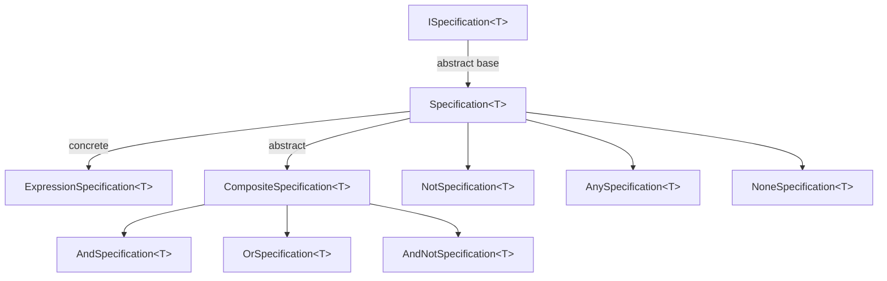

The Specification pattern encapsulates a query predicate as a first-class object, making business rules reusable, composable, and testable without leaking raw LINQ expressions across the codebase. ABP's implementation lives in `Volo.Abp.Specifications` and provides a hierarchy of types — from the primitive `ExpressionSpecification<T>` to composite `AndSpecification<T>`, `OrSpecification<T>`, `AndNotSpecification<T>` — all producing `Expression<Func<T, bool>>` trees that translate transparently to SQL or MongoDB filter definitions through standard LINQ providers. The extension methods on `ISpecification<T>` let you chain them in a fluent, declarative style.

<CardGroup cols={2}>
  <Card title="Core Interfaces" icon="code" href="#ispecificationt-and-specificationt">
    ISpecification&lt;T&gt;, Specification&lt;T&gt;, ExpressionSpecification&lt;T&gt;
  </Card>
  <Card title="Composition" icon="diagram-project" href="#composing-specifications">
    And(), Or(), AndNot(), Not() extension methods
  </Card>
  <Card title="Composite Types" icon="layer-group" href="#composite-specification-classes">
    AndSpecification, OrSpecification, AndNotSpecification, NotSpecification
  </Card>
  <Card title="Special Cases" icon="star" href="#anyspecification-and-nonespecification">
    AnySpecification (always true), NoneSpecification (always false)
  </Card>
</CardGroup>

---

## Module

`AbpSpecificationsModule` is the root module. Add it as a dependency when you want to use the specification types:

```csharp
[DependsOn(typeof(AbpSpecificationsModule))]
public class MyDomainModule : AbpModule { }
```

---

## `ISpecification<T>` and `Specification<T>`

**File:** `Volo/Abp/Specifications/ISpecification.cs` · `Volo/Abp/Specifications/Specification.cs`

Every specification implements `ISpecification<T>`:

```csharp
public interface ISpecification<T>
{
    /// <summary>
    /// Returns true if the specification is satisfied by the given object.
    /// </summary>
    bool IsSatisfiedBy(T obj);

    /// <summary>
    /// Returns the LINQ expression that represents this specification.
    /// Used by repositories to translate the spec into a database query.
    /// </summary>
    Expression<Func<T, bool>> ToExpression();
}
```

`Specification<T>` is the abstract base class. Its `IsSatisfiedBy` compiles the expression and evaluates it in-memory, so you can reuse the same spec for both LINQ-to-objects unit tests and LINQ-to-database queries:

```csharp
public abstract class Specification<T> : ISpecification<T>
{
    public virtual bool IsSatisfiedBy(T obj)
        => ToExpression().Compile()(obj);

    public abstract Expression<Func<T, bool>> ToExpression();

    // Implicit conversion to Expression<Func<T, bool>>
    public static implicit operator Expression<Func<T, bool>>(Specification<T> specification)
        => specification.ToExpression();
}
```

The implicit cast operator means a `Specification<T>` can be passed directly wherever an `Expression<Func<T, bool>>` is expected.

---

## `ExpressionSpecification<T>`

**File:** `Volo/Abp/Specifications/ExpressionSpecification.cs`

The simplest concrete specification — wraps a lambda you supply:

```csharp
public class ExpressionSpecification<T> : Specification<T>
{
    private readonly Expression<Func<T, bool>> _expression;

    public ExpressionSpecification(Expression<Func<T, bool>> expression)
    {
        _expression = expression;
    }

    public override Expression<Func<T, bool>> ToExpression()
        => _expression;
}
```

Use it for ad-hoc predicates that don't deserve a named class:

```csharp
ISpecification<Book> cheapBooks =
    new ExpressionSpecification<Book>(b => b.Price < 20.0m);
```

---

## Defining Named Specifications

The idiomatic way is to subclass `Specification<T>` and override `ToExpression`:

```csharp
public class ActiveBookSpecification : Specification<Book>
{
    public override Expression<Func<Book, bool>> ToExpression()
        => book => !book.IsDeleted && book.IsPublished;
}

public class PremiumBookSpecification : Specification<Book>
{
    private readonly decimal _priceThreshold;

    public PremiumBookSpecification(decimal priceThreshold = 50.0m)
    {
        _priceThreshold = priceThreshold;
    }

    public override Expression<Func<Book, bool>> ToExpression()
        => book => book.Price >= _priceThreshold;
}
```

---

## Composing Specifications

**File:** `Volo/Abp/Specifications/SpecificationExtensions.cs`

`SpecificationExtensions` adds fluent composition methods to any `ISpecification<T>`:

```csharp
public static ISpecification<T> And<T>(
    this ISpecification<T> specification,
    ISpecification<T> other)
    => new AndSpecification<T>(specification, other);

public static ISpecification<T> Or<T>(
    this ISpecification<T> specification,
    ISpecification<T> other)
    => new OrSpecification<T>(specification, other);

public static ISpecification<T> AndNot<T>(
    this ISpecification<T> specification,
    ISpecification<T> other)
    => new AndNotSpecification<T>(specification, other);

public static ISpecification<T> Not<T>(
    this ISpecification<T> specification)
    => new NotSpecification<T>(specification);
```

### Example: Chaining

```csharp
var activeSpec   = new ActiveBookSpecification();
var premiumSpec  = new PremiumBookSpecification(priceThreshold: 50.0m);
var discountSpec = new ExpressionSpecification<Book>(b => b.HasDiscount);

// Active AND (premium OR discounted)
ISpecification<Book> featuredBooks =
    activeSpec.And(premiumSpec.Or(discountSpec));

// Active AND NOT premium
ISpecification<Book> affordableActiveBooks =
    activeSpec.AndNot(premiumSpec);
```

---

## Composite Specification Classes

### `CompositeSpecification<T>`

**File:** `Volo/Abp/Specifications/CompositeSpecification.cs`

Abstract base for all binary compositions. Stores the two operand specifications as `Left` and `Right`:

```csharp
public abstract class CompositeSpecification<T> : Specification<T>, ICompositeSpecification<T>
{
    public ISpecification<T> Left { get; }
    public ISpecification<T> Right { get; }

    protected CompositeSpecification(ISpecification<T> left, ISpecification<T> right)
    {
        Left = left;
        Right = right;
    }
}
```

### `AndSpecification<T>`

**File:** `Volo/Abp/Specifications/AndSpecification.cs`

Combines two expressions with `&&` using the `ExpressionFuncExtender.And` helper:

```csharp
public class AndSpecification<T> : CompositeSpecification<T>
{
    public override Expression<Func<T, bool>> ToExpression()
        => Left.ToExpression().And(Right.ToExpression());
}
```

### `OrSpecification<T>`

**File:** `Volo/Abp/Specifications/OrSpecification.cs`

Combines two expressions with `||`:

```csharp
public class OrSpecification<T> : CompositeSpecification<T>
{
    public override Expression<Func<T, bool>> ToExpression()
        => Left.ToExpression().Or(Right.ToExpression());
}
```

### `AndNotSpecification<T>`

**File:** `Volo/Abp/Specifications/AndNotSpecification.cs`

Left expression `&&` the negation of the right expression:

```csharp
public class AndNotSpecification<T> : CompositeSpecification<T>
{
    public override Expression<Func<T, bool>> ToExpression()
    {
        var rightExpression = Right.ToExpression();
        var bodyNot = Expression.Not(rightExpression.Body);
        var notExpr = Expression.Lambda<Func<T, bool>>(bodyNot, rightExpression.Parameters);
        return Left.ToExpression().And(notExpr);
    }
}
```

### `NotSpecification<T>`

**File:** `Volo/Abp/Specifications/NotSpecification.cs`

Negates a single specification:

```csharp
public class NotSpecification<T> : Specification<T>
{
    private readonly ISpecification<T> _specification;

    public override Expression<Func<T, bool>> ToExpression()
    {
        var expression = _specification.ToExpression();
        return Expression.Lambda<Func<T, bool>>(
            Expression.Not(expression.Body),
            expression.Parameters);
    }
}
```

---

## `AnySpecification` and `NoneSpecification`

**Files:** `Volo/Abp/Specifications/AnySpecification.cs` · `Volo/Abp/Specifications/NoneSpecification.cs`

Sentinel specifications that always evaluate to `true` or `false` respectively. Useful as neutral identities when building specifications conditionally:

```csharp
// AnySpecification — always satisfied
public sealed class AnySpecification<T> : Specification<T>
{
    public override Expression<Func<T, bool>> ToExpression()
        => o => true;
}

// NoneSpecification — never satisfied
public sealed class NoneSpecification<T> : Specification<T>
{
    public override Expression<Func<T, bool>> ToExpression()
        => o => false;
}
```

```csharp
// Build a spec from a list of conditions
ISpecification<Book> spec = new AnySpecification<Book>(); // start with "all"

if (onlyActive)
    spec = spec.And(new ActiveBookSpecification());

if (minPrice.HasValue)
    spec = spec.And(new ExpressionSpecification<Book>(b => b.Price >= minPrice.Value));
```

---

## `ISpecificationParser<TCriteria>`

**File:** `Volo/Abp/Specifications/ISpecificationParser.cs`

An extension point for converting a specification into a domain-specific query criteria object (e.g. for NHibernate `ICriteria`, Elasticsearch `QueryContainer`, etc.):

```csharp
public interface ISpecificationParser<out TCriteria>
{
    TCriteria Parse<T>(ISpecification<T> specification);
}
```

ABP does not ship a built-in parser; implement this interface when targeting a query engine that doesn't accept `Expression<Func<T,bool>>` directly.

---

## Integration with Repositories

ABP repositories accept specifications via overloads on `IRepository.GetListAsync` and `IRepository.GetCountAsync`. Pass a specification instead of a raw lambda to keep query logic out of application services:

```csharp
public class BookAppService : ApplicationService
{
    private readonly IRepository<Book, Guid> _bookRepository;

    public async Task<List<Book>> GetFeaturedBooksAsync()
    {
        var spec = new ActiveBookSpecification()
            .And(new PremiumBookSpecification(priceThreshold: 50.0m));

        return await _bookRepository.GetListAsync(spec);
    }
}
```

Internally the repository calls `spec.ToExpression()` and passes it to the provider's LINQ query, so no in-memory evaluation occurs — the predicate compiles directly to SQL or a MongoDB filter definition.

<Note>
`IsSatisfiedBy(T obj)` is useful in unit tests to verify spec logic against in-memory objects without requiring a database. The same expression is then used by the production query path with zero extra effort.
</Note>

---

## Composition Tree



---

## Recommended Practices

<Steps>
  <Step title="One class per rule">
    Name each specification after the business rule it encodes (`PremiumBookSpecification`, `OverdueOrderSpecification`). This makes them discoverable and reusable across features.
  </Step>
  <Step title="Constructor-inject parameters">
    Pass thresholds or identifiers through the constructor rather than capturing ambient services. This keeps specs pure and unit-testable without a DI container.
  </Step>
  <Step title="Compose at the application layer">
    Domain specifications stay atomic. Combine them in application services or query objects using `.And()` / `.Or()` to express complex use-case filters.
  </Step>
  <Step title="Use AnySpecification as a base">
    When building a specification dynamically from optional filters, start with `new AnySpecification<T>()` and chain `.And(...)` only for conditions that are actually present.
  </Step>
</Steps>

---

## Related Pages

- [Repositories (DDD)](/ddd/repositories) — `IRepository.GetListAsync(ISpecification<T>)` integration
- [Entity Framework Core Integration](/data/entity-framework-core) — how `Expression<Func<T,bool>>` reaches the SQL query
- [MongoDB Integration](/data/mongodb) — LINQ queryable filtering in `MongoDbRepository`
- [Data Filtering](/data/data-filtering) — system-level filters (soft delete, multi-tenancy) that compose orthogonally with specifications
