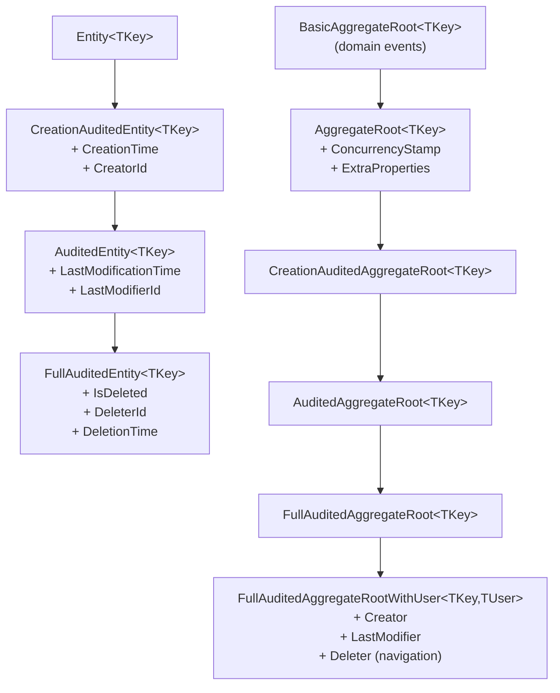

ABP's domain layer follows the tactical patterns of Domain-Driven Design closely. Every persistent object starts from a small, well-typed class hierarchy defined in `Volo.Abp.Ddd.Domain` (`Volo/Abp/Domain/Entities/`). Choosing the right base class is one of the most consequential decisions in a service's design — it determines what auditing columns appear in the database, whether the object can emit domain events, and how optimistic concurrency is handled.

## `Entity<TKey>` — The Root of the Hierarchy

`Entity<TKey>` (`Entity.cs`) is the thinnest useful base class:

```csharp
[Serializable]
public abstract class Entity<TKey> : Entity, IEntity<TKey>
{
    public virtual TKey Id { get; protected set; } = default!;

    protected Entity() { }

    protected Entity(TKey id) { Id = id; }

    public override object?[] GetKeys() => [Id];

    public override string ToString() => $"[ENTITY: {GetType().Name}] Id = {Id}";
}
```

Use `Entity<TKey>` for child objects that are owned by an aggregate and will never be fetched independently. They do not generate domain events and have no concurrency stamp.

<Note>
`Entity` (non-generic) also exists for composite-key scenarios. Override `GetKeys()` to return the multi-part key array. Most entities use the generic form.
</Note>

---

## `BasicAggregateRoot<TKey>` — Domain Events Without Extra Overhead

`BasicAggregateRoot<TKey>` (`BasicAggregateRoot.cs`) extends `Entity<TKey>` and implements `IGeneratesDomainEvents`:

```csharp
[Serializable]
public abstract class BasicAggregateRoot<TKey> : Entity<TKey>,
    IAggregateRoot<TKey>,
    IGeneratesDomainEvents
{
    private ICollection<DomainEventRecord>? _distributedEvents;
    private ICollection<DomainEventRecord>? _localEvents;

    public virtual IEnumerable<DomainEventRecord> GetLocalEvents()
        => _localEvents ?? Array.Empty<DomainEventRecord>();

    public virtual IEnumerable<DomainEventRecord> GetDistributedEvents()
        => _distributedEvents ?? Array.Empty<DomainEventRecord>();

    public virtual void ClearLocalEvents() => _localEvents?.Clear();
    public virtual void ClearDistributedEvents() => _distributedEvents?.Clear();

    protected virtual void AddLocalEvent(object eventData)
    {
        _localEvents ??= new Collection<DomainEventRecord>();
        _localEvents.Add(new DomainEventRecord(eventData, EventOrderGenerator.GetNext()));
    }

    protected virtual void AddDistributedEvent(object eventData)
    {
        _distributedEvents ??= new Collection<DomainEventRecord>();
        _distributedEvents.Add(new DomainEventRecord(eventData, EventOrderGenerator.GetNext()));
    }
}
```

`IGeneratesDomainEvents` (`IGeneratesDomainEvents.cs`) is the interface that the Unit of Work infrastructure reads when collecting events to publish:

```csharp
public interface IGeneratesDomainEvents
{
    IEnumerable<DomainEventRecord> GetLocalEvents();
    IEnumerable<DomainEventRecord> GetDistributedEvents();
    void ClearLocalEvents();
    void ClearDistributedEvents();
}
```

- **Local events** are published inside the same process via the local event bus and cleared after the Unit of Work completes.
- **Distributed events** are published to the outbox / message broker and cleared after successful commit.

```csharp
public class Order : BasicAggregateRoot<Guid>
{
    public OrderStatus Status { get; private set; }

    public void Cancel()
    {
        if (Status == OrderStatus.Completed)
            throw new BusinessException("Order.CannotCancelCompleted");

        Status = OrderStatus.Cancelled;
        AddLocalEvent(new OrderCancelledEvent(Id));
        AddDistributedEvent(new OrderCancelledDistributedEvent(Id));
    }
}
```

---

## `AggregateRoot<TKey>` — Concurrency Stamps and Extra Properties

`AggregateRoot<TKey>` (`AggregateRoot.cs`) extends `BasicAggregateRoot<TKey>` with two widely-used cross-cutting concerns:

```csharp
[Serializable]
public abstract class AggregateRoot<TKey> : BasicAggregateRoot<TKey>,
    IHasExtraProperties,
    IHasConcurrencyStamp
{
    public virtual ExtraPropertyDictionary ExtraProperties { get; protected set; }

    [DisableAuditing]
    public virtual string ConcurrencyStamp { get; set; }

    protected AggregateRoot()
    {
        ConcurrencyStamp = Guid.NewGuid().ToString("N");
        ExtraProperties = new ExtraPropertyDictionary();
        this.SetDefaultsForExtraProperties();
    }

    protected AggregateRoot(TKey id)
        : base(id)
    {
        ConcurrencyStamp = Guid.NewGuid().ToString("N");
        ExtraProperties = new ExtraPropertyDictionary();
        this.SetDefaultsForExtraProperties();
    }
}
```

| Feature | Interface | Purpose |
|---|---|---|
| `ConcurrencyStamp` | `IHasConcurrencyStamp` | Optimistic concurrency; EF Core maps this to a `byte[]` rowversion or string column |
| `ExtraProperties` | `IHasExtraProperties` | Schemaless key-value store for module extensions and custom fields |

<Tip>
Prefer `AggregateRoot<TKey>` over `BasicAggregateRoot<TKey>` for most aggregate roots. The concurrency stamp prevents lost-update bugs in high-contention scenarios at negligible cost.
</Tip>

---

## Auditing Entity Hierarchy

ABP provides a layered set of auditing base classes for both plain entities and aggregate roots. Each level adds more audit columns.



### `CreationAuditedEntity<TKey>`

```csharp
public abstract class CreationAuditedEntity<TKey> : Entity<TKey>, ICreationAuditedObject
{
    public virtual DateTime CreationTime { get; protected set; }
    public virtual Guid? CreatorId { get; protected set; }
}
```

### `AuditedEntity<TKey>`

Adds `LastModificationTime` and `LastModifierId` on top of creation auditing.

### `FullAuditedEntity<TKey>`

Adds soft-delete columns: `IsDeleted`, `DeleterId`, `DeletionTime`. Queries against repositories automatically filter out soft-deleted records when the `ISoftDelete` data filter is enabled.

### `FullAuditedAggregateRoot<TKey>`

The aggregate-root equivalent of `FullAuditedEntity<TKey>` — combines domain events, concurrency stamps, extra properties, and full auditing.

### `FullAuditedAggregateRootWithUser<TKey, TUser>`

Adds navigation properties to the actual user entity:

```csharp
public abstract class FullAuditedAggregateRootWithUser<TKey, TUser>
    : FullAuditedAggregateRoot<TKey>, IFullAuditedObject<TUser>
    where TUser : IEntity<Guid>
{
    public virtual TUser? Creator { get; protected set; }
    public virtual TUser? LastModifier { get; set; }
    public virtual TUser? Deleter { get; set; }
}
```

Use this variant only when you need to eagerly load user details alongside audit information — it introduces a join and requires the `TUser` entity to be in the same DbContext.

---

## Choosing the Right Base Class

<Accordion title="I need a simple child object inside an aggregate">
Use `Entity<TKey>`. Child entities should not emit events or have their own concurrency stamps — those are the aggregate root's responsibility.
</Accordion>

<Accordion title="I need domain events but no auditing columns">
Use `BasicAggregateRoot<TKey>`. Suitable for event-sourced or CQRS write models where you manage auditing separately.
</Accordion>

<Accordion title="I need domain events, optimistic concurrency, and extra properties">
Use `AggregateRoot<TKey>`. This is the standard choice for most aggregate roots in a typical CRUD-with-events application.
</Accordion>

<Accordion title="I need all standard auditing columns plus soft delete">
Use `FullAuditedAggregateRoot<TKey>`. Most application modules in ABP itself (e.g., `IdentityUser`) use this class.
</Accordion>

<Accordion title="I need navigation properties to the user who created/modified/deleted">
Use `FullAuditedAggregateRootWithUser<TKey, TUser>` only if you will load those user references frequently and they share the same DbContext.
</Accordion>

---

## `DomainEventRecord`

Domain events are wrapped in `DomainEventRecord` (`Volo/Abp/Domain/Entities/DomainEventRecord.cs`) which carries the event payload and an ordering token:

```csharp
public class DomainEventRecord
{
    public object EventData { get; }
    public long EventOrder { get; }

    public DomainEventRecord(object eventData, long eventOrder)
    {
        EventData = eventData;
        EventOrder = eventOrder;
    }
}
```

`EventOrderGenerator.GetNext()` returns a monotonically increasing `long` so that events published in a single aggregate operation are dispatched in the correct order regardless of how the UoW collects them.

---

## Related Pages

- [Repositories](./repositories) — How to persist and query entities
- [Domain Services](./domain-services) — Orchestrating complex operations across multiple aggregates
- [Unit of Work](./unit-of-work) — When and how domain events are dispatched
