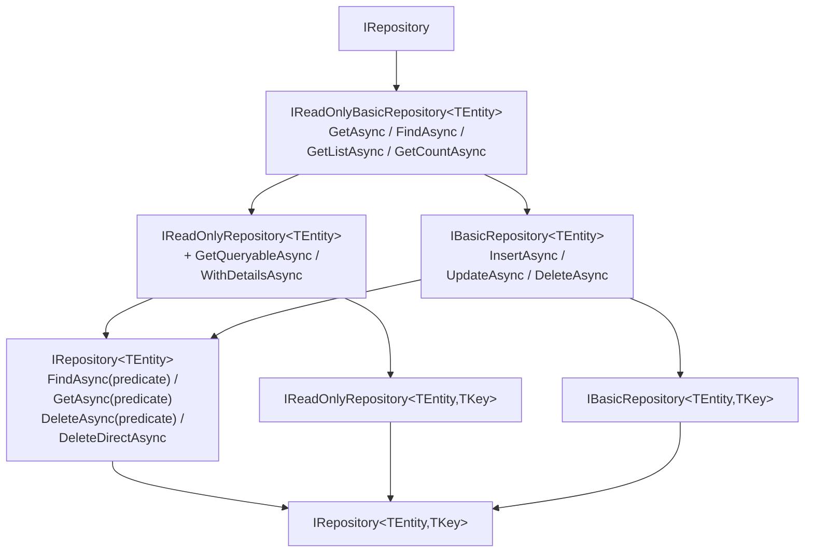

ABP's repository layer is a thin but opinionated abstraction over data access. It follows the Repository pattern from DDD — callers work exclusively against interfaces, concrete implementations are swapped by database provider packages, and data filters (soft-delete, multi-tenancy) are applied automatically. Every repository is a `IUnitOfWorkEnabled` service, meaning calls to its methods are automatically enrolled in the ambient Unit of Work.

## Interface Hierarchy



All files live in `Volo/Abp/Domain/Repositories/` inside `Volo.Abp.Ddd.Domain`.

### `IReadOnlyBasicRepository<TEntity>`

The base read contract: `GetAsync(id)`, `FindAsync(id)`, `GetListAsync()`, `GetCountAsync()`.

### `IReadOnlyRepository<TEntity>`

Adds `IQueryable` access and detail-loading:

```csharp
public interface IReadOnlyRepository<TEntity> : IReadOnlyBasicRepository<TEntity>
    where TEntity : class, IEntity
{
    IAsyncQueryableExecuter AsyncExecuter { get; }

    Task<IQueryable<TEntity>> GetQueryableAsync();

    Task<IQueryable<TEntity>> WithDetailsAsync();
    Task<IQueryable<TEntity>> WithDetailsAsync(
        params Expression<Func<TEntity, object>>[] propertySelectors);

    Task<List<TEntity>> GetListAsync(
        Expression<Func<TEntity, bool>> predicate,
        bool includeDetails = false,
        CancellationToken cancellationToken = default);
}
```

### `IBasicRepository<TEntity>`

The write contract: `InsertAsync`, `InsertManyAsync`, `UpdateAsync`, `UpdateManyAsync`, `DeleteAsync`, `DeleteManyAsync`.

Every mutating method accepts an `autoSave` parameter. When `false` (the default), changes are flushed only when the Unit of Work completes. Set `autoSave: true` to immediately call `SaveChangesAsync` — useful when you need the generated `Id` before the UoW commits.

### `IRepository<TEntity, TKey>` — Full Contract

```csharp
public interface IRepository<TEntity, TKey>
    : IRepository<TEntity>,
      IReadOnlyRepository<TEntity, TKey>,
      IBasicRepository<TEntity, TKey>
    where TEntity : class, IEntity<TKey>
{ }
```

This is what you inject in 95% of cases. In addition to the members above, `IRepository<TEntity>` adds:

```csharp
Task<TEntity?> FindAsync(
    Expression<Func<TEntity, bool>> predicate,
    bool includeDetails = true,
    CancellationToken cancellationToken = default);

Task<TEntity> GetAsync(
    Expression<Func<TEntity, bool>> predicate,
    bool includeDetails = true,
    CancellationToken cancellationToken = default);

Task DeleteAsync(
    Expression<Func<TEntity, bool>> predicate,
    bool autoSave = false,
    CancellationToken cancellationToken = default);

// Bulk delete directly in the database, bypassing domain events and filters:
Task DeleteDirectAsync(
    Expression<Func<TEntity, bool>> predicate,
    CancellationToken cancellationToken = default);
```

<Warning>
`DeleteDirectAsync` bypasses soft-delete, multi-tenancy filters, auditing, and domain events. Use it only for maintenance operations where you explicitly need a raw DELETE statement.
</Warning>

---

## Base Classes

### `BasicRepositoryBase<TEntity>`

Provides lazy-loaded service properties that implementations need:

```csharp
public abstract class BasicRepositoryBase<TEntity> :
    IBasicRepository<TEntity>,
    IServiceProviderAccessor,
    IUnitOfWorkEnabled
{
    public IAbpLazyServiceProvider LazyServiceProvider { get; set; }
    public IDataFilter DataFilter { get; }
    public ICurrentTenant CurrentTenant { get; }
    public IAsyncQueryableExecuter AsyncExecuter { get; }
    public IUnitOfWorkManager UnitOfWorkManager { get; }
    public string ProviderName { get; }
    // ...
}
```

### `RepositoryBase<TEntity>`

Extends `BasicRepositoryBase<TEntity>` and implements the `IQueryable`-based members. It also applies data filters automatically. `RepositoryBase<TEntity, TKey>` further extends this class to implement keyed lookup operations.

```csharp
protected virtual TQueryable ApplyDataFilters<TQueryable>(TQueryable query)
    where TQueryable : IQueryable<TEntity>
{
    if (typeof(ISoftDelete).IsAssignableFrom(typeof(TEntity)))
        query = query.WhereIf(DataFilter.IsEnabled<ISoftDelete>(),
                              e => ((ISoftDelete)e!).IsDeleted == false);

    if (typeof(IMultiTenant).IsAssignableFrom(typeof(TEntity)))
    {
        var tenantId = CurrentTenant.Id;
        query = query.WhereIf(DataFilter.IsEnabled<IMultiTenant>(),
                              e => ((IMultiTenant)e!).TenantId == tenantId);
    }
    return query;
}
```

---

## Using `IQueryable` via `GetQueryableAsync`

```csharp
public class OrderAppService : ApplicationService
{
    private readonly IRepository<Order, Guid> _orderRepo;

    public OrderAppService(IRepository<Order, Guid> orderRepo)
    {
        _orderRepo = orderRepo;
    }

    public async Task<List<OrderSummaryDto>> GetOpenOrdersAsync()
    {
        var query = await _orderRepo.GetQueryableAsync();

        var results = await AsyncExecuter.ToListAsync(
            query.Where(o => o.Status == OrderStatus.Open)
                 .OrderByDescending(o => o.CreationTime)
                 .Select(o => new OrderSummaryDto(o.Id, o.TotalPrice))
        );

        return results;
    }
}
```

<Note>
Always execute `IQueryable` through `IAsyncQueryableExecuter` (accessible as `AsyncExecuter` on `ApplicationService` and `DomainService`). This keeps the domain layer decoupled from ORM-specific extensions like `ToListAsync`.
</Note>

---

## Async Extension Methods

`RepositoryAsyncExtensions.cs` and `RepositoryExtensions.cs` add convenience extensions directly to `IReadOnlyRepository<TEntity>`:

```csharp
// Count with a predicate
var count = await orderRepo.CountAsync(o => o.Status == OrderStatus.Open);

// Any check
bool hasOpen = await orderRepo.AnyAsync(o => o.Status == OrderStatus.Open);

// Min / Max
var oldest = await orderRepo.MinAsync(o => o.CreationTime);
```

---

## Conventional Registration via `AbpRepositoryConventionalRegistrar`

Repositories are **not** registered by the default `DefaultConventionalRegistrar`. Instead, each database-provider module adds an `AbpRepositoryConventionalRegistrar` to the registrar list during its `ConfigureServices`:

```csharp
// Volo/Abp/Domain/Repositories/AbpRepositoryConventionalRegistrar.cs
public class AbpRepositoryConventionalRegistrar : DefaultConventionalRegistrar
{
    protected override bool IsConventionalRegistrationDisabled(Type type)
        => !typeof(IRepository).IsAssignableFrom(type)
           || base.IsConventionalRegistrationDisabled(type);

    // By default only interface registrations are exposed (not the concrete class)
    protected override List<Type> GetExposedServiceTypes(Type type)
    {
        if (ExposeRepositoryClasses) return base.GetExposedServiceTypes(type);
        return base.GetExposedServiceTypes(type).Where(x => x.IsInterface).ToList();
    }

    protected override ServiceLifetime? GetDefaultLifeTimeOrNull(Type type)
        => ServiceLifetime.Transient;
}
```

This ensures that only `IRepository<T, TKey>` (and its supertypes) are resolvable — not the concrete EF Core or MongoDB class — keeping the domain layer database-agnostic.

---

## EF Core Implementation Pattern

EF Core repositories live in `Volo.Abp.EntityFrameworkCore` and inherit from `EfCoreRepository<TDbContext, TEntity, TKey>`. You never write this class yourself for standard entities — the `AddAbpDbContext` method registers them automatically:

```csharp
// In your EF Core module
context.Services.AddAbpDbContext<BookStoreDbContext>(options =>
{
    options.AddDefaultRepositories(includeAllEntities: true);

    // Or explicitly for specific entities:
    options.AddRepository<Book, BookRepository>();
});
```

Custom repository implementations extend `EfCoreRepository` to add domain-specific queries:

```csharp
public class BookRepository : EfCoreRepository<BookStoreDbContext, Book, Guid>,
    IBookRepository
{
    public BookRepository(IDbContextProvider<BookStoreDbContext> dbContextProvider)
        : base(dbContextProvider) { }

    public async Task<List<Book>> GetBestSellersAsync(int count)
    {
        var db = await GetDbContextAsync();
        return await db.Books
            .OrderByDescending(b => b.SalesCount)
            .Take(count)
            .ToListAsync();
    }
}
```

---

## MongoDB Implementation Pattern

MongoDB repositories extend `MongoDbRepository<TMongoDbContext, TEntity, TKey>` (from `Volo.Abp.MongoDB`). The API surface is identical to the EF Core variant; only the `GetDbContextAsync` call and LINQ provider differ.

---

## Cross-Database Switching with `[ReplaceDbContext]`

When a module needs to use a host application's merged `DbContext` instead of its own, apply `[ReplaceDbContext]`:

```csharp
// Volo/Abp/DependencyInjection/ReplaceDbContextAttribute.cs
[AttributeUsage(AttributeTargets.Class, AllowMultiple = true)]
public class ReplaceDbContextAttribute : Attribute
{
    public MultiTenantDbContextType[] ReplacedDbContextTypes { get; }

    public ReplaceDbContextAttribute(params Type[] replacedDbContextTypes) { ... }

    public ReplaceDbContextAttribute(Type replacedDbContextType, MultiTenancySides side) { ... }
}
```

```csharp
[ReplaceDbContext(typeof(IIdentityDbContext))]
[ReplaceDbContext(typeof(ITenantManagementDbContext))]
public class BookStoreDbContext : AbpDbContext<BookStoreDbContext>,
    IIdentityDbContext,
    ITenantManagementDbContext
{
    // Merged DbContext hosts Identity and TenantManagement tables
}
```

ABP resolves the replacement at runtime: any code that requests `IIdentityDbContext` will receive the host's `BookStoreDbContext` instance instead, keeping all repositories within the same transaction.

---

## Related Pages

- [Entities & Aggregates](./entities-and-aggregates) — What types `TEntity` can be
- [Unit of Work](./unit-of-work) — How `autoSave` and change-tracking relate to the UoW
- [Domain Services](./domain-services) — Orchestrating repository calls within a single transaction
