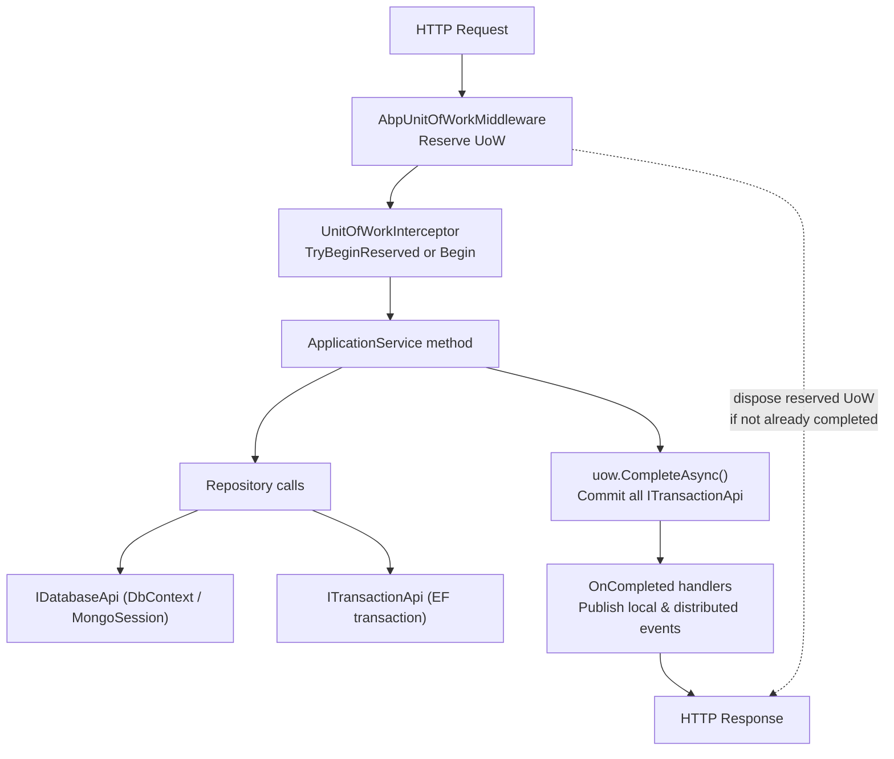
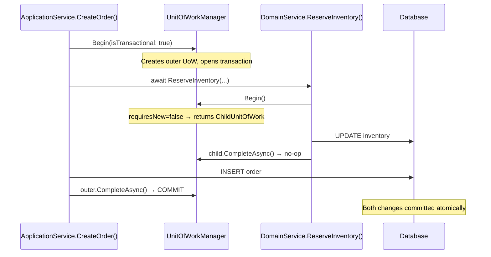

ABP's Unit of Work (UoW) pattern manages database connections, transactions, and change-flushing across an entire request or operation. Rather than calling `SaveChanges` manually at every repository call, you let the UoW infrastructure gather all changes and commit them atomically when the outermost operation completes. This keeps business logic free of infrastructure plumbing while ensuring consistency.

All UoW types live in `Volo.Abp.Uow` (`Volo/Abp/Uow/`).

---

## Core Interfaces

### `IUnitOfWork`

```csharp
public interface IUnitOfWork : IDatabaseApiContainer, ITransactionApiContainer, IDisposable
{
    Guid Id { get; }
    Dictionary<string, object> Items { get; }

    event EventHandler<UnitOfWorkFailedEventArgs> Failed;
    event EventHandler<UnitOfWorkEventArgs> Disposed;

    IAbpUnitOfWorkOptions Options { get; }
    IUnitOfWork? Outer { get; }       // parent UoW in nested scenarios

    bool IsReserved { get; }
    bool IsDisposed { get; }
    bool IsCompleted { get; }

    Task SaveChangesAsync(CancellationToken cancellationToken = default);
    Task CompleteAsync(CancellationToken cancellationToken = default);
    Task RollbackAsync(CancellationToken cancellationToken = default);

    void OnCompleted(Func<Task> handler);  // run handler after commit

    void AddOrReplaceLocalEvent(UnitOfWorkEventRecord record, ...);
    void AddOrReplaceDistributedEvent(UnitOfWorkEventRecord record, ...);
}
```

Key behaviours:
- **`CompleteAsync`** flushes all pending changes and commits the underlying transaction.
- **`RollbackAsync`** discards all changes and rolls back any open transaction.
- **`OnCompleted`** registers a callback that fires after successful `CompleteAsync`. Used internally to publish domain events after the database transaction commits.
- `Items` is a general-purpose dictionary for sharing state between interceptors and handlers within the same UoW scope.

### `IUnitOfWorkManager`

```csharp
public interface IUnitOfWorkManager
{
    IUnitOfWork? Current { get; }

    IUnitOfWork Begin(AbpUnitOfWorkOptions options, bool requiresNew = false);

    IUnitOfWork Reserve(string reservationName, bool requiresNew = false);

    void BeginReserved(string reservationName, AbpUnitOfWorkOptions options);
    bool TryBeginReserved(string reservationName, AbpUnitOfWorkOptions options);
}
```

`UnitOfWorkManager` (`UnitOfWorkManager.cs`) is registered as a **singleton**. Its `Begin` method checks for an ambient (current) UoW:

```csharp
public IUnitOfWork Begin(AbpUnitOfWorkOptions options, bool requiresNew = false)
{
    var currentUow = Current;
    if (currentUow != null && !requiresNew)
    {
        return new ChildUnitOfWork(currentUow); // join existing
    }

    var unitOfWork = CreateNewUnitOfWork();
    unitOfWork.Initialize(options);
    return unitOfWork;
}
```

When `requiresNew = false` and an ambient UoW already exists, `Begin` returns a `ChildUnitOfWork` that delegates every call to the outer UoW. The child's `CompleteAsync` is a no-op — the outer UoW controls the actual commit.

### `IAmbientUnitOfWork`

```csharp
public interface IAmbientUnitOfWork : IUnitOfWorkAccessor
{
    IUnitOfWork? GetCurrentByChecking();
}
```

`IAmbientUnitOfWork` is the ambient-context carrier. It is accessed via `AsyncLocal<T>` state so that each async execution flow has its own ambient UoW. `UnitOfWorkManager.Current` is backed by `_ambientUnitOfWork.GetCurrentByChecking()`.

---

## `IDatabaseApi` and `ITransactionApi`

`IUnitOfWork` implements both `IDatabaseApiContainer` and `ITransactionApiContainer`. These containers hold keyed references to ORM-specific database and transaction objects:

```csharp
public interface IDatabaseApi { }

public interface ITransactionApi : IDisposable
{
    Task CommitAsync(CancellationToken cancellationToken = default);
}
```

Database provider implementations (EF Core, MongoDB) register their `DbContext` (or session) as a `IDatabaseApi` and their transaction as an `ITransactionApi` when the first repository call opens a connection. The UoW calls `CommitAsync()` on every registered `ITransactionApi` during `CompleteAsync`.

This design allows a single UoW to span **multiple databases** — each provider contributes its own API pair, and all are committed in the same `CompleteAsync` call.

---

## `AbpUnitOfWorkOptions` and `[UnitOfWork]`

UoW behavior is controlled by `AbpUnitOfWorkOptions`:

```csharp
public class AbpUnitOfWorkOptions : IAbpUnitOfWorkOptions
{
    public bool IsTransactional { get; set; }   // default: false
    public IsolationLevel? IsolationLevel { get; set; }
    public int? Timeout { get; set; }           // milliseconds
}
```

Override per method or class with the `[UnitOfWork]` attribute:

```csharp
[UnitOfWork(isTransactional: true, IsolationLevel.ReadCommitted)]
public async Task TransferFundsAsync(Guid fromId, Guid toId, decimal amount)
{
    // Both repository calls run inside a single READ COMMITTED transaction
    await _accountRepo.UpdateAsync(from);
    await _accountRepo.UpdateAsync(to);
}
```

`[UnitOfWork(IsDisabled = true)]` prevents the interceptor from starting a UoW for that method even if there is no ambient one. If an ambient UoW exists, `IsDisabled` is ignored.

---

## `IUnitOfWorkEnabled` Marker

Any class implementing `IUnitOfWorkEnabled` is detected by `UnitOfWorkHelper.IsUnitOfWorkClass`. The UoW interceptor is applied to all such classes by `UnitOfWorkInterceptorRegistrar`:

```csharp
public interface IUnitOfWorkEnabled { }
```

`ApplicationService` and `BasicRepositoryBase` both implement this interface. This is why every application service method and every repository call is automatically enrolled in a UoW without explicit attribute decoration.

---

## `UnitOfWorkInterceptor`

The interceptor (`UnitOfWorkInterceptor.cs`) runs around every eligible method invocation:

```csharp
public override async Task InterceptAsync(IAbpMethodInvocation invocation)
{
    if (!UnitOfWorkHelper.IsUnitOfWorkMethod(invocation.Method, out var unitOfWorkAttribute))
    {
        await invocation.ProceedAsync();
        return;
    }

    using (var scope = _serviceScopeFactory.CreateScope())
    {
        var options = CreateOptions(scope.ServiceProvider, invocation, unitOfWorkAttribute);
        var unitOfWorkManager = scope.ServiceProvider.GetRequiredService<IUnitOfWorkManager>();

        // Try to reuse a UoW reserved by the ASP.NET Core middleware
        if (unitOfWorkManager.TryBeginReserved(UnitOfWork.UnitOfWorkReservationName, options))
        {
            await invocation.ProceedAsync();
            if (unitOfWorkManager.Current != null)
                await unitOfWorkManager.Current.SaveChangesAsync();
            return;
        }

        using (var uow = unitOfWorkManager.Begin(options))
        {
            await invocation.ProceedAsync();
            await uow.CompleteAsync();
        }
    }
}
```

The interceptor also determines `IsTransactional` automatically: methods whose names do not start with `Get` are treated as transactional by default (configurable via `AbpUnitOfWorkDefaultOptions`).

---

## Lifecycle Flow



---

## ASP.NET Core Middleware

`AbpUnitOfWorkMiddleware` (in `Volo.Abp.AspNetCore.Uow`) reserves a UoW at the start of every HTTP request:

```csharp
// Registered in OnApplicationInitialization via app.UseUnitOfWork()
app.UseUnitOfWork();
```

This ensures that any repository or application service call within the same request can join the pre-allocated UoW rather than opening a new connection. The middleware reserves the UoW with the name `UnitOfWork.UnitOfWorkReservationName` — this is what the interceptor's `TryBeginReserved` call looks for.

---

## Nested Unit of Work



`ChildUnitOfWork` (`ChildUnitOfWork.cs`) delegates all operations to its parent. Its `CompleteAsync` is a deliberate no-op. Only the outermost `CompleteAsync` triggers the real commit.

Use `requiresNew: true` when you need a genuinely independent transaction:

```csharp
using (var uow = UnitOfWorkManager.Begin(
    new AbpUnitOfWorkOptions { IsTransactional = true },
    requiresNew: true))
{
    await _auditRepo.InsertAsync(auditEntry);
    await uow.CompleteAsync(); // commits independently, even if outer UoW rolls back
}
```

---

## `OnCompleted` for Post-Commit Logic

```csharp
public async Task PlaceOrderAsync(Order order)
{
    await _orderRepo.InsertAsync(order);

    // Register a handler to run only after the transaction commits successfully
    CurrentUnitOfWork!.OnCompleted(async () =>
    {
        await _emailService.SendOrderConfirmationAsync(order.CustomerId, order.Id);
    });
}
```

`OnCompleted` handlers run in registration order after `CompleteAsync` succeeds. They do **not** run if the UoW is rolled back.

---

## Manual UoW Usage Pattern

Outside of application services and repositories, you can manage a UoW manually:

```csharp
public class DataSeedContributor : IDataSeedContributor, ITransientDependency
{
    private readonly IUnitOfWorkManager _uowManager;
    private readonly IRepository<Setting, Guid> _settingRepo;

    public async Task SeedAsync(DataSeedContext context)
    {
        using (var uow = _uowManager.Begin(
            new AbpUnitOfWorkOptions { IsTransactional = true }))
        {
            if (!await _settingRepo.AnyAsync(s => s.Key == "InitialSeed"))
            {
                await _settingRepo.InsertAsync(
                    new Setting(Guid.NewGuid(), "InitialSeed", "true"));
            }
            await uow.CompleteAsync();
        }
    }
}
```

---

## Related Pages

- [Repositories](./repositories) — How `autoSave` and change tracking interact with the UoW
- [Application Services](./application-services) — UoW automatically applied via `IUnitOfWorkEnabled`
- [Domain Services](./domain-services) — Repository calls inside domain services are enrolled in the ambient UoW
- [Application Lifecycle](../module-system/application-lifecycle) — Where `app.UseUnitOfWork()` middleware is registered
