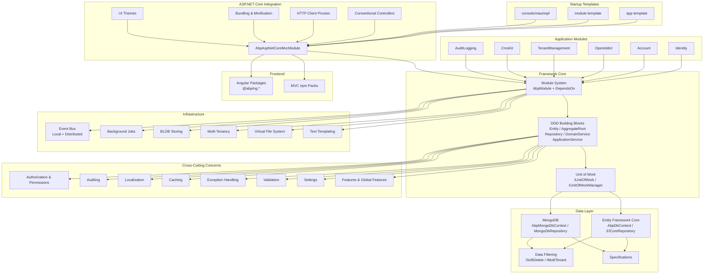

ABP is a modular, opinionated application framework built on top of ASP.NET Core. It provides the foundational infrastructure — dependency injection, module lifecycle, DDD building blocks, data layer abstractions, cross-cutting concerns, and pre-built application modules — so teams can focus on business logic rather than plumbing. The framework is distributed as 177+ NuGet packages under the `Volo.Abp.*` namespace, each encapsulating a single cohesive concern.

## Architecture Overview

## Subsystem Map

<CardGroup cols={2}>
  <Card title="Module System" icon="puzzle-piece" href="/module-system/abp-module">
    `AbpModule` base class, `[DependsOn]` typed dependency graph, and the three-phase service configuration lifecycle.
  </Card>
  <Card title="DDD Building Blocks" icon="layer-group" href="/ddd/entities-and-aggregates">
    `Entity`, `AggregateRoot`, `IRepository`, `DomainService`, `ApplicationService` — the core DDD abstractions and their auditing hierarchies.
  </Card>
  <Card title="Data Layer" icon="database" href="/data/entity-framework-core">
    `AbpDbContext`, `EfCoreRepository`, `AbpMongoDbContext`, data filters (`ISoftDelete`, `IMultiTenant`), and the Specification pattern.
  </Card>
  <Card title="Cross-Cutting Concerns" icon="shield-halved" href="/cross-cutting/authorization-permissions">
    Authorization, auditing, localization, caching, exception handling, validation, settings, and feature flags — all wired via interceptors.
  </Card>
  <Card title="Infrastructure" icon="server" href="/infrastructure/event-bus">
    Distributed Event Bus (Inbox/Outbox), Background Jobs, BLOB Storing, Multi-Tenancy resolution, Virtual File System, and Text Templating.
  </Card>
  <Card title="ASP.NET Core Integration" icon="globe" href="/aspnetcore/mvc-controllers">
    Conventional API controllers, dynamic HTTP client proxies, bundling/minification pipeline, and the UI theming contract.
  </Card>
  <Card title="Application Modules" icon="blocks" href="/modules/identity">
    Pre-built modules: Identity, Account, OpenIddict, TenantManagement, CmsKit, AuditLogging — each a self-contained ABP module with its own DDD layers.
  </Card>
  <Card title="Angular Packages" icon="angular" href="/angular/ng-core">
    `@abp/ng.core` and sibling Angular packages for authentication, identity, settings, feature management, and theming.
  </Card>
  <Card title="MVC UI & Assets" icon="palette" href="/mvc-ui/npm-packs">
    Server-side MVC npm packs (Bootstrap, jQuery, DataTables, SignalR) and the Razor Pages theming system.
  </Card>
  <Card title="ABP CLI & Templates" icon="terminal" href="/tooling/abp-cli">
    `abp` CLI commands, project scaffolding, proxy generation, and the startup template structure.
  </Card>
  <Card title="Build & Configuration" icon="gear" href="/tooling/build-system">
    PowerShell build scripts, `common.props` / `Directory.Build.props`, NuGet versioning, and test configuration.
  </Card>
</CardGroup>

## Where to Start

If you are reading this cold, start with:

1. **[Architecture Overview](/architecture-overview)** — how all subsystems fit together and the request lifecycle end-to-end.
2. **[AbpModule](/module-system/abp-module)** — the central extensibility primitive. Everything in ABP is a module. Understanding `AbpModule` and `[DependsOn]` unlocks the entire codebase.
3. **Key entry points:**
   - `framework/src/Volo.Abp.Core/` — the ABP kernel: `AbpModule`, application bootstrapper, DI extensions, and core utilities.
   - `framework/src/Volo.Abp.Ddd.Domain/` — DDD building blocks: `Entity`, `AggregateRoot`, `IRepository`, `DomainService`.
   - `framework/src/Volo.Abp.AspNetCore.Mvc/Volo/Abp/AspNetCore/Mvc/AbpAspNetCoreMvcModule.cs` — the MVC integration hub.
   - `modules/identity/src/` — a reference implementation of a full ABP application module with all DDD layers.

<Note>
This wiki documents the open-source ABP Framework at version **10.6.0-preview**. Source lives at `framework/` (core packages), `modules/` (application modules), `npm/` (JavaScript packages), and `templates/` (project scaffolds).
</Note>
