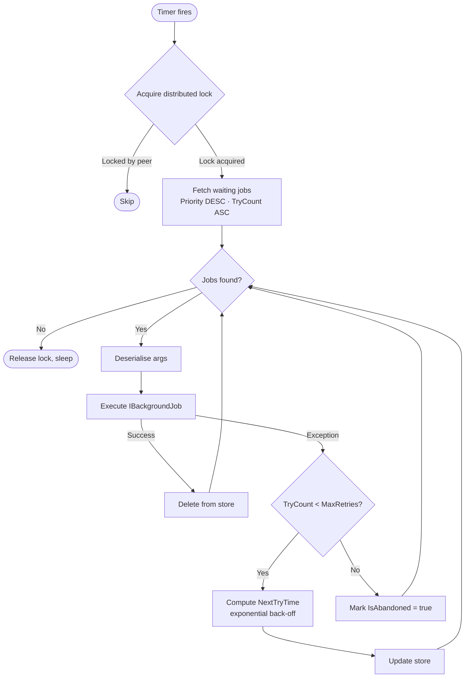

ABP's background-job infrastructure provides a persistent, retry-capable job queue that decouples long-running work from the HTTP request lifecycle. The default implementation stores job metadata in your existing application database and runs a polling worker to execute them; third-party integrations with HangFire and Quartz replace the worker with their own schedulers while keeping the same `IBackgroundJobManager` API.

<CardGroup cols={2}>
  <Card title="IBackgroundJobManager" icon="list-check">
    The single entry point for enqueueing work. Returns a string job-ID and persists the serialised arguments to the store.
  </Card>
  <Card title="BackgroundJobWorker" icon="gears">
    Async polling worker that fetches waiting jobs, executes them via `IBackgroundJobExecuter`, and applies exponential back-off on failure.
  </Card>
  <Card title="IBackgroundJobStore" icon="database">
    Persistence contract. The default in-memory store is swapped for a database-backed one when you add an EF Core or MongoDB module.
  </Card>
  <Card title="IBackgroundJobSerializer" icon="code">
    Serialises/deserialises job arguments. Defaults to `JsonBackgroundJobSerializer` (System.Text.Json).
  </Card>
</CardGroup>

## Core Interfaces

### `IBackgroundJobManager`

```csharp
public interface IBackgroundJobManager
{
    // Enqueue job; returns job ID
    Task<string> EnqueueAsync<TArgs>(
        TArgs args,
        BackgroundJobPriority priority = BackgroundJobPriority.Normal,
        TimeSpan? delay = null);
}
```

### `IBackgroundJob<TArgs>`

Implement this interface to define a job. ABP discovers implementations automatically via DI.

```csharp
public class SendWelcomeEmailArgs
{
    public Guid UserId { get; set; }
    public string Email { get; set; } = default!;
}

public class SendWelcomeEmailJob
    : AsyncBackgroundJob<SendWelcomeEmailArgs>,
      ITransientDependency
{
    private readonly IEmailSender _emailSender;

    public SendWelcomeEmailJob(IEmailSender emailSender)
    {
        _emailSender = emailSender;
    }

    public override async Task ExecuteAsync(SendWelcomeEmailArgs args)
    {
        await _emailSender.SendAsync(
            to: args.Email,
            subject: "Welcome!",
            body: "Thanks for signing up."
        );
    }
}
```

### Enqueueing a job

```csharp
public class UserRegistrationService : ITransientDependency
{
    private readonly IBackgroundJobManager _jobManager;

    public UserRegistrationService(IBackgroundJobManager jobManager)
    {
        _jobManager = jobManager;
    }

    public async Task RegisterAsync(string email)
    {
        // ... registration logic ...

        // Enqueue with optional 30-second delay
        await _jobManager.EnqueueAsync(
            new SendWelcomeEmailArgs { Email = email },
            priority: BackgroundJobPriority.High,
            delay: TimeSpan.FromSeconds(30)
        );
    }
}
```

## `BackgroundJobInfo` — Persistence Model

`BackgroundJobInfo` is the entity ABP persists in your store. It tracks the full job lifecycle:

```csharp
// framework/src/Volo.Abp.BackgroundJobs/Volo/Abp/BackgroundJobs/BackgroundJobInfo.cs

public class BackgroundJobInfo
{
    public Guid Id { get; set; }
    public string? ApplicationName { get; set; }  // for multi-node isolation
    public string JobName { get; set; }            // type name of TArgs
    public string JobArgs { get; set; }            // JSON-serialised args
    public short TryCount { get; set; }
    public DateTime CreationTime { get; set; }
    public DateTime NextTryTime { get; set; }
    public DateTime? LastTryTime { get; set; }
    public bool IsAbandoned { get; set; }          // permanently failed
    public BackgroundJobPriority Priority { get; set; }
}
```

## `DefaultBackgroundJobManager`

The default manager serialises args, constructs a `BackgroundJobInfo`, and delegates to `IBackgroundJobStore`:

```csharp
// framework/src/Volo.Abp.BackgroundJobs/Volo/Abp/BackgroundJobs/DefaultBackgroundJobManager.cs

public class DefaultBackgroundJobManager : IBackgroundJobManager, ITransientDependency
{
    public virtual async Task<string> EnqueueAsync<TArgs>(
        TArgs args,
        BackgroundJobPriority priority = BackgroundJobPriority.Normal,
        TimeSpan? delay = null)
    {
        var jobName = BackgroundJobOptions.Value.GetBackgroundJobName(typeof(TArgs));
        var jobId = await EnqueueAsync(jobName, args!, priority, delay);
        return jobId.ToString();
    }

    protected virtual async Task<Guid> EnqueueAsync(
        string jobName, object args,
        BackgroundJobPriority priority, TimeSpan? delay)
    {
        var jobInfo = new BackgroundJobInfo
        {
            Id = GuidGenerator.Create(),
            ApplicationName = BackgroundJobWorkerOptions.Value.ApplicationName,
            JobName = jobName,
            JobArgs = Serializer.Serialize(args),
            Priority = priority,
            CreationTime = Clock.Now,
            NextTryTime = Clock.Now
        };
        // delay handling, then Store.InsertAsync(jobInfo)
        // ...
    }
}
```

## `IBackgroundJobStore`

The store contract defines simple CRUD plus the priority-ordered waiting-jobs query:

```csharp
// framework/src/Volo.Abp.BackgroundJobs/Volo/Abp/BackgroundJobs/IBackgroundJobStore.cs

public interface IBackgroundJobStore
{
    Task<BackgroundJobInfo> FindAsync(Guid jobId);
    Task InsertAsync(BackgroundJobInfo jobInfo);

    // Priority DESC, TryCount ASC, NextTryTime ASC
    Task<List<BackgroundJobInfo>> GetWaitingJobsAsync(
        string? applicationName, int maxResultCount);

    Task DeleteAsync(Guid jobId);
    Task UpdateAsync(BackgroundJobInfo jobInfo);
}
```

`InMemoryBackgroundJobStore` is the default. For persistence, add the EF Core or MongoDB persistence module which provides a database-backed implementation automatically.

## `BackgroundJobWorker` — Polling Loop

`BackgroundJobWorker` extends `AsyncPeriodicBackgroundWorkerBase` and fires on a configurable timer:

```csharp
// framework/src/Volo.Abp.BackgroundJobs/Volo/Abp/BackgroundJobs/BackgroundJobWorker.cs

protected override async Task DoWorkAsync(PeriodicBackgroundWorkerContext workerContext)
{
    // Acquire distributed lock to prevent multi-node double-execution
    await using (var handler = await DistributedLock.TryAcquireAsync(
        WorkerOptions.DistributedLockName))
    {
        if (handler != null)
        {
            var store = workerContext.ServiceProvider
                .GetRequiredService<IBackgroundJobStore>();

            var waitingJobs = await store.GetWaitingJobsAsync(
                WorkerOptions.ApplicationName,
                WorkerOptions.MaxJobFetchCount);

            foreach (var jobInfo in waitingJobs)
            {
                jobInfo.TryCount++;
                // Execute → delete on success, update NextTryTime on failure
            }
        }
    }
}
```

### Job execution flow



## `AbpBackgroundJobWorkerOptions`

```csharp
// framework/src/Volo.Abp.BackgroundJobs/Volo/Abp/BackgroundJobs/AbpBackgroundJobWorkerOptions.cs

Configure<AbpBackgroundJobWorkerOptions>(options =>
{
    // Isolate jobs to this app instance (useful in multi-app deployments)
    options.ApplicationName = "my-app";

    // Poll every 5 seconds (default)
    options.JobPollPeriod = 5000;

    // Max jobs fetched per cycle (default 1000)
    options.MaxJobFetchCount = 50;

    // Initial wait after first failure: 60 s (default)
    options.DefaultFirstWaitDuration = 60;

    // Abandon job after 2 days of retrying (default)
    options.DefaultTimeout = 172_800;

    // Each failure doubles the wait time (default 2.0)
    options.DefaultWaitFactor = 2.0;

    // Distributed lock name (default "AbpBackgroundJobWorker")
    options.DistributedLockName = "AbpBackgroundJobWorker";
});
```

<Note>
Set `ApplicationName` when multiple ABP applications share the same database. The worker will only pick up jobs whose `ApplicationName` matches, preventing cross-app execution.
</Note>

## Third-Party Job Schedulers

<Tabs>
  <Tab title="HangFire">
    Replaces the polling worker with HangFire's reliable queue. The `IBackgroundJobManager` API remains unchanged.

    ```bash
    dotnet add package Volo.Abp.BackgroundJobs.HangFire
    ```

    ```csharp
    [DependsOn(typeof(AbpBackgroundJobsHangfireModule))]
    public class MyModule : AbpModule
    {
        public override void ConfigureServices(ServiceConfigurationContext context)
        {
            context.Services.AddHangfire(config =>
            {
                config.UseSqlServerStorage("...connection string...");
            });
        }
    }
    ```

    HangFire's own dashboard is available at `/hangfire`. Recurring jobs can be registered directly via `IRecurringJobManager`.
  </Tab>
  <Tab title="Quartz.NET">
    Uses Quartz triggers and job stores. Provides cron-based scheduling out of the box.

    ```bash
    dotnet add package Volo.Abp.BackgroundJobs.Quartz
    ```

    ```csharp
    [DependsOn(typeof(AbpBackgroundJobsQuartzModule))]
    public class MyModule : AbpModule
    {
        public override void ConfigureServices(ServiceConfigurationContext context)
        {
            Configure<AbpQuartzOptions>(options =>
            {
                options.Configurator = configure =>
                    configure.UsePersistentStore(store =>
                    {
                        store.UseSqlServer("...connection string...");
                        store.UseJsonSerializer();
                    });
            });
        }
    }
    ```
  </Tab>
  <Tab title="TickerQ (Recurring)">
    `Volo.Abp.BackgroundJobs.TickerQ` integrates TickerQ with ABP's standard `IBackgroundJobManager` API, providing improved job scheduling via TickerQ's task runner.

    ```bash
    dotnet add package Volo.Abp.BackgroundJobs.TickerQ
    ```

    ```csharp
    [DependsOn(typeof(AbpBackgroundJobsTickerQModule))]
    public class MyModule : AbpModule { }

    // Define a job using the standard IBackgroundJob<TArgs> interface
    public class DailyReportArgs
    {
        public string ReportType { get; set; } = default!;
    }

    public class DailyReportJob
        : AsyncBackgroundJob<DailyReportArgs>,
          ITransientDependency
    {
        public override async Task ExecuteAsync(DailyReportArgs args)
        {
            // generate report
        }
    }
    ```
  </Tab>
</Tabs>

## Disabling Background Jobs

If your deployment runs a dedicated worker process, disable job execution in web-frontend hosts to avoid double-processing:

```csharp
Configure<AbpBackgroundJobOptions>(options =>
{
    options.IsJobExecutionEnabled = false;
});
```

<Warning>
Disabling job execution does **not** disable enqueueing. Jobs will accumulate in the store until a worker host picks them up.
</Warning>

## Retry Back-Off Behaviour

The default worker applies exponential back-off using `DefaultFirstWaitDuration` and `DefaultWaitFactor`:

| Try | Wait before retry |
|-----|-------------------|
| 1   | 60 s              |
| 2   | 120 s             |
| 3   | 240 s             |
| …   | … × 2.0           |
| n   | Abandoned after `DefaultTimeout` total elapsed |

## Related Pages

- [Event Bus](/infrastructure/event-bus) — publish domain events that trigger background jobs
- [Virtual File System](/infrastructure/virtual-file-system) — background workers can serve generated files
- [Multi-Tenancy](/infrastructure/multi-tenancy) — tenant context is preserved across job execution
