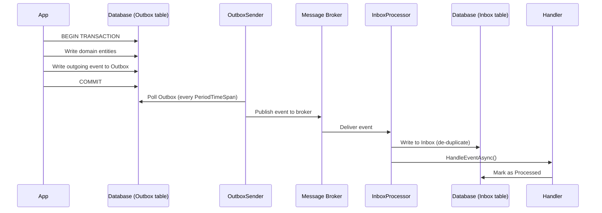

ABP ships two complementary event-bus abstractions that share a common `IEventBus` base contract. The **local bus** delivers events in-process and in-memory, while the **distributed bus** integrates with external brokers (RabbitMQ, Kafka, Azure Service Bus, Dapr, Rebus) and adds transactional reliability through the Inbox/Outbox pattern. Understanding which bus to use, and how they compose, is central to building well-structured ABP applications.

<CardGroup cols={2}>
  <Card title="ILocalEventBus" icon="bolt">
    In-process pub/sub. Handlers run synchronously within the same application lifetime. Use for domain events inside a bounded context.
  </Card>
  <Card title="IDistributedEventBus" icon="network-wired">
    Cross-process pub/sub backed by a pluggable broker. Guarantees at-least-once delivery via Inbox/Outbox. Use for integration events between services.
  </Card>
  <Card title="Inbox / Outbox" icon="inbox">
    Transactional reliability patterns. The Outbox persists outgoing events in the same DB transaction; the Inbox de-duplicates incoming events.
  </Card>
  <Card title="LocalDistributedEventBus" icon="flask">
    Drop-in distributed bus for unit tests. Routes published events directly to local handlers, no broker required.
  </Card>
</CardGroup>

## Core Interfaces

### `IEventBus` — shared root

Both buses implement `IEventBus`, which surfaces `Subscribe` and `PublishAsync` overloads:

```csharp
// Subscribe with a typed handler
IDisposable Subscribe<TEvent>(IEventHandlerFactory factory) where TEvent : class;

// Publish (deferred until UoW completes by default)
Task PublishAsync(Type eventType, object eventData, bool onUnitOfWorkComplete = true);
```

### `ILocalEventBus`

```csharp
// framework/src/Volo.Abp.EventBus.Abstractions/Volo/Abp/EventBus/Local/ILocalEventBus.cs

public interface ILocalEventBus : IEventBus
{
    IDisposable Subscribe<TEvent>(ILocalEventHandler<TEvent> handler)
        where TEvent : class;

    List<EventTypeWithEventHandlerFactories> GetEventHandlerFactories(Type eventType);
    List<EventTypeWithEventHandlerFactories> GetDynamicEventHandlerFactories(string eventName);
}
```

### `IDistributedEventBus`

```csharp
// framework/src/Volo.Abp.EventBus.Abstractions/Volo/Abp/EventBus/Distributed/IDistributedEventBus.cs

public interface IDistributedEventBus : IEventBus
{
    IDisposable Subscribe<TEvent>(IDistributedEventHandler<TEvent> handler)
        where TEvent : class;

    // Dynamic (untyped) event name support
    IDisposable Subscribe(string eventName, IDistributedEventHandler<DynamicEventData> handler);

    // useOutbox=true  → write to Outbox table then relay to broker
    Task PublishAsync<TEvent>(
        TEvent eventData,
        bool onUnitOfWorkComplete = true,
        bool useOutbox = true)
        where TEvent : class;

    Task PublishAsync(
        string eventName,
        object eventData,
        bool onUnitOfWorkComplete = true,
        bool useOutbox = true);
}
```

## Implementing Event Handlers

### Local event handler

```csharp
public class OrderPlacedEventData
{
    public Guid OrderId { get; set; }
}

// Implement ILocalEventHandler<T> and register as a transient service
public class SendOrderConfirmationHandler
    : ILocalEventHandler<OrderPlacedEventData>,
      ITransientDependency
{
    public async Task HandleEventAsync(OrderPlacedEventData eventData)
    {
        // runs in-process, same UoW scope
    }
}
```

### Distributed event handler

```csharp
// framework/src/Volo.Abp.EventBus.Abstractions/.../IDistributedEventHandler.cs
public interface IDistributedEventHandler<in TEvent> : IEventHandler
{
    Task HandleEventAsync(TEvent eventData);
}

public class InventoryDeductedEto  // Event Transfer Object
{
    public Guid ProductId { get; set; }
    public int Quantity { get; set; }
}

public class InventoryDeductedHandler
    : IDistributedEventHandler<InventoryDeductedEto>,
      ITransientDependency
{
    public async Task HandleEventAsync(InventoryDeductedEto eventData)
    {
        // may run in a different microservice
    }
}
```

### Handler ordering (`[LocalEventHandlerOrder]`)

When multiple local handlers subscribe to the same event, execution order is controlled with the attribute:

```csharp
// framework/src/Volo.Abp.EventBus.Abstractions/.../LocalEventHandlerOrderAttribute.cs

[LocalEventHandlerOrder(1)]   // lower number = runs first
public class FirstHandler : ILocalEventHandler<MyEvent>, ITransientDependency { ... }

[LocalEventHandlerOrder(2)]
public class SecondHandler : ILocalEventHandler<MyEvent>, ITransientDependency { ... }
```

## `EventBusBase` and `DistributedEventBusBase`

`EventBusBase` is the abstract implementation shared by both buses. It stores handler factories, dispatches events to matching handlers, and integrates with the Unit of Work (`IUnitOfWorkManager`) so that `PublishAsync` with `onUnitOfWorkComplete: true` defers dispatch until the outer transaction commits.

`DistributedEventBusBase` extends it with:

- Correlation-ID propagation (`ICorrelationIdProvider`)
- Multi-tenant context forwarding (`ICurrentTenant`)
- Outbox/Inbox awareness (`ISupportsEventBoxes`)

```csharp
// framework/src/Volo.Abp.EventBus/Volo/Abp/EventBus/Distributed/DistributedEventBusBase.cs

public abstract class DistributedEventBusBase : EventBusBase, IDistributedEventBus, ISupportsEventBoxes
{
    protected AbpDistributedEventBusOptions AbpDistributedEventBusOptions { get; }
    protected ILocalEventBus LocalEventBus { get; }
    protected ICorrelationIdProvider CorrelationIdProvider { get; }
    // ...
}
```

## Configuration Options

### `AbpDistributedEventBusOptions`

Registered handlers and configured Outbox/Inbox dictionaries:

```csharp
// framework/src/Volo.Abp.EventBus/Volo/Abp/EventBus/Distributed/AbpDistributedEventBusOptions.cs

public class AbpDistributedEventBusOptions
{
    public ITypeList<IEventHandler> Handlers { get; }
    public OutboxConfigDictionary Outboxes { get; }
    public InboxConfigDictionary Inboxes { get; }
}
```

Register handlers in your module:

```csharp
Configure<AbpDistributedEventBusOptions>(options =>
{
    options.Handlers.Add<InventoryDeductedHandler>();
});
```

### `AbpEventBusBoxesOptions`

Tune the timing and behaviour of the Inbox/Outbox workers:

```csharp
// framework/src/Volo.Abp.EventBus/Volo/Abp/EventBus/Distributed/AbpEventBusBoxesOptions.cs

Configure<AbpEventBusBoxesOptions>(options =>
{
    // Poll period (default 2 s)
    options.PeriodTimeSpan = TimeSpan.FromSeconds(5);

    // Max events picked up per poll
    options.OutboxWaitingEventMaxCount = 500;
    options.InboxWaitingEventMaxCount = 500;

    // Retry failed inbox events (default: InboxProcessorFailurePolicy.Retry)
    options.InboxProcessorFailurePolicy = InboxProcessorFailurePolicy.RetryLater;
    options.InboxProcessorMaxRetryCount = 5;

    // Exponential backoff seed (seconds)
    options.InboxProcessorRetryBackoffFactor = 10;

    // How long processed inbox events are kept before deletion
    options.WaitTimeToDeleteProcessedInboxEvents = TimeSpan.FromHours(1);
});
```

## Inbox / Outbox Pattern

The Inbox/Outbox pattern eliminates the dual-write problem between your database and the message broker.



### `OutboxSender` and `OutboxSenderManager`

`OutboxSender` polls the Outbox table at `PeriodTimeSpan` intervals, acquires a distributed lock (`AbpOutbox_{DatabaseName}`), and batch-publishes pending events to the configured broker. `OutboxSenderManager` starts one `OutboxSender` per configured `OutboxConfig`.

### `InboxProcessor` and `InboxProcessManager`

`InboxProcessor` polls the Inbox table, acquires a distributed lock, and calls the local event handler pipeline for each unprocessed event. `InboxProcessManager` starts one `InboxProcessor` per configured `InboxConfig`.

## Available Broker Providers

<Tabs>
  <Tab title="RabbitMQ">
    ```bash
    dotnet add package Volo.Abp.EventBus.RabbitMQ
    ```

    ```csharp
    [DependsOn(typeof(AbpEventBusRabbitMqModule))]
    public class MyModule : AbpModule { }

    Configure<AbpRabbitMqEventBusOptions>(options =>
    {
        options.ClientName = "MyApp";
        options.ExchangeName = "MyApp";
    });
    ```
  </Tab>
  <Tab title="Kafka">
    ```bash
    dotnet add package Volo.Abp.EventBus.Kafka
    ```

    ```csharp
    [DependsOn(typeof(AbpEventBusKafkaModule))]
    public class MyModule : AbpModule { }

    Configure<AbpKafkaEventBusOptions>(options =>
    {
        options.GroupId = "MyApp";
        options.TopicName = "MyApp";
    });
    ```
  </Tab>
  <Tab title="Azure Service Bus">
    ```bash
    dotnet add package Volo.Abp.EventBus.Azure
    ```

    ```csharp
    [DependsOn(typeof(AbpEventBusAzureModule))]
    public class MyModule : AbpModule { }

    Configure<AbpAzureEventBusOptions>(options =>
    {
        options.ConnectionName = "...";
        options.TopicName = "MyApp";
    });
    ```
  </Tab>
  <Tab title="Dapr">
    ```bash
    dotnet add package Volo.Abp.EventBus.Dapr
    ```

    ```csharp
    [DependsOn(typeof(AbpEventBusDaprModule))]
    public class MyModule : AbpModule { }
    ```
  </Tab>
  <Tab title="Rebus">
    ```bash
    dotnet add package Volo.Abp.EventBus.Rebus
    ```

    ```csharp
    [DependsOn(typeof(AbpEventBusRebusModule))]
    public class MyModule : AbpModule { }
    ```
  </Tab>
  <Tab title="Testing (Local)">
    ```csharp
    // LocalDistributedEventBus routes distributed events through the
    // local bus — no broker needed in integration tests.
    [DependsOn(typeof(AbpEventBusModule))]
    public class TestModule : AbpModule
    {
        public override void ConfigureServices(ServiceConfigurationContext context)
        {
            context.Services.AddAlwaysAllowAuthorization();
            // LocalDistributedEventBus is automatically registered
        }
    }
    ```
  </Tab>
</Tabs>

## Domain Events vs. Integration Events

<Accordion title="When to use the Local Bus (Domain Events)">
Domain events describe something that happened within a single bounded context. They are published and consumed within the same process and UoW scope, so there is no need for a broker.

- Order state transitions (`OrderPlacedEvent`, `OrderShippedEvent`)
- Entity-level side-effects (cascade index updates, audit logs)
- Modules that live in the same deployment unit

Publish with `ILocalEventBus.PublishAsync<TEvent>(eventData)`. Handlers are discovered automatically if they implement `ILocalEventHandler<TEvent>` and are registered in the DI container.
</Accordion>

<Accordion title="When to use the Distributed Bus (Integration Events)">
Integration events cross service or process boundaries and must survive network partitions. ABP routes them through a pluggable broker and makes the delivery transactional via Outbox.

- Microservice-to-microservice notifications
- Triggering sagas or workflows in another bounded context
- Events that must fan out to multiple downstream services

Follow the convention of naming ETOs with the `Eto` suffix (e.g., `ProductUpdatedEto`) and placing them in a shared contracts project.
</Accordion>

<Note>
By default, `PublishAsync` on both buses defers the actual dispatch until the current Unit of Work completes. Pass `onUnitOfWorkComplete: false` to publish immediately, bypassing this safety net.
</Note>

<Warning>
Enabling the Outbox requires an `IEventOutbox` implementation backed by a persistent store (e.g., `Volo.Abp.EntityFrameworkCore`). Without it, events published inside a failing transaction will be silently lost even if `useOutbox: true` is set.
</Warning>

## Subscribing Programmatically

Beyond DI-based auto-subscription, you can subscribe manually at module startup using the fluent overloads on `IEventBus`:

```csharp
public class MyModule : AbpModule
{
    public override void OnApplicationInitialization(ApplicationInitializationContext context)
    {
        var eventBus = context.ServiceProvider.GetRequiredService<ILocalEventBus>();

        // Subscribe with a lambda
        eventBus.Subscribe<OrderPlacedEventData>(async data =>
        {
            // inline handler
        });
    }
}
```

<Tip>
Prefer DI-registered handlers over manual subscription in production code. Manual subscriptions are convenient for tests and dynamic scenarios but bypass the handler ordering and lifecycle management provided by the framework.
</Tip>

## Related Pages

- [Background Jobs](/infrastructure/background-jobs) — queue fire-and-forget work triggered by events
- [Multi-Tenancy](/infrastructure/multi-tenancy) — tenant context is automatically forwarded across distributed events
- [Unit of Work](/ddd/unit-of-work) — controls when deferred events are flushed
