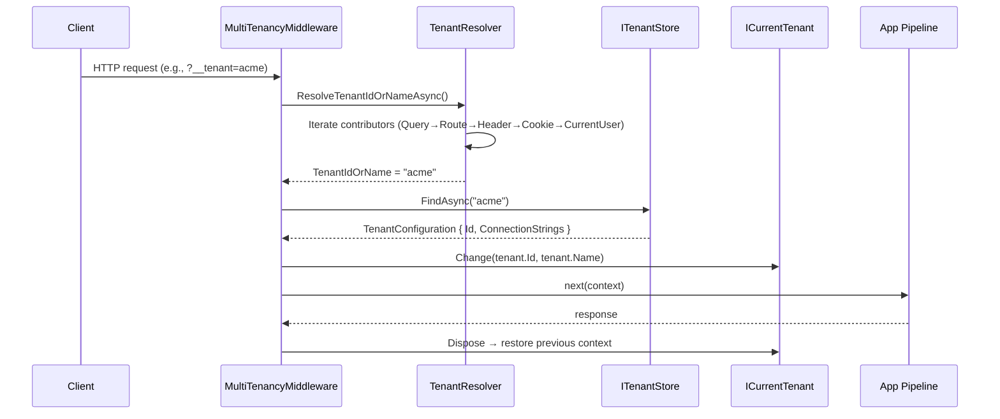

ABP's multi-tenancy infrastructure turns a single codebase into a SaaS product. Every HTTP request is examined by a chain of `ITenantResolveContributor` instances; the winning contributor sets the ambient `ICurrentTenant` for the entire request lifetime. Downstream services — EF Core, Blob Storing, Settings, Background Jobs — read this context to automatically scope data to the correct tenant, including routing to a tenant-specific database when configured.

<CardGroup cols={2}>
  <Card title="ICurrentTenant" icon="user-tag">
    Ambient accessor for the active tenant ID and name. Scoped per async execution context via AsyncLocal.
  </Card>
  <Card title="TenantResolver" icon="magnifying-glass">
    Iterates the registered ITenantResolveContributor list and stops at the first match.
  </Card>
  <Card title="MultiTenancyMiddleware" icon="layer-group">
    ASP.NET Core middleware that runs TenantResolver and calls ICurrentTenant.Change() for the request lifetime.
  </Card>
  <Card title="MultiTenantConnectionStringResolver" icon="database">
    Overrides the default connection-string resolver to return the tenant-specific database when available.
  </Card>
</CardGroup>

## Enabling Multi-Tenancy

Multi-tenancy is **opt-in**. Enable it in module configuration:

```csharp
// framework/src/Volo.Abp.MultiTenancy.Abstractions/Volo/Abp/MultiTenancy/AbpMultiTenancyOptions.cs

Configure<AbpMultiTenancyOptions>(options =>
{
    options.IsEnabled = true;

    // MultiTenancyDatabaseStyle: Hybrid (default), Shared, or Isolated
    options.DatabaseStyle = MultiTenancyDatabaseStyle.Hybrid;

    // TenantUserSharingStrategy: Isolated (default) or Shared
    options.UserSharingStrategy = TenantUserSharingStrategy.Isolated;
});
```

## `ICurrentTenant` and `CurrentTenant`

`ICurrentTenant` exposes the currently active tenant and provides a scoped `Change()` method to temporarily override it:

```csharp
// framework/src/Volo.Abp.MultiTenancy/Volo/Abp/MultiTenancy/CurrentTenant.cs

public class CurrentTenant : ICurrentTenant, ITransientDependency
{
    public virtual bool IsAvailable => Id.HasValue;
    public virtual Guid? Id => _currentTenantAccessor.Current?.TenantId;
    public string? Name => _currentTenantAccessor.Current?.Name;

    public IDisposable Change(Guid? id, string? name = null)
    {
        var parentScope = _currentTenantAccessor.Current;
        _currentTenantAccessor.Current = new BasicTenantInfo(id, name);

        // Restore previous tenant when disposed
        return new DisposeAction(/* restore parentScope */);
    }
}
```

### `AsyncLocalCurrentTenantAccessor`

The tenant state is stored in `AsyncLocal<BasicTenantInfo?>`, which flows automatically across `await` continuations within the same logical call chain:

```csharp
// framework/src/Volo.Abp.MultiTenancy/Volo/Abp/MultiTenancy/AsyncLocalCurrentTenantAccessor.cs

public class AsyncLocalCurrentTenantAccessor : ICurrentTenantAccessor
{
    public static AsyncLocalCurrentTenantAccessor Instance { get; } = new();

    public BasicTenantInfo? Current
    {
        get => _currentScope.Value;
        set => _currentScope.Value = value;
    }

    private readonly AsyncLocal<BasicTenantInfo?> _currentScope;
}
```

### Switching tenant context programmatically

```csharp
public class TenantDataSyncService : ITransientDependency
{
    private readonly ICurrentTenant _currentTenant;

    public TenantDataSyncService(ICurrentTenant currentTenant)
    {
        _currentTenant = currentTenant;
    }

    public async Task SyncAllTenantsAsync(IEnumerable<TenantDto> tenants)
    {
        foreach (var tenant in tenants)
        {
            // Temporarily switch to this tenant's context
            using (_currentTenant.Change(tenant.Id, tenant.Name))
            {
                await SyncTenantDataAsync();
            }
            // Previous context (host or null) is restored here
        }
    }
}
```

<Warning>
`ICurrentTenant.Change()` returns an `IDisposable`. Always wrap it in a `using` block. Forgetting to dispose leaves the wrong tenant active for the remainder of the async context.
</Warning>

## Tenant Resolution Pipeline

`TenantResolver` iterates `AbpTenantResolveOptions.TenantResolvers` in order and stops at the first non-null result:

```csharp
// framework/src/Volo.Abp.MultiTenancy/Volo/Abp/MultiTenancy/TenantResolver.cs

public async Task<TenantResolveResult> ResolveTenantIdOrNameAsync()
{
    var result = new TenantResolveResult();

    using (var serviceScope = ServiceProvider.CreateScope())
    {
        var context = new TenantResolveContext(serviceScope.ServiceProvider);

        foreach (var contributor in Options.TenantResolvers)
        {
            await contributor.ResolveAsync(context);
            result.AppliedResolvers.Add(contributor.Name);

            if (context.HasResolvedTenantOrHost())
            {
                result.TenantIdOrName = context.TenantIdOrName;
                break;
            }
        }
    }

    // FallbackTenant used if nothing resolved
    return result;
}
```

### `AbpTenantResolveOptions`

```csharp
// framework/src/Volo.Abp.MultiTenancy.Abstractions/.../AbpTenantResolveOptions.cs

Configure<AbpTenantResolveOptions>(options =>
{
    // Insert a custom contributor before the built-ins
    options.TenantResolvers.Insert(0, new ApiKeyTenantResolveContributor());

    // Fallback when no contributor matches (e.g., "host")
    options.FallbackTenant = null;
});
```

## Built-In Resolve Contributors

<Tabs>
  <Tab title="ASP.NET Core (HTTP)">
    Registered by `AbpAspNetCoreMultiTenancyModule` — these contributors run during the HTTP request:

    | Contributor | Source |
    |-------------|--------|
    | `QueryStringTenantResolveContributor` | `?__tenant=acme` query parameter |
    | `RouteTenantResolveContributor` | Route value `{__tenant}` |
    | `HeaderTenantResolveContributor` | `__tenant` request header |
    | `CookieTenantResolveContributor` | `__tenant` cookie |
    | `FormTenantResolveContributor` | Form POST field `__tenant` |
    | `DomainTenantResolveContributor` | Subdomain or custom domain mapping |

    The default tenant key `__tenant` is configurable:

    ```csharp
    Configure<AbpAspNetCoreMultiTenancyOptions>(options =>
    {
        options.TenantKey = "X-Tenant";
    });
    ```
  </Tab>
  <Tab title="Core (Non-HTTP)">
    Always available regardless of transport:

    | Contributor | Source |
    |-------------|--------|
    | `CurrentUserTenantResolveContributor` | `ICurrentUser.TenantId` — resolves the signed-in user's tenant |
    | `ActionTenantResolveContributor` | Explicitly set in `TenantResolveContext` by custom code |
  </Tab>
</Tabs>

## `MultiTenancyMiddleware` (ASP.NET Core)

The middleware is registered by calling `app.UseMultiTenancy()` and should be placed early in the pipeline, before authentication:

```csharp
// Startup.cs / Program.cs
app.UseMultiTenancy();   // resolves tenant and sets ICurrentTenant
app.UseAuthentication();
app.UseAuthorization();
```

Internally it calls `ITenantConfigurationProvider.GetAsync()`, which invokes `TenantResolver` and validates the result against the tenant store. If the tenant is not found it returns a `404 Not Found` by default; this behaviour is customisable via `AbpAspNetCoreMultiTenancyOptions.MultiTenancyMiddlewareErrorPageBuilder`.



## Isolated Databases with `MultiTenantConnectionStringResolver`

When a tenant has its own `ConnectionStrings` entry in the tenant configuration, `MultiTenantConnectionStringResolver` returns the tenant-specific connection string:

```csharp
// framework/src/Volo.Abp.MultiTenancy/Volo/Abp/MultiTenancy/MultiTenantConnectionStringResolver.cs

public override async Task<string> ResolveAsync(string? connectionStringName = null)
{
    if (_currentTenant.Id == null)
    {
        // Host context → default resolver
        return await base.ResolveAsync(connectionStringName);
    }

    var tenant = await FindTenantConfigurationAsync(_currentTenant.Id.Value);

    if (tenant == null || tenant.ConnectionStrings.IsNullOrEmpty())
    {
        // Tenant shares the host DB → default resolver
        return await base.ResolveAsync(connectionStringName);
    }

    // Tenant has its own DB
    var tenantDefaultConnectionString = tenant.ConnectionStrings?.Default;
    if (connectionStringName == null ||
        connectionStringName == ConnectionStrings.DefaultConnectionStringName)
    {
        return !tenantDefaultConnectionString.IsNullOrWhiteSpace()
            ? tenantDefaultConnectionString!
            : Options.ConnectionStrings.Default!;
    }

    var connString = tenant.ConnectionStrings?.GetOrDefault(connectionStringName);
    if (!connString.IsNullOrWhiteSpace())
    {
        return connString!;
    }

    return await base.ResolveAsync(connectionStringName);
}
```

### Database styles

| `MultiTenancyDatabaseStyle` | Description |
|------------------------------|-------------|
| `Shared` | All tenants share the host database. All tables have a `TenantId` column. |
| `Isolated` | Each tenant has a dedicated database. EF Core migrations must run per-tenant. |
| `Hybrid` (default) | Tenants can optionally override with their own connection string; falls back to the host DB. |

## `TenantSettingValueProvider`

Settings can be scoped to a tenant. `TenantSettingValueProvider` reads the current tenant from `ICurrentTenant` and resolves setting values from the tenant-scoped setting store before falling through to the global defaults:

```csharp
// Resolution order: Tenant → Global → Default
var maxFileSize = await _settingProvider.GetOrNullAsync("App.MaxFileUploadSize");
```

## Custom Tenant Store

By default ABP reads tenants from `appsettings.json` via `DefaultTenantStore`. In production, implement `ITenantStore` to load tenants from your database:

```csharp
[Dependency(ReplaceServices = true)]
public class DatabaseTenantStore : ITenantStore, ITransientDependency
{
    private readonly ITenantRepository _tenantRepository;

    public DatabaseTenantStore(ITenantRepository tenantRepository)
        => _tenantRepository = tenantRepository;

    public async Task<TenantConfiguration?> FindAsync(string normalizedName)
    {
        var tenant = await _tenantRepository.FindByNameAsync(normalizedName);
        return tenant == null ? null : ToConfiguration(tenant);
    }

    public async Task<TenantConfiguration?> FindAsync(Guid id)
    {
        var tenant = await _tenantRepository.FindAsync(id);
        return tenant == null ? null : ToConfiguration(tenant);
    }
}
```

<Note>
The `TenantManagement` module provides a ready-made UI and API for managing tenants, including per-tenant connection string configuration. It auto-registers a database-backed `ITenantStore`.
</Note>

## Related Pages

- [Blob Storing](/infrastructure/blob-storing) — blobs are automatically namespaced under the current tenant
- [Event Bus](/infrastructure/event-bus) — tenant context is forwarded in distributed event headers
- [Background Jobs](/infrastructure/background-jobs) — jobs capture and restore tenant context on execution
