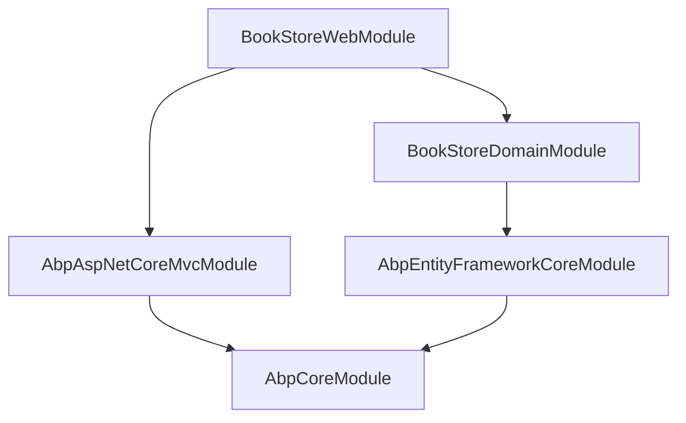

Every feature in an ABP-based application is packaged as a **module** — a self-contained unit of code that declares its dependencies, registers its services, and participates in the application lifecycle. The `AbpModule` base class (defined in `Volo.Abp.Core`) is the contract every module must fulfil, giving the framework a uniform way to discover, order, and initialize all participating assemblies.

## The `AbpModule` Base Class

`AbpModule` lives at `Volo/Abp/Modularity/AbpModule.cs` and implements several lifecycle interfaces at once:

```csharp
// Volo.Abp.Core — Volo/Abp/Modularity/AbpModule.cs
public abstract class AbpModule :
    IAbpModule,
    IOnPreApplicationInitialization,
    IOnApplicationInitialization,
    IOnPostApplicationInitialization,
    IOnApplicationShutdown,
    IPreConfigureServices,
    IPostConfigureServices
{
    protected internal bool SkipAutoServiceRegistration { get; protected set; }

    protected internal ServiceConfigurationContext ServiceConfigurationContext { ... }

    public virtual void PreConfigureServices(ServiceConfigurationContext context) { }
    public virtual void ConfigureServices(ServiceConfigurationContext context) { }
    public virtual void PostConfigureServices(ServiceConfigurationContext context) { }

    public virtual void OnPreApplicationInitialization(ApplicationInitializationContext context) { }
    public virtual void OnApplicationInitialization(ApplicationInitializationContext context) { }
    public virtual void OnPostApplicationInitialization(ApplicationInitializationContext context) { }
    public virtual void OnApplicationShutdown(ApplicationShutdownContext context) { }
}
```

All lifecycle methods also have `Async` counterparts (`PreConfigureServicesAsync`, `OnApplicationInitializationAsync`, etc.) that the framework calls when running in async mode.

<Note>
`ServiceConfigurationContext` is only accessible during the three `ConfigureServices` phases. Trying to read it outside those methods throws `AbpException`.
</Note>

### Helper `Configure<TOptions>` Overloads

`AbpModule` exposes typed `Configure<TOptions>`, `PreConfigure<TOptions>`, `PostConfigure<TOptions>`, and `PostConfigureAll<TOptions>` helpers that forward directly to `ServiceConfigurationContext.Services`, so you never need to capture the `IServiceCollection` manually:

```csharp
public override void ConfigureServices(ServiceConfigurationContext context)
{
    Configure<AbpAuditingOptions>(options =>
    {
        options.IsEnabled = false;
    });
}
```

---

## Declaring Dependencies with `[DependsOn]`

Module dependencies are declared using `DependsOnAttribute` (`Volo/Abp/Modularity/DependsOnAttribute.cs`):

```csharp
[AttributeUsage(AttributeTargets.Class, AllowMultiple = true)]
public class DependsOnAttribute : Attribute, IDependedTypesProvider
{
    public Type[] DependedTypes { get; }

    public DependsOnAttribute(params Type[]? dependedTypes)
    {
        DependedTypes = dependedTypes ?? Type.EmptyTypes;
    }

    public virtual Type[] GetDependedTypes()
    {
        return DependedTypes;
    }
}
```

Apply it to your module class to pull in other modules:

```csharp
[DependsOn(
    typeof(AbpAspNetCoreMvcModule),
    typeof(MyCompany.BookStore.Domain.BookStoreDomainModule)
)]
public class BookStoreWebModule : AbpModule
{
    public override void ConfigureServices(ServiceConfigurationContext context)
    {
        Configure<AbpRouteOptions>(options =>
        {
            options.Prefixes.Add("api");
        });
    }

    public override void OnApplicationInitialization(ApplicationInitializationContext context)
    {
        var app = context.GetApplicationBuilder();
        app.UseRouting();
        app.UseAbpRequestLocalization();
        app.UseEndpoints(endpoints => endpoints.MapControllers());
    }
}
```

The framework resolves the full transitive closure of dependencies and performs a topological sort so that leaf modules are always initialized before the modules that depend on them.

---

## Module Dependency Graph



The `ModuleLoader` (`Volo/Abp/Modularity/ModuleLoader.cs`) builds this graph by calling `AbpModuleHelper.FindAllModuleTypes`, then sorts it with `SortByDependency`, placing the startup module last:

```csharp
protected virtual List<IAbpModuleDescriptor> SortByDependency(
    List<IAbpModuleDescriptor> modules,
    Type startupModuleType)
{
    var sortedModules = modules.SortByDependencies(m => m.Dependencies);
    sortedModules.MoveItem(m => m.Type == startupModuleType, modules.Count - 1);
    return sortedModules;
}
```

---

## `AbpModuleDescriptor` and `IModuleContainer`

Once loaded, each module is wrapped in an `AbpModuleDescriptor` (`Volo/Abp/Modularity/AbpModuleDescriptor.cs`):

```csharp
public class AbpModuleDescriptor : IAbpModuleDescriptor
{
    public Type Type { get; }
    public Assembly Assembly { get; }
    public Assembly[] AllAssemblies { get; }   // populated by AbpModuleHelper.GetAllAssemblies
    public IAbpModule Instance { get; }
    public bool IsLoadedAsPlugIn { get; }
    public IReadOnlyList<IAbpModuleDescriptor> Dependencies { get; }
}
```

The full list of loaded descriptors is available through `IModuleContainer`:

```csharp
public interface IModuleContainer
{
    IReadOnlyList<IAbpModuleDescriptor> Modules { get; }
}
```

`AbpApplicationBase` implements `IModuleContainer` and registers itself as a singleton, so you can inject `IModuleContainer` anywhere to enumerate loaded modules at runtime.

---

## Lifecycle Hook Reference

<CardGroup cols={2}>
  <Card title="PreConfigureServices" icon="gear">
    Run before `ConfigureServices`. Ideal for using `PreConfigure<TOptions>` to allow other modules to observe options before they are applied.
  </Card>
  <Card title="ConfigureServices" icon="wrench">
    Main hook for service registration and options setup. Auto-registration of assembly types runs here when `SkipAutoServiceRegistration` is `false`.
  </Card>
  <Card title="PostConfigureServices" icon="check">
    Run after all `ConfigureServices` calls. Use `PostConfigure<TOptions>` here to enforce invariants regardless of what other modules configured.
  </Card>
  <Card title="OnPreApplicationInitialization" icon="play">
    Executes during `InitializeModules`, before the main initialization pass. Good for early middleware setup.
  </Card>
  <Card title="OnApplicationInitialization" icon="rocket">
    The primary hook for configuring the `IApplicationBuilder` pipeline (middleware, routing, etc.).
  </Card>
  <Card title="OnPostApplicationInitialization" icon="flag-checkered">
    Final initialization pass, after all modules have run their `OnApplicationInitialization`.
  </Card>
  <Card title="OnApplicationShutdown" icon="power-off">
    Called in reverse dependency order during graceful shutdown. Release background resources here.
  </Card>
</CardGroup>

---

## Skipping Auto Service Registration

By default, ABP scans every assembly listed in `AllAssemblies` and registers types that implement `ITransientDependency`, `ISingletonDependency`, or `IScopedDependency`. Setting `SkipAutoServiceRegistration = true` prevents that scan for the current module:

```csharp
public class MySpecialModule : AbpModule
{
    public MySpecialModule()
    {
        SkipAutoServiceRegistration = true;
    }

    public override void ConfigureServices(ServiceConfigurationContext context)
    {
        // Register services manually
        context.Services.AddSingleton<IMyService, MyService>();
    }
}
```

---

## Plugin Modules

The `PlugInSourceList` fed to `ModuleLoader.LoadModules` supports three source types out of the box:

| Source | Class |
|---|---|
| Assembly folder | `FolderPlugInSource` |
| Single assembly file | `FilePlugInSource` |
| Direct `Type` reference | `TypePlugInSource` |

```csharp
var app = AbpApplicationFactory.Create<MyAppModule>(options =>
{
    options.PlugInSources.AddFolder(@"C:\MyApp\Plugins");
});
```

Plugin modules have `IsLoadedAsPlugIn = true` on their descriptor and are appended after the static dependency graph is resolved. They are initialized in the same lifecycle order as regular modules.

---

## Related Pages

- [Application Lifecycle](./application-lifecycle) — How `AbpApplicationFactory` orchestrates the full startup sequence
- [Dependency Injection](./dependency-injection) — Conventional registration and `IServiceCollection` extensions
- [Domain Services](../ddd/domain-services) — Implementing `IDomainService` inside a module
