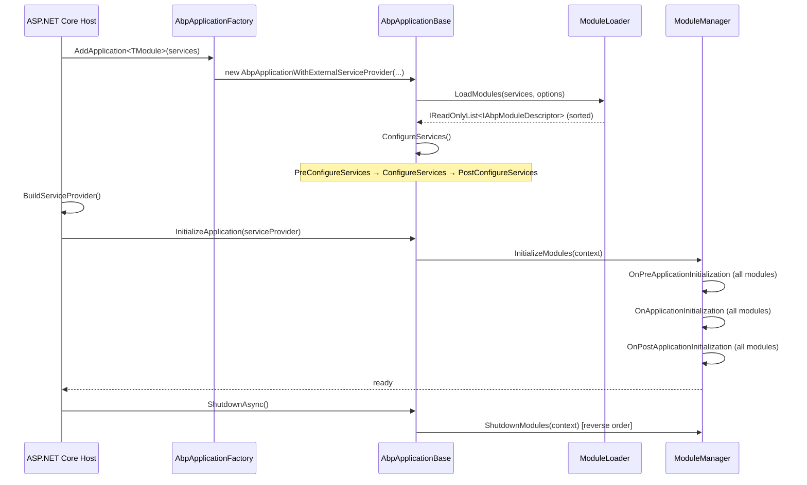

An ABP application goes through a well-defined two-stage lifecycle before it can serve requests: a **service configuration stage** (where modules populate the DI container) and an **initialization stage** (where modules configure the middleware pipeline and other runtime state). Understanding this sequence is critical when debugging startup failures, ordering module contributions, or adding new cross-cutting infrastructure.

## Entry Points: `AbpApplicationFactory`

`AbpApplicationFactory` (`Volo/Abp/AbpApplicationFactory.cs`) is the single place that creates an `IAbpApplication`. It has two flavors:

<Tabs>
  <Tab title="External Service Provider (ASP.NET Core)">
    ```csharp
    // Used inside Startup.ConfigureServices / Program.cs
    var app = services.AddApplication<BookStoreWebModule>(options =>
    {
        options.ApplicationName = "BookStore";
    });
    // IServiceProvider is built by the host; call app.InitializeApplication() later
    ```
    Returns `IAbpApplicationWithExternalServiceProvider`. The host owns the container.
  </Tab>
  <Tab title="Internal Service Provider (Console / Tests)">
    ```csharp
    // AbpApplicationFactory.Create builds its own container
    var app = AbpApplicationFactory.Create<MyModule>();
    app.Initialize();
    var svc = app.ServiceProvider.GetRequiredService<IMyService>();
    ```
    Returns `IAbpApplicationWithInternalServiceProvider`. The application calls `Services.BuildServiceProviderFromFactory()` and owns the resulting scope.
  </Tab>
  <Tab title="Async variant">
    ```csharp
    var app = await AbpApplicationFactory.CreateAsync<MyModule>(options =>
    {
        options.SkipConfigureServices = false;
    });
    await app.InitializeAsync();
    ```
    Async overloads exist for all factory methods and initialization calls. Prefer these in modern .NET 6+ hosts.
  </Tab>
</Tabs>

---

## Stage 1: Module Loading

When `AbpApplicationBase` is constructed it immediately calls `LoadModules`:

```csharp
Modules = LoadModules(services, options);

protected virtual IReadOnlyList<IAbpModuleDescriptor> LoadModules(
    IServiceCollection services,
    AbpApplicationCreationOptions options)
{
    return services
        .GetSingletonInstance<IModuleLoader>()
        .LoadModules(services, StartupModuleType, options.PlugInSources);
}
```

`ModuleLoader.LoadModules` (`Volo/Abp/Modularity/ModuleLoader.cs`) performs three steps:

1. **`FillModules`** — recursively walks `[DependsOn]` attributes starting from the startup module, then appends any plugin modules from `PlugInSourceList`.
2. **`SetDependencies`** — links each `AbpModuleDescriptor` to its dependency descriptors.
3. **`SortByDependency`** — topological sort; the startup module is always moved to the last position.

Each module type is instantiated via `Activator.CreateInstance` and registered as a singleton in the container so interceptors can be applied to it.

---

## Stage 2: Service Configuration

After modules are loaded, `ConfigureServices()` (or `ConfigureServicesAsync()`) is called on `AbpApplicationBase`. It runs three sequential passes over the sorted module list:

### Pass 1 — `PreConfigureServices`

```csharp
foreach (var module in Modules.Where(m => m.Instance is IPreConfigureServices))
{
    ((IPreConfigureServices)module.Instance).PreConfigureServices(context);
}
```

Use this to publish `PreConfigure<TOptions>` actions that other modules will read in the next pass.

### Pass 2 — `ConfigureServices` (+ auto-registration)

```csharp
foreach (var module in Modules)
{
    if (module.Instance is AbpModule abpModule && !abpModule.SkipAutoServiceRegistration)
    {
        foreach (var assembly in module.AllAssemblies)
        {
            services.AddAssembly(assembly); // conventional scanning
        }
    }
    module.Instance.ConfigureServices(context);
}
```

Auto-registration runs before each module's `ConfigureServices` so that the module's own types are already in the container when it calls `Configure<TOptions>`.

### Pass 3 — `PostConfigureServices`

```csharp
foreach (var module in Modules.Where(m => m.Instance is IPostConfigureServices))
{
    ((IPostConfigureServices)module.Instance).PostConfigureServices(context);
}
```

Post-configure is the last chance to override options set by any module. Use `PostConfigureAll<TOptions>` here for global enforcement.

<Note>
`ServiceConfigurationContext` is set on each `AbpModule` instance before passes begin and nulled out after `PostConfigureServices` completes. Accessing it outside these three phases throws `AbpException`.
</Note>

---

## Stage 3: Application Initialization

After the `IServiceProvider` is available (either built internally or injected by the host), `InitializeModules` is called:

```csharp
protected virtual void InitializeModules()
{
    using (var scope = ServiceProvider.CreateScope())
    {
        scope.ServiceProvider
            .GetRequiredService<IModuleManager>()
            .InitializeModules(new ApplicationInitializationContext(scope.ServiceProvider));
    }
}
```

`ModuleManager` iterates over registered `IModuleLifecycleContributor` implementations. ABP ships three contributors by default, executed in order:

| Contributor | Calls on each module |
|---|---|
| `OnPreApplicationInitializationModuleLifecycleContributor` | `OnPreApplicationInitialization` |
| `OnApplicationInitializationModuleLifecycleContributor` | `OnApplicationInitialization` |
| `OnPostApplicationInitializationModuleLifecycleContributor` | `OnPostApplicationInitialization` |

Within each contributor, modules are visited in the **same topological order** as service configuration (leaf dependencies first, startup module last).

### Shutdown

`ShutdownModules` visits modules in **reverse order** (startup module first, leaves last), calling each module's `OnApplicationShutdown`:

```csharp
public virtual async Task ShutdownModulesAsync(ApplicationShutdownContext context)
{
    var modules = _moduleContainer.Modules.Reverse().ToList();
    foreach (var contributor in _lifecycleContributors)
        foreach (var module in modules)
            await contributor.ShutdownAsync(context, module.Instance);
}
```

---

## Complete Startup Sequence



---

## Plugin System

Plugins are additional modules loaded at runtime from external assemblies. You configure them via `AbpApplicationCreationOptions.PlugInSources`:

```csharp
services.AddApplication<AppModule>(options =>
{
    // Load all ABP modules found in DLLs under this folder
    options.PlugInSources.AddFolder(@"/app/plugins", SearchOption.AllDirectories);

    // Or load a specific assembly file
    options.PlugInSources.AddFiles(@"/app/plugins/MyPlugin.dll");

    // Or add a known Type directly (useful in tests)
    options.PlugInSources.AddTypes(typeof(MyPluginModule));
});
```

`ModuleLoader.FillModules` appends plugin-sourced types after the static dependency graph is resolved. Plugin modules with `IsLoadedAsPlugIn = true` on their `AbpModuleDescriptor` participate in the same lifecycle as regular modules.

---

## `SkipConfigureServices` Option

When using the async factory overloads you can defer `ConfigureServicesAsync` to a later point:

```csharp
var app = AbpApplicationFactory.Create<MyModule>(options =>
{
    options.SkipConfigureServices = true;
});

// Do something before services are configured...

await app.ConfigureServicesAsync(); // explicit call
await app.InitializeAsync();
```

This is the pattern used by the async factory methods themselves (`CreateAsync`) to let callers interpose logic before the DI container is populated.

---

## Related Pages

- [AbpModule](./abp-module) — Module class structure and lifecycle hooks
- [Dependency Injection](./dependency-injection) — Conventional scanning that runs during `ConfigureServices`
- [Unit of Work](../ddd/unit-of-work) — Middleware registered in `OnApplicationInitialization`
