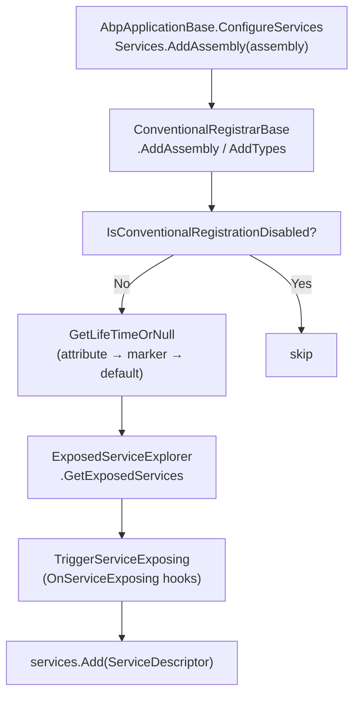

ABP does not replace `Microsoft.Extensions.DependencyInjection` — it builds on top of it. The framework adds **conventional registration** (scanning assemblies for marker interfaces), **interceptor-aware proxy generation** via Castle DynamicProxy or Autofac, and a rich set of `IServiceCollection` extension methods that make multi-module wiring straightforward. Understanding these layers is essential for diagnosing registration issues and for writing reusable infrastructure components.

## Marker Interfaces

The simplest way to register a class is to implement one of the three lifetime marker interfaces defined in `Volo.Abp.Core`:

```csharp
// Volo/Abp/DependencyInjection/ITransientDependency.cs
public interface ITransientDependency { }

// Volo/Abp/DependencyInjection/ISingletonDependency.cs
public interface ISingletonDependency { }

// Volo/Abp/DependencyInjection/IScopedDependency.cs
public interface IScopedDependency { }
```

Any non-abstract, non-generic class that implements one of these is automatically discovered when ABP scans the module's assembly during `ConfigureServices`.

```csharp
// Registered as transient, exposed as IOrderCalculator + OrderCalculator
public class OrderCalculator : IOrderCalculator, ITransientDependency
{
    public decimal Calculate(Order order) { ... }
}
```

<Tip>
You can fine-tune or override the resolved lifetime by applying `[Dependency(ServiceLifetime.Singleton)]` from `Volo.Abp.DependencyInjection`. The attribute takes precedence over the marker interface.
</Tip>

---

## `DefaultConventionalRegistrar`

All conventional scanning is performed by `DefaultConventionalRegistrar` (`Volo/Abp/DependencyInjection/DefaultConventionalRegistrar.cs`), which extends `ConventionalRegistrarBase`:

```csharp
public class DefaultConventionalRegistrar : ConventionalRegistrarBase
{
    public override void AddType(IServiceCollection services, Type type)
    {
        if (IsConventionalRegistrationDisabled(type))
            return;

        var dependencyAttribute = GetDependencyAttributeOrNull(type);
        var lifeTime = GetLifeTimeOrNull(type, dependencyAttribute);

        if (lifeTime == null)
            return;

        var exposedServiceTypes = GetExposedKeyedServiceTypes(type)
            .Concat(GetExposedServiceTypes(type).Select(t => new ServiceIdentifier(t)))
            .ToList();

        TriggerServiceExposing(services, type, exposedServiceTypes);

        foreach (var exposedServiceType in exposedServiceTypes)
        {
            var serviceDescriptor = CreateServiceDescriptor(
                type, exposedServiceType.ServiceKey,
                exposedServiceType.ServiceType,
                exposedServiceTypes, lifeTime.Value);

            services.Add(serviceDescriptor);
        }
    }
}
```

The lifetime resolution priority is:

1. `[Dependency(ServiceLifetime.X)]` attribute
2. `ITransientDependency` / `ISingletonDependency` / `IScopedDependency` hierarchy
3. `GetDefaultLifeTimeOrNull` override (returns `null` in the base registrar)

Annotate a class with `[DisableConventionalRegistration]` to exclude it from scanning entirely.

---

## `ExposedServiceExplorer` and `[ExposeServices]`

When a class is registered, `ExposedServiceExplorer` (`Volo/Abp/DependencyInjection/ExposedServiceExplorer.cs`) determines which service types it is exposed under:

```csharp
public static class ExposedServiceExplorer
{
    private static readonly ExposeServicesAttribute DefaultExposeServicesAttribute =
        new ExposeServicesAttribute { IncludeDefaults = true, IncludeSelf = true };

    public static List<Type> GetExposedServices(Type type)
    {
        var providers = type.GetCustomAttributes(true)
            .OfType<IExposedServiceTypesProvider>().ToList();

        return providers
            .DefaultIfEmpty(DefaultExposeServicesAttribute)
            .SelectMany(p => p.GetExposedServiceTypes(type))
            .Distinct().ToList();
    }
}
```

By default (`IncludeDefaults = true`) a class is exposed under its directly implemented interfaces and itself. You can narrow or widen that with the attribute:

```csharp
[ExposeServices(typeof(IOrderService))]   // only expose the interface
public class OrderService : IOrderService, ITransientDependency { ... }
```

### `OnServiceExposing` Hook

Modules can observe and mutate the exposure list before registration via `OnServiceExposing`:

```csharp
// In your module's ConfigureServices
context.Services.OnExposing(exposingContext =>
{
    // Add a service type to every exposed list that includes IOrderService
    if (exposingContext.ExposedTypes.Any(t => t.ServiceType == typeof(IOrderService)))
    {
        exposingContext.ExposedTypes.Add(new ServiceIdentifier(typeof(IOrderAuditService)));
    }
});
```

---

## Key `IServiceCollection` Extensions

`ServiceCollectionCommonExtensions` (`Microsoft/Extensions/DependencyInjection/`) and related files add a suite of helpers:

<Tabs>
  <Tab title="AddApplication">
    ```csharp
    // ServiceCollectionApplicationExtensions.cs
    services.AddApplication<MyAppModule>(options =>
    {
        options.ApplicationName = "MyApp";
    });
    ```
    Calls `AbpApplicationFactory.Create<TModule>` internally and returns an `IAbpApplicationWithExternalServiceProvider`. Use `AddApplicationAsync` for async module configuration.
  </Tab>
  <Tab title="GetSingletonInstance">
    ```csharp
    var moduleLoader = services.GetSingletonInstance<IModuleLoader>();
    ```
    Retrieves the single registered instance of a type from the `IServiceCollection` without building the container.
  </Tab>
  <Tab title="PreConfigure / PostConfigure">
    ```csharp
    services.PreConfigure<AbpAuditingOptions>(options =>
    {
        options.Contributors.Add(new MyAuditContributor());
    });
    ```
    Stores configuration actions that run before/after the standard `Configure<TOptions>` pass, allowing modules to cooperate on options ordering.
  </Tab>
</Tabs>

---

## `IAbpApplication` vs `IAbpApplicationWithInternalServiceProvider`

<CardGroup cols={2}>
  <Card title="IAbpApplicationWithExternalServiceProvider" icon="arrow-right-from-bracket">
    Used in ASP.NET Core hosts where `IServiceProvider` is built by the host pipeline. You call `services.AddApplication<T>()` and later `app.InitializeApplication()`.
  </Card>
  <Card title="IAbpApplicationWithInternalServiceProvider" icon="box">
    Builds its own `ServiceProvider` via `Services.BuildServiceProviderFromFactory()`. Used in console apps, tests, and standalone workers via `AbpApplicationFactory.Create<T>()`.
  </Card>
</CardGroup>

```csharp
// Console / test usage
var app = AbpApplicationFactory.Create<MyModule>();
app.Initialize();

var myService = app.ServiceProvider.GetRequiredService<IMyService>();
```

---

## Autofac Integration (`Volo.Abp.Autofac`)

ABP ships a first-class Autofac adapter at `Volo/Abp/Autofac/AbpAutofacModule.cs`. Adding it enables:

- **Property injection** — `AbpPropertySelector` marks properties decorated with `[Autowired]`
- **Castle DynamicProxy interceptors** — required for UoW, validation, and auditing cross-cutting concerns
- **Named/keyed registrations** — Autofac's richer registration API is accessible via `ContainerBuilder`

```csharp
[DependsOn(typeof(AbpAutofacModule))]
public class MyAppModule : AbpModule { }
```

In the host entry point, swap the service provider factory:

```csharp
// Program.cs (ASP.NET Core)
Host.CreateDefaultBuilder(args)
    .UseAutofac()           // AbpAutofacHostBuilderExtensions
    .ConfigureWebHostDefaults(web => web.UseStartup<Startup>())
    .Build()
    .Run();
```

`UseAutofac()` calls `services.AddObjectAccessor<ContainerBuilder>()` and registers `AbpAutofacServiceProviderFactory`. You can access the raw `ContainerBuilder` via:

```csharp
var builder = services.GetContainerBuilder();
builder.RegisterType<MyComponent>().As<IMyComponent>().InstancePerDependency();
```

---

## Dynamic Proxies and Interceptors

ABP's cross-cutting concerns (Unit of Work, Validation, Auditing, Authorization) are applied through Castle DynamicProxy interceptors wired by `AbpAutofacModule` (or the built-in MS DI adapter for simpler scenarios). The interceptors are registered via `ClassInterceptorsSelectorList` and run in the order contributed by each feature module.

<Warning>
If you skip `UseAutofac()`, some interceptors (particularly property injection–based ones) may silently not fire. Always include `AbpAutofacModule` in production applications that rely on those cross-cutting features.
</Warning>

---

## Conventional Registrar Pipeline



---

## Related Pages

- [AbpModule](./abp-module) — How modules declare dependencies and configure services
- [Application Lifecycle](./application-lifecycle) — When conventional scanning runs in the startup sequence
- [Unit of Work](../ddd/unit-of-work) — The UoW interceptor that relies on DI proxy generation
