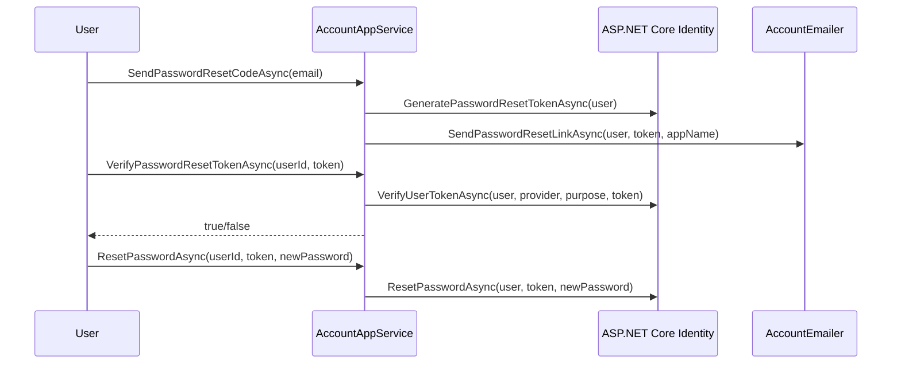
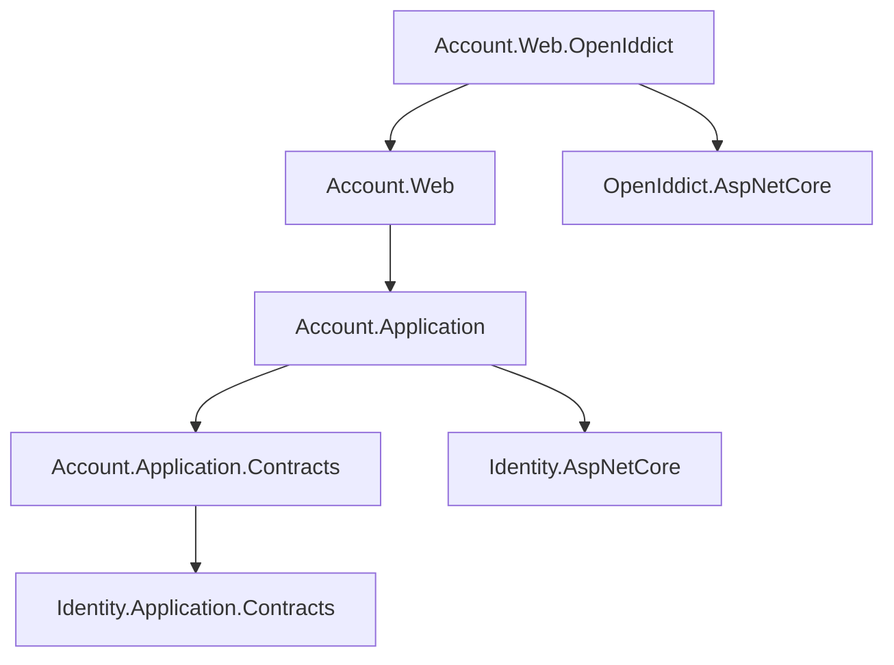

The Account module provides the end-user-facing authentication and self-service UX layer — login, registration, password reset, two-factor authentication, and profile management. It sits directly on top of the Identity module and does not define its own domain entities; it orchestrates ASP.NET Core Identity's `UserManager` and `SignInManager` through ABP application services.

<CardGroup cols={2}>
  <Card title="IAccountAppService" icon="user-plus">
    Register, send/verify password-reset token, reset password
  </Card>
  <Card title="IProfileAppService" icon="id-card">
    Read and update the current user's profile, change password
  </Card>
  <Card title="External Login" icon="right-to-bracket">
    OAuth2/OIDC social login via ASP.NET Core external authentication middleware
  </Card>
  <Card title="2FA" icon="shield">
    TOTP and email-based two-factor authentication flows
  </Card>
</CardGroup>

## Package structure

```
modules/account/src/
├── Volo.Abp.Account.Application.Contracts  # IAccountAppService, IProfileAppService, DTOs, settings
├── Volo.Abp.Account.Application            # AccountAppService, ProfileAppService implementations
├── Volo.Abp.Account.HttpApi                # REST controller (auto-generated conventional)
├── Volo.Abp.Account.HttpApi.Client         # Static HTTP client proxies
├── Volo.Abp.Account.Web                    # Razor Pages: Login, Register, ForgotPassword, Profile
├── Volo.Abp.Account.Web.OpenIddict         # Razor Pages adapted for OpenIddict consent/callback
├── Volo.Abp.Account.Web.IdentityServer     # Razor Pages adapted for IdentityServer4 (legacy)
├── Volo.Abp.Account.Blazor                 # Blazor profile management components
└── Volo.Abp.Account.Blazor.MudBlazor      # MudBlazor variant
```

<Note>
For new projects, use `Volo.Abp.Account.Web.OpenIddict` together with the OpenIddict module. The `IdentityServer` variant is maintained for existing deployments only.
</Note>

## IAccountAppService

```csharp
// modules/account/src/.../Application.Contracts/IAccountAppService.cs
public interface IAccountAppService : IApplicationService
{
    Task<IdentityUserDto> RegisterAsync(RegisterDto input);

    Task SendPasswordResetCodeAsync(SendPasswordResetCodeDto input);

    Task<bool> VerifyPasswordResetTokenAsync(VerifyPasswordResetTokenInput input);

    Task ResetPasswordAsync(ResetPasswordDto input);
}
```

### RegisterDto

```csharp
public class RegisterDto : ExtensibleObject
{
    [Required]
    public string UserName { get; set; }

    [Required]
    [EmailAddress]
    public string EmailAddress { get; set; }

    [Required]
    public string Password { get; set; }

    public string AppName { get; set; }
    // AppName is used for email template routing
}
```

`RegisterAsync` creates the user via `IdentityUserManager`, assigns default roles, and raises the `AccountRegisteredEto` distributed event so other services can react (e.g., send a welcome email).

### Password reset flow



## IProfileAppService

```csharp
// modules/account/src/.../Application.Contracts/IProfileAppService.cs
public interface IProfileAppService : IApplicationService
{
    Task<ProfileDto> GetAsync();

    Task<ProfileDto> UpdateAsync(UpdateProfileDto input);

    Task ChangePasswordAsync(ChangePasswordInput input);
}
```

`GetAsync` returns the current user's profile (resolved via `ICurrentUser`). `UpdateAsync` allows changing `UserName`, `Email`, `Name`, `Surname`, `PhoneNumber`, and any extra properties registered via ABP's object-extension system.

### ProfileDto

```csharp
public class ProfileDto : ExtensibleObject
{
    public string UserName { get; set; }
    public string Email { get; set; }
    public bool EmailConfirmed { get; set; }
    public string Name { get; set; }
    public string Surname { get; set; }
    public string PhoneNumber { get; set; }
    public bool PhoneNumberConfirmed { get; set; }
    public bool IsExternal { get; set; }
    public bool HasPassword { get; set; }
    public bool TwoFactorEnabled { get; set; }
    public string ConcurrencyStamp { get; set; }
}
```

## IDynamicClaimsAppService

The Account module provides `IDynamicClaimsAppService` to refresh the cookie-based claims principal without forcing a logout/login cycle. This is called after profile updates or role changes so the browser session reflects the new state immediately.

## Account settings

```csharp
// modules/account/src/.../Settings/AccountSettingNames.cs
public class AccountSettingNames
{
    public const string IsSelfRegistrationEnabled = "Abp.Account.IsSelfRegistrationEnabled";
    public const string EnableLocalLogin = "Abp.Account.EnableLocalLogin";
}
```

Configure at the host level via `ISettingManager` or in `appsettings.json`:

```json
{
  "Settings": {
    "Abp.Account.IsSelfRegistrationEnabled": "true",
    "Abp.Account.EnableLocalLogin": "true"
  }
}
```

## Razor Pages (Web layer)

`Volo.Abp.Account.Web` ships the following Razor Pages:

| Page | Route |
|---|---|
| Login | `/Account/Login` |
| Register | `/Account/Register` |
| Logout | `/Account/Logout` |
| Forgot Password | `/Account/ForgotPassword` |
| Reset Password | `/Account/ResetPassword` |
| Email Confirmation | `/Account/EmailConfirmation` |
| Profile (manage) | `/Account/Manage` |
| Two-Factor Auth | `/Account/TwoFactorAuthentication` |
| External Login callback | `/Account/ExternalLogin` |

All pages follow ABP's layout conventions — they use `StandardLayouts.Account` so the active theme controls the visual presentation.

## External login providers

External authentication is configured through standard ASP.NET Core middleware:

```csharp
context.Services
    .AddAuthentication()
    .AddGoogle(options =>
    {
        options.ClientId = "...";
        options.ClientSecret = "...";
    })
    .AddMicrosoftAccount(options =>
    {
        options.ClientId = "...";
        options.ClientSecret = "...";
    });
```

The Account module's `ExternalLoginPage` handles the callback, creates a local user on first login (if `IsSelfRegistrationEnabled`), and links the external login to the user record via `UserManager.AddLoginAsync`.

## Two-factor authentication

Two-factor authentication is enabled per-user via the `ProfileDto.TwoFactorEnabled` flag. ABP ships two built-in providers:

1. **Authenticator app (TOTP)** — uses `UserManager.GetAuthenticatorKeyAsync` and validates with `VerifyTwoFactorTokenAsync`.
2. **Email** — sends a code via `AccountEmailer`; provider name is `"Email"`.

The two-factor challenge redirects to `/Account/TwoFactorAuthentication` after a successful username/password login.

## OpenIddict Web integration

`Volo.Abp.Account.Web.OpenIddict` adds the consent UI pages needed when OpenIddict issues tokens with user interaction:

| Page | Purpose |
|---|---|
| `/connect/authorize` | Authorization endpoint UI |
| `/connect/logout` | Logout confirmation |
| `/connect/device` | Device authorization flow |

It depends on `Volo.Abp.Account.Web` and `Volo.Abp.OpenIddict.AspNetCore`.

## Module dependencies



## See also

- [Identity Module](./identity) — user entities and role management
- [OpenIddict Module](./openiddict) — OAuth2/OIDC server that the Account Web layer integrates with
- [Tenant Management](./tenant-management) — switching tenants from the login page
