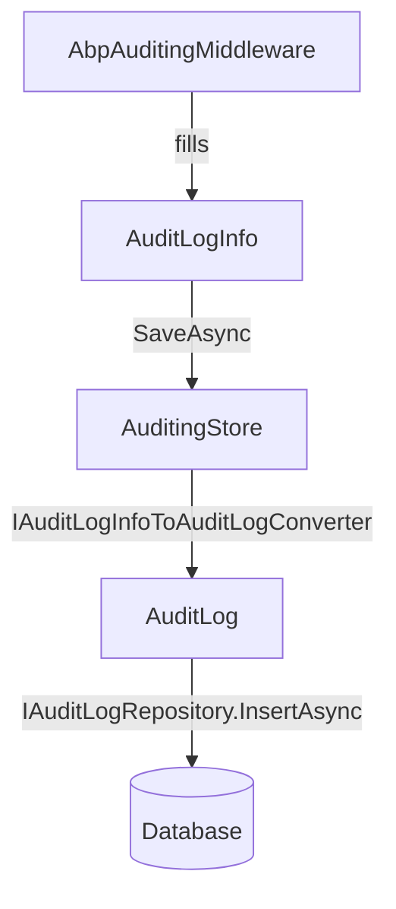

The Audit Logging module is the persistence layer for ABP's built-in auditing system. The `Volo.Abp.Auditing` framework package produces `AuditLogInfo` objects as HTTP requests complete; the Audit Logging module converts and stores those objects via `AuditingStore`, which implements the `IAuditingStore` contract and writes to `IAuditLogRepository`. Separate packages provide EF Core and MongoDB backends, and the `Domain` package is database-agnostic.

<CardGroup cols={2}>
  <Card title="AuditingStore" icon="floppy-disk">
    Implements `IAuditingStore.SaveAsync` — converts `AuditLogInfo` to `AuditLog` and persists it
  </Card>
  <Card title="IAuditLogRepository" icon="magnifying-glass">
    Rich query API: filter by user, URL, HTTP method, date range, status code, execution duration
  </Card>
  <Card title="EntityChange tracking" icon="pen-to-square">
    Records property-level before/after values for every modified entity in the UoW
  </Card>
  <Card title="UI" icon="table">
    Filterable, sortable audit log list and detail page (EF Core–based host required)
  </Card>
</CardGroup>

## Package structure

```
modules/audit-logging/src/
├── Volo.Abp.AuditLogging.Domain.Shared          # Consts, localization resource, extension config
├── Volo.Abp.AuditLogging.Domain                 # AuditLog entity, AuditingStore, IAuditLogRepository
├── Volo.Abp.AuditLogging.EntityFrameworkCore    # EF Core DbContext and repository
└── Volo.Abp.AuditLogging.MongoDB                # MongoDB collection and repository
```

<Note>
Unlike most ABP modules, Audit Logging ships no `Application`, `Application.Contracts`, or `HttpApi` packages — querying audit logs is done directly through the repository, not through an application service layer. A Web UI is provided by the commercial ABP Suite and the open-source management UI layer shipped in the host template.
</Note>

## How AuditLogInfo flows to the database



ABP's `AbpAuditingMiddleware` creates an `AuditLogInfo` scope around each HTTP request, then calls `IAuditingStore.SaveAsync` when the response is sent. `AuditingStore` (in this module) converts the DTO to the `AuditLog` aggregate root and persists it in a new, independent unit of work — so audit records are committed even if the original request transaction rolled back.

## AuditingStore

```csharp
// modules/audit-logging/src/Volo.Abp.AuditLogging.Domain/.../AuditingStore.cs
public class AuditingStore : IAuditingStore, ITransientDependency
{
    protected IAuditLogRepository AuditLogRepository { get; }
    protected IUnitOfWorkManager UnitOfWorkManager { get; }
    protected AbpAuditingOptions Options { get; }
    protected IAuditLogInfoToAuditLogConverter Converter { get; }

    public virtual async Task SaveAsync(AuditLogInfo auditInfo)
    {
        if (!Options.HideErrors)
        {
            await SaveLogAsync(auditInfo);
            return;
        }

        try
        {
            await SaveLogAsync(auditInfo);
        }
        catch (Exception ex)
        {
            Logger.LogWarning("Could not save audit log! " + ex.Message);
        }
    }

    private async Task SaveLogAsync(AuditLogInfo auditInfo)
    {
        using var uow = UnitOfWorkManager.Begin(requiresNew: true, isTransactional: false);
        var auditLog = await Converter.ConvertAsync(auditInfo);
        await AuditLogRepository.InsertAsync(auditLog);
        await uow.CompleteAsync();
    }
}
```

The inner UoW uses `requiresNew: true` to ensure the audit record is saved in its own transaction, independent of any ambient UoW that may have faulted.

## AuditLog entity

```csharp
// modules/audit-logging/src/Volo.Abp.AuditLogging.Domain/.../AuditLog.cs
[DisableAuditing]  // prevent infinite recursion
public class AuditLog : AggregateRoot<Guid>, IMultiTenant
{
    public virtual string ApplicationName { get; set; }
    public virtual Guid? UserId { get; protected set; }
    public virtual string UserName { get; protected set; }
    public virtual Guid? TenantId { get; protected set; }
    public virtual string TenantName { get; protected set; }
    public virtual Guid? ImpersonatorUserId { get; protected set; }
    public virtual string ImpersonatorUserName { get; protected set; }
    public virtual Guid? ImpersonatorTenantId { get; protected set; }
    public virtual string ImpersonatorTenantName { get; protected set; }
    public virtual DateTime ExecutionTime { get; protected set; }
    public virtual int ExecutionDuration { get; protected set; }   // milliseconds
    public virtual string ClientIpAddress { get; protected set; }
    public virtual string ClientName { get; protected set; }
    public virtual string ClientId { get; set; }                   // OAuth2 client
    public virtual string CorrelationId { get; set; }
    public virtual string BrowserInfo { get; protected set; }
    public virtual string HttpMethod { get; protected set; }
    public virtual string Url { get; protected set; }
    public virtual string Exceptions { get; protected set; }       // serialised exception info
    public virtual string Comments { get; protected set; }
    public virtual int? HttpStatusCode { get; set; }

    public virtual ICollection<EntityChange> EntityChanges { get; protected set; }
    public virtual ICollection<AuditLogAction> Actions { get; protected set; }
}
```

The `[DisableAuditing]` attribute on `AuditLog` itself prevents audit records being generated for audit-log writes.

## EntityChange and EntityPropertyChange

Each `EntityChange` captures a single entity modification within the request:

| Property | Description |
|---|---|
| `EntityTypeFullName` | CLR type name, e.g. `"Acme.BookStore.Books.Book"` |
| `EntityId` | Stringified primary key |
| `ChangeType` | `Created`, `Updated`, `Deleted` |
| `ChangeTime` | UTC timestamp |
| `PropertyChanges` | Collection of `EntityPropertyChange` |

`EntityPropertyChange` records:

| Property | Description |
|---|---|
| `PropertyName` | e.g. `"Price"` |
| `PropertyTypeFullName` | CLR type of the property |
| `OriginalValue` | Serialised before value |
| `NewValue` | Serialised after value |

## IAuditLogRepository

```csharp
// modules/audit-logging/src/Volo.Abp.AuditLogging.Domain/.../IAuditLogRepository.cs
public interface IAuditLogRepository : IRepository<AuditLog, Guid>
{
    Task<List<AuditLog>> GetListAsync(
        string sorting = null,
        int maxResultCount = 50,
        int skipCount = 0,
        DateTime? startTime = null,
        DateTime? endTime = null,
        string httpMethod = null,
        string url = null,
        string clientId = null,
        Guid? userId = null,
        string userName = null,
        string applicationName = null,
        string clientIpAddress = null,
        string correlationId = null,
        int? maxExecutionDuration = null,
        int? minExecutionDuration = null,
        bool? hasException = null,
        HttpStatusCode? httpStatusCode = null,
        bool includeDetails = false,
        CancellationToken cancellationToken = default);

    Task<long> GetCountAsync(/* same filters, no pagination */);

    Task<Dictionary<DateTime, double>> GetAverageExecutionDurationPerDayAsync(
        DateTime startDate, DateTime endDate,
        CancellationToken cancellationToken = default);

    Task<EntityChange> GetEntityChange(Guid entityChangeId,
        CancellationToken cancellationToken = default);

    Task<List<EntityChange>> GetEntityChangeListAsync(
        string sorting = null, int maxResultCount = 50, int skipCount = 0,
        Guid? auditLogId = null,
        DateTime? startTime = null, DateTime? endTime = null,
        EntityChangeType? changeType = null,
        string entityId = null,
        string entityTypeFullName = null,
        bool includeDetails = false,
        CancellationToken cancellationToken = default);

    Task<EntityChangeWithUsername> GetEntityChangeWithUsernameAsync(
        Guid entityChangeId, CancellationToken cancellationToken = default);

    Task<List<EntityChangeWithUsername>> GetEntityChangesWithUsernameAsync(
        string entityId, string entityTypeFullName,
        CancellationToken cancellationToken = default);
}
```

### Useful query patterns

<Accordion title="Find all slow requests in the last 24 hours">
```csharp
var slowLogs = await auditLogRepository.GetListAsync(
    startTime: DateTime.UtcNow.AddHours(-24),
    minExecutionDuration: 2000, // ms
    sorting: "ExecutionDuration desc",
    maxResultCount: 20);
```
</Accordion>

<Accordion title="Find all failed requests for a specific user">
```csharp
var failedLogs = await auditLogRepository.GetListAsync(
    userId: userId,
    hasException: true,
    includeDetails: true); // includes EntityChanges and Actions
```
</Accordion>

<Accordion title="Get entity change history for a single record">
```csharp
var changes = await auditLogRepository.GetEntityChangesWithUsernameAsync(
    entityId: bookId.ToString(),
    entityTypeFullName: typeof(Book).FullName);
// Returns EntityChangeWithUsername (change + actor username)
```
</Accordion>

<Accordion title="Performance chart data">
```csharp
var avgDurations = await auditLogRepository.GetAverageExecutionDurationPerDayAsync(
    startDate: DateTime.UtcNow.AddDays(-30),
    endDate: DateTime.UtcNow);
// Returns Dictionary<DateTime (day), double (avg ms)> for chart rendering
```
</Accordion>

## AuditLogConsts

```csharp
// modules/audit-logging/src/.../AuditLogConsts.cs
public class AuditLogConsts
{
    public const int MaxApplicationNameLength = 96;
    public const int MaxClientIpAddressLength = 64;
    public const int MaxClientNameLength = 128;
    public const int MaxClientIdLength = 64;
    public const int MaxCorrelationIdLength = 64;
    public const int MaxHttpMethodLength = 16;
    public const int MaxUrlLength = 256;
    public const int MaxUserNameLength = 256;
    public const int MaxTenantNameLength = 64;
    public const int MaxBrowserInfoLength = 512;
    public const int MaxExceptionsLength = 4000;
    public const int MaxCommentsLength = 256;
}
```

These constants drive the EF Core column-length configuration and prevent truncation-related exceptions.

## EF Core configuration

`Volo.Abp.AuditLogging.EntityFrameworkCore` adds an `AbpAuditLoggingDbContext` (or `IAbpAuditLoggingDbContext` for integration into an existing `DbContext`). Tables are prefixed with `AbpAudit`:

| Entity | Table |
|---|---|
| `AuditLog` | `AbpAuditLogs` |
| `AuditLogAction` | `AbpAuditLogActions` |
| `EntityChange` | `AbpEntityChanges` |
| `EntityPropertyChange` | `AbpEntityPropertyChanges` |

Integrate into your host `DbContext`:

```csharp
[DependsOn(typeof(AbpAuditLoggingEntityFrameworkCoreModule))]
public class MyDbContext : AbpDbContext<MyDbContext>, IAbpAuditLoggingDbContext
{
    public DbSet<AuditLog> AuditLogs { get; set; }
    public DbSet<AuditLogAction> AuditLogActions { get; set; }
    public DbSet<EntityChange> EntityChanges { get; set; }
    public DbSet<EntityPropertyChange> EntityPropertyChanges { get; set; }

    protected override void OnModelCreating(ModelBuilder builder)
    {
        base.OnModelCreating(builder);
        builder.ConfigureAuditLogging();  // extension method from the EF Core package
    }
}
```

## Controlling what gets audited

`AbpAuditingOptions` (in `Volo.Abp.Auditing`) controls auditing behaviour at the framework level. Common settings:

```csharp
Configure<AbpAuditingOptions>(options =>
{
    options.IsEnabled = true;
    options.IsEnabledForAnonymousUsers = true;
    options.IsEnabledForGetRequests = false; // default: false; set true to log GETs
    options.EntityHistorySelectors.AddAllEntities(); // track all entity changes

    // Exclude specific entity types from change tracking:
    options.IgnoredTypes.Add(typeof(AuditLog));
});
```

## See also

- [Identity Module](./identity) — user information populated in `AuditLog.UserId`/`UserName`
- [Tenant Management](./tenant-management) — `AuditLog.TenantId` for multi-tenant filtering
- [MVC Controllers](../aspnetcore/mvc-controllers) — `AbpAuditActionFilter` creates `AuditLogAction` entries per controller action
