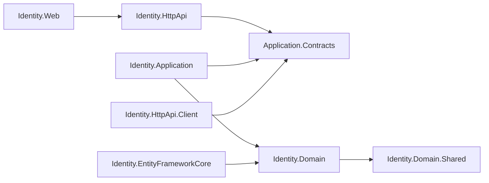

The Identity module provides user account management, role-based access control, and hierarchical organisation units on top of ASP.NET Core Identity. It follows ABP's standard layered module structure and ships separate NuGet packages for every concern — domain model, application contracts, HTTP API, client proxies, EF Core, MongoDB, Blazor, and Web UI.

<CardGroup cols={3}>
  <Card title="Domain" icon="database">
    `IdentityUser`, `IdentityRole`, `OrganizationUnit` aggregate roots and domain services
  </Card>
  <Card title="Application" icon="gears">
    `IdentityUserAppService`, `IdentityRoleAppService` — full CRUD with role assignment
  </Card>
  <Card title="Integration" icon="plug">
    `IIdentityUserIntegrationService` for cross-service user/role lookups
  </Card>
</CardGroup>

## Package structure

```
modules/identity/src/
├── Volo.Abp.Identity.Domain.Shared          # Consts, enums, ETO types
├── Volo.Abp.Identity.Domain                 # IdentityUser, IdentityRole, OrgUnit, domain services
├── Volo.Abp.Identity.Application.Contracts  # Interfaces, DTOs, permissions
├── Volo.Abp.Identity.Application            # App service implementations
├── Volo.Abp.Identity.HttpApi                # REST controller layer (auto-generated)
├── Volo.Abp.Identity.HttpApi.Client         # Static HTTP client proxies
├── Volo.Abp.Identity.EntityFrameworkCore    # EF Core DbContext, repositories
├── Volo.Abp.Identity.MongoDB                # MongoDB repositories
├── Volo.Abp.Identity.Web                    # Razor Pages UI
├── Volo.Abp.Identity.Blazor                 # Blazor component set (shared)
├── Volo.Abp.Identity.Blazor.Server          # Blazor Server variant
├── Volo.Abp.Identity.Blazor.WebAssembly     # Blazor WASM variant
├── Volo.Abp.Identity.Blazor.MudBlazor       # MudBlazor components
└── Volo.Abp.Identity.AspNetCore             # SignIn manager, security stamp
```

## Key domain entities

### IdentityUser

```csharp
// modules/identity/src/Volo.Abp.Identity.Domain/Volo/Abp/Identity/IdentityUser.cs
public class IdentityUser
    : FullAuditedAggregateRoot<Guid>, IUser, IHasEntityVersion
{
    public virtual Guid? TenantId { get; protected set; }
    public virtual string UserName { get; protected internal set; }
    public virtual string NormalizedUserName { get; protected internal set; }
    public virtual string Name { get; set; }
    public virtual string Surname { get; set; }
    public virtual string Email { get; protected internal set; }
    public virtual bool EmailConfirmed { get; protected internal set; }
    public virtual string PhoneNumber { get; set; }
    public virtual bool PhoneNumberConfirmed { get; protected internal set; }
    public virtual bool IsActive { get; set; }
    public virtual bool LockoutEnabled { get; set; }
    public virtual DateTimeOffset? LockoutEnd { get; protected set; }
    public virtual int AccessFailedCount { get; protected set; }
    // ... roles, claims, tokens, organisation units
}
```

`IdentityUser` extends `FullAuditedAggregateRoot<Guid>` so it carries full soft-delete, creator, modifier, and deletion auditing out of the box. It implements `IUser` from `Volo.Abp.Users.Abstractions` enabling cross-module user resolution.

### IdentityRole

`IdentityRole` is a `FullAuditedAggregateRoot<Guid>` with `Name`, `NormalizedName`, `IsDefault`, and `IsPublic` properties. Roles marked `IsDefault` are automatically assigned to new users.

### OrganizationUnit

```csharp
// modules/identity/src/Volo.Abp.Identity.Domain/Volo/Abp/Identity/OrganizationUnit.cs
public class OrganizationUnit
    : FullAuditedAggregateRoot<Guid>, IMultiTenant, IHasEntityVersion
{
    public virtual Guid? TenantId { get; protected set; }
    public virtual Guid? ParentId { get; internal set; }

    /// <summary>Hierarchical code, e.g. "00001.00042.00005"</summary>
    public virtual string Code { get; internal set; }

    public virtual string DisplayName { get; set; }
    // children, roles, users
}
```

The `Code` field encodes position in the hierarchy as a dot-separated zero-padded numeric string. This allows efficient subtree queries using `LIKE '00001%'` without recursive CTEs.

## Application service interfaces

### IIdentityUserAppService

```csharp
// modules/identity/src/.../Application.Contracts/IIdentityUserAppService.cs
public interface IIdentityUserAppService
    : ICrudAppService<
        IdentityUserDto,
        Guid,
        GetIdentityUsersInput,
        IdentityUserCreateDto,
        IdentityUserUpdateDto>
{
    Task<ListResultDto<IdentityRoleDto>> GetRolesAsync(Guid id);
    Task<ListResultDto<IdentityRoleDto>> GetAssignableRolesAsync();
    Task UpdateRolesAsync(Guid id, IdentityUserUpdateRolesDto input);
    Task<IdentityUserDto> FindByUsernameAsync(string userName);
    Task<IdentityUserDto> FindByEmailAsync(string email);
    Task<IdentityUserDto> FindByIdAsync(Guid id);
}
```

Inheriting `ICrudAppService` gives `GetAsync`, `GetListAsync`, `CreateAsync`, `UpdateAsync`, and `DeleteAsync` for free. The extra methods cover role management and lookup by username/email.

### IIdentityRoleAppService

```csharp
public interface IIdentityRoleAppService
    : ICrudAppService<
        IdentityRoleDto,
        Guid,
        GetIdentityRolesInput,
        IdentityRoleCreateDto,
        IdentityRoleUpdateDto>
{
    Task<ListResultDto<IdentityRoleDto>> GetAllListAsync();
}
```

### IIdentityUserLookupAppService

Lightweight interface for populating user-picker UI components:

```csharp
public interface IIdentityUserLookupAppService : IApplicationService
{
    Task<UserData> FindByIdAsync(Guid id);
    Task<UserData> FindByUserNameAsync(string userName);
}
```

## Integration service

`IIdentityUserIntegrationService` is decorated with `[IntegrationService]` and is **not** exposed by default through the public HTTP API (requires `ExposeIntegrationServices = true`). It is intended for micro-service to micro-service calls:

```csharp
[IntegrationService]
public interface IIdentityUserIntegrationService : IApplicationService
{
    Task<string[]> GetRoleNamesAsync(Guid id);
    Task<UserData> FindByIdAsync(Guid id);
    Task<UserData> FindByUserNameAsync(string userName);
    Task<ListResultDto<UserData>> SearchAsync(UserLookupSearchInputDto input);
    Task<ListResultDto<UserData>> SearchByIdsAsync(Guid[] ids);
    Task<long> GetCountAsync(UserLookupCountInputDto input);
    Task<ListResultDto<RoleData>> SearchRoleAsync(RoleLookupSearchInputDto input);
    Task<ListResultDto<RoleData>> SearchRoleByNamesAsync(string[] ids);
    Task<long> GetRoleCountAsync(RoleLookupCountInputDto input);
}
```

## Key DTOs

<Accordion title="IdentityUserDto">
```csharp
public class IdentityUserDto
    : ExtensibleFullAuditedEntityDto<Guid>, IMultiTenant, IHasConcurrencyStamp, IHasEntityVersion
{
    public Guid? TenantId { get; set; }
    public string UserName { get; set; }
    public string Name { get; set; }
    public string Surname { get; set; }
    public string Email { get; set; }
    public bool EmailConfirmed { get; set; }
    public string PhoneNumber { get; set; }
    public bool PhoneNumberConfirmed { get; set; }
    public bool IsActive { get; set; }
    public bool LockoutEnabled { get; set; }
    public int AccessFailedCount { get; set; }
    public DateTimeOffset? LockoutEnd { get; set; }
    public string ConcurrencyStamp { get; set; }
    public int EntityVersion { get; set; }
    public DateTimeOffset? LastPasswordChangeTime { get; set; }
}
```
</Accordion>

<Accordion title="GetIdentityUsersInput">
```csharp
public class GetIdentityUsersInput : PagedAndSortedResultRequestDto, IExtensibleObject
{
    public string Filter { get; set; }    // text search
    public Guid? RoleId { get; set; }
    public Guid? OrganizationUnitId { get; set; }
    public string UserName { get; set; }
    public string PhoneNumber { get; set; }
    public string EmailAddress { get; set; }
    public bool? IsLockedOut { get; set; }
    public bool? NotActive { get; set; }
    public ExtraPropertyDictionary ExtraProperties { get; set; }
}
```
</Accordion>

## Permission definitions

```csharp
// modules/identity/src/.../IdentityPermissions.cs
public static class IdentityPermissions
{
    public const string GroupName = "AbpIdentity";

    public static class Roles
    {
        public const string Default = "AbpIdentity.Roles";
        public const string Create = "AbpIdentity.Roles.Create";
        public const string Update = "AbpIdentity.Roles.Update";
        public const string Delete = "AbpIdentity.Roles.Delete";
        public const string ManagePermissions = "AbpIdentity.Roles.ManagePermissions";
    }

    public static class Users
    {
        public const string Default = "AbpIdentity.Users";
        public const string Create = "AbpIdentity.Users.Create";
        public const string Update = "AbpIdentity.Users.Update";
        public const string Delete = "AbpIdentity.Users.Delete";
        public const string ManagePermissions = "AbpIdentity.Users.ManagePermissions";
        public const string ManageRoles = "AbpIdentity.Users.Update.ManageRoles";
    }

    public static class UserLookup
    {
        public const string Default = "AbpIdentity.UserLookup";
    }
}
```

<Warning>
`IdentityPermissions.Users.ManagePermissions` grants a user the ability to change permission grants for other users — a highly privileged operation. Grant it only to super-admins.
</Warning>

## Module dependency flow



## Data seeding

`IdentityDataSeedContributor` creates an initial `admin` user and `admin` role when the database is seeded. The admin password comes from `IdentityDataSeedOptions.AdminPassword`. Override this in tests or CI:

```csharp
Configure<IdentityDataSeedOptions>(options =>
{
    options.AdminEmail = "admin@example.com";
    options.AdminPassword = "1q2w3E*";
});
```

## See also

- [Account Module](./account) — login, registration, and profile management built on top of Identity
- [OpenIddict Module](./openiddict) — OAuth2 server that uses `IdentityUser` for authentication
- [HTTP Client Proxies](../aspnetcore/http-client-proxies) — consuming `IIdentityUserIntegrationService` from another micro-service
