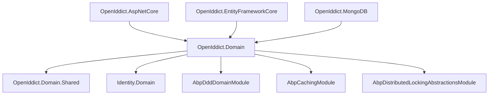
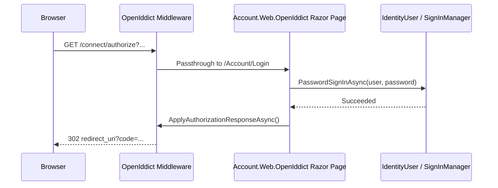

The OpenIddict module wraps the [OpenIddict](https://documentation.openiddict.com/) library as an ABP module, providing an OAuth2 and OpenID Connect authorization server backed by ABP's persistence abstractions. It stores applications, authorizations, tokens, and scopes in the same database as the rest of the application and integrates with ABP's Identity module for user authentication.

<CardGroup cols={2}>
  <Card title="Domain" icon="database">
    `OpenIddictApplication`, `OpenIddictAuthorization`, `OpenIddictToken`, `OpenIddictScope` aggregate roots
  </Card>
  <Card title="AspNetCore" icon="server">
    Wires OpenIddict's token endpoint middleware into the ABP ASP.NET Core pipeline
  </Card>
  <Card title="EF Core / MongoDB" icon="hard-drive">
    Repository implementations backed by ABP's unit-of-work infrastructure
  </Card>
  <Card title="Account Integration" icon="door-open">
    Login/consent UI provided by `Volo.Abp.Account.Web.OpenIddict`
  </Card>
</CardGroup>

## Package structure

```
modules/openiddict/src/
├── Volo.Abp.OpenIddict.Domain.Shared          # Consts, extension config
├── Volo.Abp.OpenIddict.Domain                 # Entities, stores, managers
├── Volo.Abp.OpenIddict.AspNetCore             # Middleware, endpoint wiring
├── Volo.Abp.OpenIddict.EntityFrameworkCore    # EF Core DbContext, repositories
├── Volo.Abp.OpenIddict.MongoDB                # MongoDB repositories
└── Volo.Abp.PermissionManagement.Domain.OpenIddict  # Permission seeding
```

## Module dependency graph



## AbpOpenIddictDomainModule

```csharp
// modules/openiddict/src/Volo.Abp.OpenIddict.Domain/Volo/Abp/OpenIddict/AbpOpenIddictDomainModule.cs
[DependsOn(
    typeof(AbpDddDomainModule),
    typeof(AbpIdentityDomainModule),
    typeof(AbpOpenIddictDomainSharedModule),
    typeof(AbpDistributedLockingAbstractionsModule),
    typeof(AbpCachingModule),
    typeof(AbpGuidsModule)
)]
public class AbpOpenIddictDomainModule : AbpModule
{
    public override void ConfigureServices(ServiceConfigurationContext context)
    {
        AddOpenIddictCore(context.Services);
        // Registers ABP-specific OpenIddict stores for Applications,
        // Authorizations, Tokens, and Scopes.
    }
}
```

The module hooks OpenIddict's `IOpenIddictApplicationStore<>`, `IOpenIddictAuthorizationStore<>`, `IOpenIddictTokenStore<>`, and `IOpenIddictScopeStore<>` implementations to ABP repositories. ABP's unit-of-work ensures that token creation and authorization persistence participate in the same transaction as application business logic.

## Core entities

### OpenIddictApplication

```csharp
// modules/openiddict/src/.../Applications/OpenIddictApplication.cs
public class OpenIddictApplication : FullAuditedAggregateRoot<Guid>
{
    public virtual string ApplicationType { get; set; }   // "web", "native"
    public virtual string ClientId { get; set; }
    public virtual string ClientSecret { get; set; }      // hashed
    public virtual string ClientType { get; set; }         // "public", "confidential"
    public virtual string ConsentType { get; set; }        // "explicit", "implicit", "systematic"
    public virtual string DisplayName { get; set; }
    public virtual string Permissions { get; set; }        // JSON array
    public virtual string PostLogoutRedirectUris { get; set; }
    public virtual string RedirectUris { get; set; }
    public virtual string Requirements { get; set; }
    public virtual string Properties { get; set; }         // arbitrary extra data
}
```

Each application represents one OAuth2 client. `ClientSecret` is stored as a hashed value managed by OpenIddict's application manager. `Permissions` is a JSON-serialised array of OpenIddict permission strings (e.g., `"ept:token"`, `"gt:client_credentials"`, `"scp:openid"`).

### OpenIddictAuthorization

Represents a persistent consent grant between a user and an application. Stores `ApplicationId`, `Subject` (user identifier), `Status`, `Type`, and `Scopes`.

### OpenIddictToken

Stores issued tokens for auditing and revocation:

| Property | Description |
|---|---|
| `ApplicationId` | Issuing application |
| `AuthorizationId` | Linked authorization (nullable for client_credentials) |
| `Type` | `"access_token"`, `"refresh_token"`, `"authorization_code"` |
| `Status` | `"valid"`, `"redeemed"`, `"revoked"`, `"rejected"` |
| `Subject` | User identifier |
| `ExpirationDate` | UTC expiry |
| `Payload` | Opaque token reference for JWT-style tokens |

### OpenIddictScope

Defines a named OAuth2 scope with an optional display name, description, and set of resources (audiences):

```csharp
public class OpenIddictScope : FullAuditedAggregateRoot<Guid>
{
    public virtual string Description { get; set; }
    public virtual string DisplayName { get; set; }
    public virtual string Name { get; set; }
    public virtual string Properties { get; set; }
    public virtual string Resources { get; set; } // JSON array of audience URIs
}
```

## Supported grant types

| Grant Type | OpenIddict Permission | Typical Use |
|---|---|---|
| `client_credentials` | `gt:client_credentials` | Machine-to-machine, micro-service tokens |
| `authorization_code` | `gt:authorization_code` | Web apps with user login |
| `refresh_token` | `gt:refresh_token` | Obtaining new access tokens silently |
| `password` | `gt:password` | Legacy / testing (not recommended for production) |
| `device_code` | `gt:urn:ietf:params:oauth:grant-type:device_code` | CLI / smart-device flows |

## Token endpoints

After calling `app.UseAbpOpenIddict()` the following endpoints are available:

| Endpoint | Path |
|---|---|
| Authorization | `/connect/authorize` |
| Token | `/connect/token` |
| Introspection | `/connect/introspect` |
| Revocation | `/connect/revoke` |
| Logout | `/connect/logout` |
| Device Authorization | `/connect/device` |
| User Info | `/connect/userinfo` |

## Configuring OpenIddict in a host

```csharp
// In PreConfigureServices of the host web module:
PreConfigure<OpenIddictBuilder>(builder =>
{
    builder
        .AddCore(core =>
        {
            core.UseEntityFrameworkCore();
        })
        .AddServer(server =>
        {
            server
                .AllowAuthorizationCodeFlow()
                .AllowClientCredentialsFlow()
                .AllowRefreshTokenFlow();

            server
                .SetAuthorizationEndpointUris("/connect/authorize")
                .SetTokenEndpointUris("/connect/token")
                .SetIntrospectionEndpointUris("/connect/introspect")
                .SetLogoutEndpointUris("/connect/logout");

            server.RegisterScopes(
                OpenIddictConstants.Scopes.Email,
                OpenIddictConstants.Scopes.Profile,
                OpenIddictConstants.Scopes.Roles,
                "MyApi");

            server
                .UseAspNetCore()
                .EnableAuthorizationEndpointPassthrough()
                .EnableTokenEndpointPassthrough()
                .EnableLogoutEndpointPassthrough()
                .EnableUserinfoEndpointPassthrough();
        })
        .AddValidation(validation =>
        {
            validation.UseLocalServer();
            validation.UseAspNetCore();
        });
});
```

## Data seeding

`OpenIddictDataSeedContributorBase` provides a base class for seeding demo applications and scopes during development. Override `CreateApplicationsAsync()` and `CreateScopesAsync()` in your host project's seed contributor:

```csharp
public class MyOpenIddictDataSeedContributor
    : OpenIddictDataSeedContributorBase
{
    protected override async Task CreateApplicationsAsync()
    {
        await CreateApplicationAsync(
            name: "MyWebApp",
            clientId: "MyWebApp",
            clientSecret: null, // public client
            type: OpenIddictConstants.ClientTypes.Public,
            consentType: OpenIddictConstants.ConsentTypes.Implicit,
            displayName: "My Web Application",
            scopes: new[] { "openid", "profile", "email", "MyApi" },
            grantTypes: new[] {
                OpenIddictConstants.GrantTypes.AuthorizationCode,
                OpenIddictConstants.GrantTypes.RefreshToken
            },
            redirectUris: new[] { "https://myapp.example.com/signin-oidc" },
            postLogoutRedirectUris: new[] { "https://myapp.example.com/signout-callback-oidc" }
        );
    }
}
```

## Account module login UI integration

`Volo.Abp.Account.Web.OpenIddict` provides the Razor Pages that OpenIddict's passthrough middleware delegates to:



## Token cleanup background worker

`AbpOpenIddictDomainModule` registers a background worker that periodically prunes expired tokens and authorizations from the store. The interval is configurable via `AbpOpenIddictStoreOptions`:

```csharp
Configure<AbpOpenIddictStoreOptions>(options =>
{
    options.CleanupLoopDelay = TimeSpan.FromMinutes(30);
});
```

## See also

- [Account Module](./account) — login UI that OpenIddict delegates to
- [Identity Module](./identity) — `IdentityUser` used as the OpenIddict `Subject`
- [HTTP Client Proxies](../aspnetcore/http-client-proxies) — IdentityModel integration for `client_credentials` token acquisition
