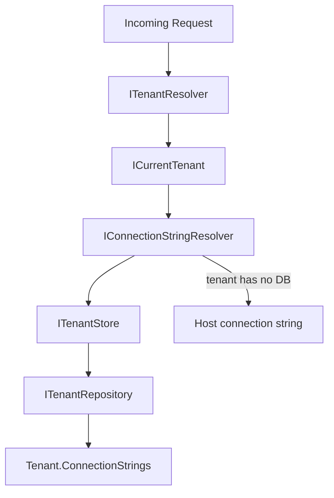

The Tenant Management module provides the administrative interface for managing tenants in a multi-tenant ABP application. It exposes CRUD operations for `Tenant` records, manages per-tenant database connection strings, and integrates with the `Volo.Abp.MultiTenancy` framework that routes requests to the correct tenant data store.

<CardGroup cols={2}>
  <Card title="ITenantAppService" icon="building">
    Full CRUD for tenants plus connection-string management methods
  </Card>
  <Card title="Per-tenant DB" icon="database">
    `GetDefaultConnectionStringAsync` / `UpdateDefaultConnectionStringAsync` for database-per-tenant setups
  </Card>
  <Card title="Permissions" icon="lock">
    `AbpTenantManagement.Tenants.*` permission set with feature management support
  </Card>
  <Card title="UI" icon="table-columns">
    Razor Pages, Blazor (Server/WASM/MudBlazor) tenant management grids
  </Card>
</CardGroup>

## Package structure

```
modules/tenant-management/src/
├── Volo.Abp.TenantManagement.Domain.Shared          # Consts, ETOs
├── Volo.Abp.TenantManagement.Domain                 # Tenant, TenantConnectionString entities
├── Volo.Abp.TenantManagement.Application.Contracts  # ITenantAppService, DTOs, permissions
├── Volo.Abp.TenantManagement.Application            # TenantAppService implementation
├── Volo.Abp.TenantManagement.HttpApi                # REST controller
├── Volo.Abp.TenantManagement.HttpApi.Client         # Static HTTP client proxies
├── Volo.Abp.TenantManagement.EntityFrameworkCore    # EF Core DbContext, repositories
├── Volo.Abp.TenantManagement.MongoDB                # MongoDB repositories
├── Volo.Abp.TenantManagement.Web                    # Razor Pages management UI
├── Volo.Abp.TenantManagement.Blazor                 # Blazor shared components
├── Volo.Abp.TenantManagement.Blazor.Server          # Blazor Server variant
├── Volo.Abp.TenantManagement.Blazor.WebAssembly     # Blazor WASM variant
├── Volo.Abp.TenantManagement.Blazor.MudBlazor       # MudBlazor variant
├── Volo.Abp.TenantManagement.Blazor.MudBlazor.Server
└── Volo.Abp.TenantManagement.Blazor.MudBlazor.WebAssembly
```

## ITenantAppService

```csharp
// modules/tenant-management/src/.../ITenantAppService.cs
public interface ITenantAppService
    : ICrudAppService<TenantDto, Guid, GetTenantsInput, TenantCreateDto, TenantUpdateDto>
{
    Task<string> GetDefaultConnectionStringAsync(Guid id);

    Task UpdateDefaultConnectionStringAsync(Guid id, string defaultConnectionString);

    Task DeleteDefaultConnectionStringAsync(Guid id);
}
```

`ICrudAppService` provides:
- `GetAsync(Guid id)`
- `GetListAsync(GetTenantsInput input)` — paginated, filterable by name
- `CreateAsync(TenantCreateDto input)`
- `UpdateAsync(Guid id, TenantUpdateDto input)`
- `DeleteAsync(Guid id)`

The three additional methods manage the **default connection string** — the connection string used for this tenant's own database when database-per-tenant isolation is required.

## TenantDto

```csharp
// modules/tenant-management/src/.../TenantDto.cs
public class TenantDto : ExtensibleEntityDto<Guid>, IHasConcurrencyStamp
{
    public string Name { get; set; }
    public string ConcurrencyStamp { get; set; }
}
```

`ExtensibleEntityDto<Guid>` gives `TenantDto` an `ExtraProperties` dictionary, enabling host application developers to attach additional fields to tenants without modifying the module's source code (via ABP's object-extension system).

## GetTenantsInput

```csharp
public class GetTenantsInput : PagedAndSortedResultRequestDto
{
    public string Filter { get; set; } // fuzzy name search
}
```

## Permission definitions

```csharp
// modules/tenant-management/src/.../TenantManagementPermissions.cs
public static class TenantManagementPermissions
{
    public const string GroupName = "AbpTenantManagement";

    public static class Tenants
    {
        public const string Default              = "AbpTenantManagement.Tenants";
        public const string Create               = "AbpTenantManagement.Tenants.Create";
        public const string Update               = "AbpTenantManagement.Tenants.Update";
        public const string Delete               = "AbpTenantManagement.Tenants.Delete";
        public const string ManageFeatures       = "AbpTenantManagement.Tenants.ManageFeatures";
        public const string ManageConnectionStrings = "AbpTenantManagement.Tenants.ManageConnectionStrings";
    }
}
```

<Warning>
`ManageConnectionStrings` allows writing raw database connection strings — including credentials — for each tenant. Restrict this permission to trusted host administrators only.
</Warning>

## Domain entities

### Tenant

`Tenant` (in `Volo.Abp.MultiTenancy.Domain`, not the Tenant Management module itself) is the aggregate root. The Tenant Management module's `TenantAppService` manages it via `ITenantRepository`.

### TenantConnectionString

A one-to-many child of `Tenant`. Each record has a `Name` (connection string name, e.g., `"Default"`) and a `Value`. `TenantAppService.UpdateDefaultConnectionStringAsync` upserts the record with `name = "Default"`.

## Connection string resolution

ABP's multi-tenancy infrastructure resolves connection strings at runtime:



`AbpDbConnectionOptions.ConnectionStrings` provides the host-level defaults. Per-tenant overrides stored via `TenantAppService.UpdateDefaultConnectionStringAsync` take precedence.

## Integration with Volo.Abp.MultiTenancy

`Volo.Abp.MultiTenancy` provides the tenant resolution middleware (`AbpMultiTenancyOptions`, `ITenantResolver`) and the `ICurrentTenant` ambient context. The Tenant Management module depends on `Volo.Abp.MultiTenancy` and satisfies the `ITenantStore` contract via `TenantStore`, which queries `ITenantRepository`.

Configure tenant resolvers in your host module:

```csharp
Configure<AbpTenantResolveOptions>(options =>
{
    // Try claim first, then subdomain, then query string
    options.TenantResolvers.Insert(0, new ClaimTenantResolveContributor());
    options.TenantResolvers.Add(new DomainTenantResolveContributor("{0}.myapp.com"));
    options.TenantResolvers.Add(new QueryStringTenantResolveContributor());
});
```

## Feature management integration

The `ManageFeatures` permission enables the host administrator to enable or disable ABP features for individual tenants via the UI. This is implemented by `IFeatureManager` from `Volo.Abp.FeatureManagement`, which the Tenant Management UI surfaces through a modal dialog on the tenant list page.

Example — programmatically enabling a feature for a tenant:

```csharp
await featureManager.SetAsync(
    featureName: "MyApp.PremiumDashboard",
    value: "true",
    providerName: TenantFeatureValueProvider.ProviderName,
    providerKey: tenantId.ToString()
);
```

## Data seeding

For development and test environments, seed an initial tenant using ABP's `IDataSeeder`. Use `ITenantRepository` for the existence check (the application service does not expose a `FindByName` query):

```csharp
public class MyDataSeedContributor : IDataSeedContributor, ITransientDependency
{
    private readonly ITenantAppService _tenantAppService;
    private readonly ITenantRepository _tenantRepository;

    public MyDataSeedContributor(
        ITenantAppService tenantAppService,
        ITenantRepository tenantRepository)
    {
        _tenantAppService = tenantAppService;
        _tenantRepository = tenantRepository;
    }

    public async Task SeedAsync(DataSeedContext context)
    {
        // Only seed at the host level
        if (context.TenantId != null)
            return;

        var existing = await _tenantRepository.FindByNameAsync("acme");
        if (existing == null)
        {
            await _tenantAppService.CreateAsync(new TenantCreateDto
            {
                Name = "acme",
                AdminEmailAddress = "admin@acme.example.com",
                AdminPassword = "1q2w3E*"
            });
        }
    }
}
```

## See also

- [Identity Module](./identity) — users and roles are scoped per-tenant
- [Account Module](./account) — tenant switching on the login page
- [OpenIddict Module](./openiddict) — applications and scopes can be tenant-scoped
