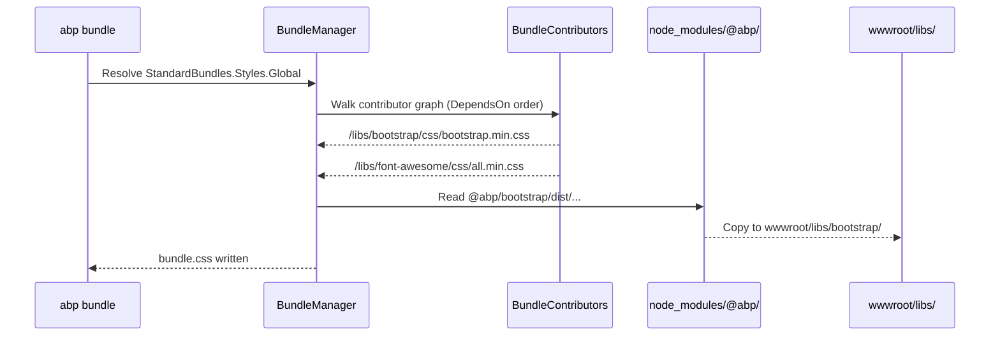

ABP's MVC/Razor Pages UI relies on a second npm distribution channel that is entirely separate from the Angular `ng-packs`. The packages under `npm/packs/` are thin, versioned wrappers that re-export third-party libraries (Bootstrap, jQuery, Select2, etc.) alongside ABP-specific client assets. They exist so that the server-side **bundling system** can resolve static files from `node_modules` at build time — no webpack pipeline required.

<Note>
  These packs are consumed at build/publish time by ABP's virtual file system and bundling infrastructure. End users never import them directly in TypeScript — they are referenced through C# `BundleContributor` classes.
</Note>

---

## Why a separate pack registry?

ABP MVC apps do not run a JavaScript bundler. Instead:

1. Each ABP module declares which npm packages it needs via `BundleContributor` classes.
2. At startup (dev) or CI (release), `abp bundle` resolves the contributor graph.
3. It reads CSS/JS from `node_modules/@abp/<pack-name>/` and copies or concatenates the files into `wwwroot/libs/`.

Versioning the re-packaged libraries under the `@abp` scope ensures that all ABP modules agree on a single copy of e.g. Bootstrap 5, preventing duplicate or conflicting versions.

---

## Pack inventory

### ABP core packs

<CardGroup cols={2}>
  <Card title="@abp/aspnetcore.mvc.ui" icon="layer-group">
    Top-level MVC pack. Provides the ABP global JavaScript runtime (`abp.js`) that handles client-side alerts, AJAX error handling, form validation hooks, and localization.
  </Card>
  <Card title="@abp/aspnetcore.mvc.ui.theme.shared" icon="palette">
    Aggregates all shared theme dependencies: Bootstrap 5, Datatables BS5, Font Awesome, Select2, SweetAlert2, Luxon, Moment, Lodash, Timeago, and more.
  </Card>
  <Card title="@abp/core" icon="cube">
    Minimal runtime helpers (`@abp/utils` dependency). Used by non-theme MVC modules.
  </Card>
  <Card title="@abp/utils" icon="wrench">
    Pure utility functions shared between MVC packs and Angular packages.
  </Card>
</CardGroup>

```json title="npm/packs/aspnetcore.mvc.ui.theme.shared/package.json — dependencies"
{
  "name": "@abp/aspnetcore.mvc.ui.theme.shared",
  "version": "10.5.0-rc.1",
  "dependencies": {
    "@abp/aspnetcore.mvc.ui": "~10.5.0-rc.1",
    "@abp/bootstrap": "~10.5.0-rc.1",
    "@abp/bootstrap-datepicker": "~10.5.0-rc.1",
    "@abp/bootstrap-daterangepicker": "~10.5.0-rc.1",
    "@abp/datatables.net-bs5": "~10.5.0-rc.1",
    "@abp/font-awesome": "~10.5.0-rc.1",
    "@abp/jquery-validation-unobtrusive": "~10.5.0-rc.1",
    "@abp/lodash": "~10.5.0-rc.1",
    "@abp/luxon": "~10.5.0-rc.1",
    "@abp/select2": "~10.5.0-rc.1",
    "@abp/sweetalert2": "~10.5.0-rc.1",
    "@abp/timeago": "~10.5.0-rc.1"
  }
}
```

### Blazor packs

| Pack | Purpose |
|---|---|
| `@abp/aspnetcore.components.server.basictheme` | Blazor Server Basic Theme assets |
| `@abp/aspnetcore.components.server.theming` | Shared Blazor Server theming assets |

### Module-specific packs

| Pack | ABP Module |
|---|---|
| `@abp/blogging` | Blogging module |
| `@abp/cms-kit` | CMS Kit public |
| `@abp/cms-kit.admin` | CMS Kit admin |
| `@abp/cms-kit.public` | CMS Kit public widgets |
| `@abp/docs` | Docs module |
| `@abp/virtual-file-explorer` | Virtual File Explorer |

### Third-party re-packages

Every third-party library is re-published under `@abp/<name>` so ABP can control the version:

<Accordion title="Full list of re-packaged libraries">
  | @abp pack | Original library |
  |---|---|
  | `@abp/bootstrap` | `bootstrap` |
  | `@abp/bootstrap-datepicker` | `bootstrap-datepicker` |
  | `@abp/bootstrap-daterangepicker` | `bootstrap-daterangepicker` |
  | `@abp/chart.js` | `chart.js` |
  | `@abp/codemirror` | `codemirror` |
  | `@abp/cropperjs` | `cropperjs` |
  | `@abp/datatables.net` | `datatables.net` |
  | `@abp/datatables.net-bs4` | `datatables.net-bs4` |
  | `@abp/datatables.net-bs5` | `datatables.net-bs5` |
  | `@abp/flag-icon-css` | `flag-icon-css` |
  | `@abp/flag-icons` | `flag-icons` |
  | `@abp/font-awesome` | `@fortawesome/fontawesome-free` |
  | `@abp/highlight.js` | `highlight.js` |
  | `@abp/jquery` | `jquery` |
  | `@abp/jquery-form` | `jquery-form` |
  | `@abp/jquery-validation` | `jquery-validation` |
  | `@abp/jquery-validation-unobtrusive` | `jquery-validation-unobtrusive` |
  | `@abp/jstree` | `jstree` |
  | `@abp/lodash` | `lodash` |
  | `@abp/luxon` | `luxon` |
  | `@abp/malihu-custom-scrollbar-plugin` | `malihu-custom-scrollbar-plugin` |
  | `@abp/markdown-it` | `markdown-it` |
  | `@abp/moment` | `moment` |
  | `@abp/owl.carousel` | `owl.carousel` |
  | `@abp/popper.js` | `@popperjs/core` |
  | `@abp/prismjs` | `prismjs` |
  | `@abp/qrcode` | `qrcode` |
  | `@abp/select2` | `select2` |
  | `@abp/signalr` | `@microsoft/signalr` |
  | `@abp/slugify` | `slugify` |
  | `@abp/star-rating-svg` | `star-rating-svg` |
  | `@abp/sweetalert2` | `sweetalert2` |
  | `@abp/timeago` | `timeago.js` |
  | `@abp/toastr` | `toastr` |
  | `@abp/tui-editor` | `tui-editor` |
  | `@abp/uppy` | `uppy` |
  | `@abp/vee-validate` | `vee-validate` |
  | `@abp/vue` | `vue` |
  | `@abp/zxcvbn` | `zxcvbn` |
</Accordion>

---

## BundleContributor integration

Each ABP module registers its required npm packs via a `BundleContributor` class. The contributor declares which files to include and which other contributors it depends on:

```csharp title="Example: AnchorJsScriptBundleContributor.cs"
[DependsOn(typeof(JQueryScriptContributor))]
public class AnchorJsScriptBundleContributor : BundleContributor
{
    public override void ConfigureBundle(BundleConfigurationContext context)
    {
        // Path resolved from node_modules/@abp/anchor-js/anchor.js
        // (copied to wwwroot/libs/ by `abp bundle`)
        context.Files.AddIfNotContains("/libs/anchor-js/anchor.js");
    }
}
```

The `[DependsOn]` attribute on contributors mirrors the npm `dependencies` graph, ensuring files are emitted in correct order.

Contributors are wired into standard bundles in module `ConfigureServices`:

```csharp title="AbpAspNetCoreMvcUiThemeSharedModule.cs — excerpt"
Configure<AbpBundlingOptions>(options =>
{
    options.StyleBundles
        .Add(StandardBundles.Styles.Global, bundle =>
        {
            bundle.AddContributors(typeof(SharedThemeGlobalStyleContributor));
        });

    options.ScriptBundles
        .Add(StandardBundles.Scripts.Global, bundle =>
        {
            bundle.AddContributors(typeof(SharedThemeGlobalScriptContributor));
        });
});
```

---

## How `abp bundle` resolves files



---

## Razor Pages tag helper usage

In a layout `_Layout.cshtml`, bundles are referenced via ABP tag helpers:

```html
<abp-style-bundle name="@StandardBundles.Styles.Global" />
<abp-script-bundle name="@StandardBundles.Scripts.Global" />
```

In development mode each file is emitted individually; in production they are concatenated and minified.

---

## Publish workflow

All MVC packs are published via `npm/publish-mvc.ps1`:

```powershell title="npm/publish-mvc.ps1 — excerpt"
param([string]$Version, [string]$Registry)

yarn install

$PacksPublishCommand = "npm run lerna -- exec 'npm publish --registry $Registry'"

if ($IsPrerelease) {
    $PacksPublishCommand += " --tag next"
}
```

The script:
1. Bumps all pack versions via Lerna.
2. Runs `npm publish` for each pack in `npm/packs/`.
3. Tags pre-releases with `--tag next` on the npm registry.

Angular packages use a parallel `publish-ng.ps1` with a Gulp-based update step.

---

## Adding a new pack

<Steps>
  <Step title="Create the pack directory">
    Add `npm/packs/<my-library>/` with a `package.json` referencing the upstream library.
  </Step>
  <Step title="Write a BundleContributor">
    Create `MyLibraryScriptBundleContributor : BundleContributor` in your module's NuGet package and add `[DependsOn]` attributes for upstream contributors.
  </Step>
  <Step title="Register in AbpBundlingOptions">
    Add the contributor to the appropriate `StyleBundles` or `ScriptBundles` bundle in your module's `ConfigureServices`.
  </Step>
  <Step title="Run abp bundle">
    Execute `abp bundle` in the web project directory to copy files to `wwwroot/libs/` and update bundle manifests.
  </Step>
</Steps>

---

## Related pages

- [MVC Theming System](./theming-system)
- [ABP CLI — bundle command](../tooling/abp-cli)
- [Angular ng-packs](../angular/ng-modules)
