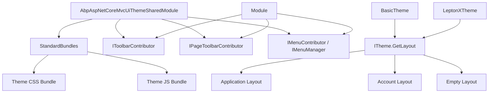

ABP's MVC theming system is a layered abstraction that separates the *application shell* (header, nav, sidebar, footer) from the *page content* (Razor Pages, Controllers). A theme is a NuGet package that implements the `ITheme` interface and registers its layout Razor views, bundle contributors, and menu/toolbar hooks. Applications can switch themes by swapping a single NuGet package.

---

## Core contract — `ITheme`

```csharp title="framework/src/Volo.Abp.AspNetCore.Mvc.UI/Volo/Abp/AspNetCore/Mvc/UI/Theming/ITheme.cs"
namespace Volo.Abp.AspNetCore.Mvc.UI.Theming;

public interface ITheme
{
    // Returns the path to a Razor layout file.
    // name: one of StandardLayouts (Application, Account, Empty, Public)
    // fallbackToDefault: return the default layout if the named one is not found
    string GetLayout(string name, bool fallbackToDefault = true);
}
```

The theme manager resolves the current theme from `AbpThemingOptions`:

```csharp title="AbpThemingOptions.cs"
public class AbpThemingOptions
{
    public ThemeDictionary Themes { get; }     // registered theme types
    public string? DefaultThemeName { get; set; }
    public string? BaseUrl { get; set; }       // injected into <base href>
}
```

```csharp title="IThemeManager.cs"
public interface IThemeManager
{
    ITheme CurrentTheme { get; }
}
```

A theme registers itself in `ConfigureServices`:

```csharp
Configure<AbpThemingOptions>(options =>
{
    options.Themes.Add<BasicTheme>();
    options.DefaultThemeName = BasicTheme.Name;
});
```

---

## `AbpAspNetCoreMvcUiThemeSharedModule`

This module is the prerequisite for all MVC themes. It provides:

- Standard bundle definitions (`StandardBundles.Styles.Global`, `StandardBundles.Scripts.Global`)
- `PageToolbar` infrastructure
- `IToolbarManager` / `IToolbarContributor` for the main navigation toolbar
- `IPageLayout` for per-page breadcrumbs and titles
- Error page controller and views

```csharp title="Module dependencies"
[DependsOn(
    typeof(AbpAspNetCoreMvcUiBootstrapModule),
    typeof(AbpAspNetCoreMvcUiPackagesModule),
    typeof(AbpAspNetCoreMvcUiWidgetsModule),
    typeof(AbpFeaturesModule)
)]
public class AbpAspNetCoreMvcUiThemeSharedModule : AbpModule { ... }
```

---

## Standard bundles

```csharp title="StandardBundles.cs"
public class StandardBundles
{
    public static class Styles
    {
        public static string Global = "Global";   // global CSS bundle
    }

    public static class Scripts
    {
        public static string Global = "Global";   // global JS bundle
    }
}
```

Themes *extend* these bundles by adding contributors. A theme never replaces the bundle name — it adds its own contributor that pulls in theme-specific CSS/JS on top of shared dependencies.

In Razor layouts:

```html
<abp-style-bundle name="@StandardBundles.Styles.Global" />
<abp-script-bundle name="@StandardBundles.Scripts.Global" />
```

---

## Navigation toolbar — `IToolbarContributor`

```csharp title="IToolbarContributor.cs"
public interface IToolbarContributor
{
    Task ConfigureToolbarAsync(IToolbarConfigurationContext context);
}
```

There is one named standard toolbar:

```csharp
public static class StandardToolbars
{
    public const string Main = "Main";  // top navigation bar items
}
```

A module adds items to the main toolbar:

```csharp
public class MyToolbarContributor : IToolbarContributor
{
    public Task ConfigureToolbarAsync(IToolbarConfigurationContext context)
    {
        if (context.Toolbar.Name == StandardToolbars.Main)
        {
            context.Toolbar.Items.Insert(0, new ToolbarItem(typeof(MyViewComponent)));
        }
        return Task.CompletedTask;
    }
}
```

Register in a module:

```csharp
Configure<AbpToolbarOptions>(options =>
{
    options.Contributors.Add(new MyToolbarContributor());
});
```

---

## Navigation menus — `IMenuContributor`

```csharp title="IMenuContributor.cs"
public interface IMenuContributor
{
    Task ConfigureMenuAsync(MenuConfigurationContext context);
}
```

```csharp title="IMenuManager.cs"
public interface IMenuManager
{
    Task<ApplicationMenu> GetAsync(string name);
    Task<ApplicationMenu> GetMainMenuAsync();
}
```

Modules implement `IMenuContributor` to add sidebar or header navigation items. The theme renders the menu returned by `IMenuManager`.

```csharp title="Example menu contributor"
public class BookStoreMenuContributor : IMenuContributor
{
    public async Task ConfigureMenuAsync(MenuConfigurationContext context)
    {
        if (context.Menu.Name == StandardMenus.Main)
        {
            context.Menu.AddItem(
                new ApplicationMenuItem("BookStore", "Book Store", "/books")
                    .RequirePermissions("BookStore.Books")
            );
        }
    }
}
```

---

## Page toolbars — `PageToolbar`

Page toolbars allow individual Razor Pages to register buttons (e.g. "New Book", "Import") that the theme renders in a standardized position — typically the page header area, right-aligned.

```csharp title="IPageToolbarContributor.cs"
public interface IPageToolbarContributor
{
    Task ContributeAsync(PageToolbarContributionContext context);
}
```

The fluent `PageToolbarExtensions` API:

```csharp title="PageToolbarExtensions — key methods"
// Add a View Component as a toolbar item
toolbar.AddComponent<MyButtonViewComponent>(order: 10);

// Add a standard ABP button with localization
toolbar.AddButton(
    text: L["NewBook"],
    icon: "plus",
    id: "NewBookButton",
    requiredPolicyName: "BookStore.Books.Create"
);
```

In a Razor Page:

```csharp
public class IndexModel : AbpPageModel
{
    public IndexModel(IPageToolbarManager toolbarManager)
    {
        toolbarManager.Get("Books.Index").AddButton(
            text: new LocalizableString(typeof(BookStoreResource), "NewBook"),
            icon: "plus",
            id: "NewBookButton"
        );
    }
}
```

```html title="In the layout — renders registered toolbar items"
<abp-page-toolbar />
```

---

## Layout hooks

Themes expose named injection points (hooks) in their layout files. Modules and applications inject view components at these hooks without modifying the layout:

```csharp
Configure<AbpLayoutHookOptions>(options =>
{
    options.Add(
        LayoutHooks.Head.Last,          // inject before </head>
        typeof(GoogleTagManagerViewComponent)
    );
});
```

---

## Basic Theme

The open-source **Basic Theme** (source: `modules/basic-theme/`) is the reference implementation. It is minimal by design — suitable for back-office UIs.

```
modules/basic-theme/src/
├── Volo.Abp.AspNetCore.Mvc.BasicTheme/      # MVC theme
├── Volo.Abp.AspNetCore.Components.Web.BasicTheme/      # Blazor shared
├── Volo.Abp.AspNetCore.Components.Server.BasicTheme/   # Blazor Server
├── Volo.Abp.AspNetCore.Components.WebAssembly.BasicTheme/  # Blazor WASM
├── Volo.Abp.AspNetCore.Components.Server.MudBlazorBasicTheme/   # MudBlazor
└── Volo.Abp.AspNetCore.Components.MauiBlazor.BasicTheme/  # MAUI Blazor
```

The Basic Theme registers bundle contributors for its own CSS/JS in each variant's module class.

---

## LeptonX Theme

The commercial **LeptonX** theme replaces Basic Theme in commercial ABP projects. Its version is pinned separately from the core ABP version in `common.props`:

```xml title="common.props"
<Version>10.6.0-preview</Version>
<LeptonXVersion>5.6.0-preview</LeptonXVersion>
```

LeptonX ships MVC, Blazor Server, Blazor WebAssembly, MAUI, and Angular variants. It is distributed as NuGet packages from the ABP commercial NuGet feed.

<Warning>
  LeptonX is not open-source. Commercial license required. Reference via `AbpLicenseCode` in `appsettings.json` or via CLI login (`abp login`).
</Warning>

---

## Blazor theming variants

ABP provides a theming abstraction for Blazor that mirrors the MVC system. The Blazor `ITheme` interface (in `Volo.Abp.AspNetCore.Components.Web.Theming`) returns layout component types instead of Razor view paths.

| Package | Runtime |
|---|---|
| `Volo.Abp.AspNetCore.Components.Web.Theming` | Shared Blazor Web abstractions |
| `Volo.Abp.AspNetCore.Components.Server.Theming` | Blazor Server (circuit) |
| `Volo.Abp.AspNetCore.Components.WebAssembly.Theming` | Blazor WebAssembly |
| `Volo.Abp.AspNetCore.Components.MauiBlazor.Theming` | .NET MAUI Blazor |
| `Volo.Abp.AspNetCore.Components.Web.Theming.MudBlazor` | MudBlazor variant |
| `Volo.Abp.AspNetCore.Components.Server.Theming.MudBlazor` | Blazor Server + MudBlazor |
| `Volo.Abp.AspNetCore.Components.WebAssembly.Theming.MudBlazor` | WASM + MudBlazor |
| `Volo.Abp.AspNetCore.Components.MauiBlazor.Theming.MudBlazor` | MAUI + MudBlazor |

Each variant has a corresponding `BasicTheme` implementation in `modules/basic-theme/src/`.

---

## Theming architecture summary



---

## Related pages

- [MVC npm Packs](./npm-packs) — how CSS/JS files reach `wwwroot/libs/`
- [Build System](../tooling/build-system) — `LeptonXVersion` in `common.props`
- [ABP CLI — bundle command](../tooling/abp-cli)
