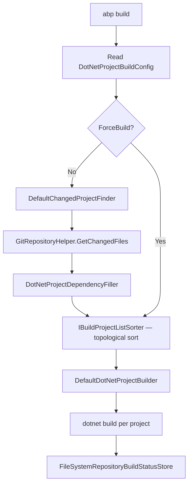

The ABP CLI (`abp`) is a .NET global tool built on `Volo.Abp.Cli` and `Volo.Abp.Cli.Core`. It is the primary developer interface for creating projects, managing modules, generating Angular/Blazor proxies, bundling MVC assets, and interacting with the ABP commercial license system. The CLI itself is an ABP application — it uses the ABP module system, DI, and event bus internally.

---

## Package structure

```
framework/src/
├── Volo.Abp.Cli/              # Entry point, module registration
└── Volo.Abp.Cli.Core/
    └── Volo/Abp/Cli/
        ├── AbpCliOptions.cs            # Command registry + global options
        ├── Args/                       # Argument parsing
        ├── Auth/                       # Login / license auth
        ├── Build/                      # Git-aware build orchestration
        ├── Bundling/                   # abp bundle internals
        ├── Commands/                   # One class per CLI command
        └── ProjectBuilding/            # Template scaffolding
```

---

## `AbpCliOptions` — command registry

```csharp title="AbpCliOptions.cs"
public class AbpCliOptions
{
    // Maps command name → IConsoleCommand implementation type
    // StringComparer.OrdinalIgnoreCase makes commands case-insensitive
    public Dictionary<string, Type> Commands { get; }

    // Module names excluded from "add to solution" suggestions
    public List<string> DisabledModulesToAddToSolution { get; set; }

    // Cache downloaded templates locally (default: true)
    public bool CacheTemplates { get; set; } = true;

    // Display name used in help output (default: "CLI")
    public string ToolName { get; set; } = "CLI";

    // Suppress external process stdout/stderr (default: false)
    public bool AlwaysHideExternalCommandOutput { get; set; }
}
```

Commands are registered in `AbpCliCoreModule` and can be extended by commercial CLI extensions that add extra entries to `AbpCliOptions.Commands`.

---

## Argument parsing

### `CommandLineArgumentParser`

Parses `string[] args` into a structured `CommandLineArgs` object. Grammar:

```
abp <command> [target] [--option value] [-o value] [--flag]
```

```csharp title="CommandLineArgumentParser.cs — Parse logic"
public class CommandLineArgumentParser : ICommandLineArgumentParser, ITransientDependency
{
    public CommandLineArgs Parse(string[] args)
    {
        var command = args[0];             // e.g. "new"
        var target  = args[1];             // e.g. "MyApp" (if not a flag)
        // Remaining args become Options dictionary
        // --output-folder ./out  → Options["output-folder"] = "./out"
        // --no-ui                 → Options["no-ui"] = null
    }
}
```

### `AbpCommandLineOptions`

A `Dictionary<string, string>` subclass with a null-safe `GetOrNull(name, ...alternativeNames)` helper, allowing commands to accept both long and short option names:

```csharp
public class AbpCommandLineOptions : Dictionary<string, string>
{
    public string? GetOrNull(string name, params string[] alternativeNames)
    {
        var value = this.GetOrDefault(name);
        if (!value.IsNullOrWhiteSpace()) return value;

        foreach (var alt in alternativeNames)
        {
            value = this.GetOrDefault(alt);
            if (!value.IsNullOrWhiteSpace()) return value;
        }
        return null;
    }
}
```

---

## Built-in commands

<CardGroup cols={2}>
  <Card title="new" icon="plus">
    Scaffolds a new ABP project from a template. Accepts template name, output folder, database provider, UI framework, and more.
  </Card>
  <Card title="update" icon="rotate">
    Updates ABP NuGet/npm packages in an existing solution to the latest stable or preview version.
  </Card>
  <Card title="add-module" icon="puzzle-piece">
    Adds an ABP module to an existing solution, installs NuGet packages, and wires up module dependencies.
  </Card>
  <Card title="add-package" icon="box">
    Adds a single NuGet package to a project, automatically updating `csproj` and module class imports.
  </Card>
  <Card title="generate-proxy" icon="code">
    Reads a `generate-proxy.json` from an `*.HttpApi.Client` project and generates TypeScript (Angular), C# (Blazor), or other client proxies.
  </Card>
  <Card title="remove-proxy" icon="trash">
    Removes previously generated proxy files.
  </Card>
  <Card title="login" icon="right-to-bracket">
    Authenticates against `account.abp.io` and stores credentials for license-gated features.
  </Card>
  <Card title="logout" icon="right-from-bracket">
    Clears stored credentials.
  </Card>
  <Card title="build" icon="hammer">
    Git-aware incremental build: detects changed projects via `DefaultChangedProjectFinder` and rebuilds only affected projects.
  </Card>
  <Card title="bundle" icon="layer-group">
    Runs the Blazor/MVC bundler to copy npm pack assets to `wwwroot/libs/` and update bundle manifests.
  </Card>
  <Card title="suite" icon="wand-magic-sparkles">
    Launches ABP Suite (commercial). Generates full CRUD pages including UI, application service, and tests.
  </Card>
  <Card title="install-libs" icon="download">
    Runs `npm install` / `yarn` in MVC/Razor Pages projects and copies libs to `wwwroot`.
  </Card>
</CardGroup>

<Accordion title="Additional commands">
  | Command | Purpose |
  |---|---|
  | `list-modules` | Lists all available ABP modules from the registry |
  | `list-templates` | Lists available project templates |
  | `get-source` | Downloads the source of an ABP module |
  | `switch-to-local` | Switches NuGet references to local project references |
  | `switch-to-nightly` | Switches to nightly preview packages |
  | `switch-to-preview` | Switches to latest preview (RC) packages |
  | `switch-to-pre-rc` | Switches to pre-RC packages |
  | `switch-to-stable` | Switches back to stable packages |
  | `translate` | Translates localization files using configured provider |
  | `create-migration-and-run-migrator` | Creates EF Core migration and runs the DbMigrator |
  | `generate-jwks` | Generates JSON Web Key Set for OpenIddict |
  | `clean` | Cleans build output directories |
  | `clear-download-cache` | Removes cached template downloads |
  | `login-info` | Displays current login information |
  | `mcp` | Model Context Protocol integration |
  | `prompt` | AI prompt integration |
  | `help` | Displays help for a command |
</Accordion>

---

## `IConsoleCommand` contract

All commands implement:

```csharp
public interface IConsoleCommand
{
    Task ExecuteAsync(CommandLineArgs commandLineArgs);
    string GetUsageInfo();
}
```

Each command is a transient DI service. The `CommandSelector` resolves the correct `IConsoleCommand` from `AbpCliOptions.Commands` using the parsed command name.

---

## Auth service — `AuthService`

The CLI uses `AuthService` to authenticate with `account.abp.io` for commercial features:

```csharp title="Auth/AuthService.cs — GetLoginInfoAsync"
public class AuthService : IAuthService, ITransientDependency
{
    protected IIdentityModelAuthenticationService AuthenticationService { get; }
    protected CliHttpClientFactory CliHttpClientFactory { get; }

    public async Task<LoginInfo> GetLoginInfoAsync()
    {
        if (!IsLoggedIn()) return null;

        var url = $"{CliUrls.AccountAbpIo}api/license/login-info";
        var client = CliHttpClientFactory.CreateClient();

        using var response = await client.GetHttpResponseMessageWithRetryAsync(
            url, CancellationTokenProvider.Token, Logger);

        // Deserializes response into LoginInfo { UserName, Email, ... }
    }
}
```

`IAuthService` also exposes `LoginAsync`, `LogoutAsync`, and `CheckMultipleOrganizationsAsync`. Credentials are stored locally (encrypted) after `abp login`. The `abp login-info` command calls `GetLoginInfoAsync()` to display the current session.

---

## Build orchestration

The `build` command uses a Git-aware incremental build system:

```csharp title="DotNetProjectBuildConfig.cs"
public class DotNetProjectBuildConfig
{
    public string BuildName { get; set; }
    public string SlFilePath { get; set; }         // path to .sln / .slnx file
    public GitRepository GitRepository { get; set; }
    public bool ForceBuild { get; set; }           // bypass change detection
}
```



`DefaultChangedProjectFinder` compares the current Git HEAD to the last successful build commit stored in `.abpbuildstatus` files.

---

## Bundling internals

The `bundle` command is backed by `BundlerBase` and its concrete implementations:

```csharp title="BundleConfig.cs — key properties"
public class BundleConfig
{
    public BundlingMode Mode { get; set; }    // BundleAndMinify | None
    public List<string> Parameters { get; set; }
}
```

The bundler:
1. Loads the target project's `AbpBundlingOptions` by spinning up a minimal ABP host.
2. Walks the contributor graph for each named bundle.
3. Copies resolved files from `node_modules/` to `wwwroot/libs/`.
4. In `BundleAndMinify` mode, concatenates and minifies output.

---

## `NewCommand` — project scaffolding

`NewCommand` delegates to `TemplateProjectBuilder`, which:
1. Downloads the template zip from the ABP template server (or uses cache).
2. Applies rename transformations (`MyCompanyName.MyProjectName` → user-specified names).
3. Optionally creates the initial EF Core migration (`InitialMigrationCreator`).
4. Installs npm packages (`IInstallLibsService`).
5. Fires `ProjectCreatedEvent` via `ILocalEventBus`.

```csharp title="NewCommand constructor dependencies"
public NewCommand(
    ConnectionStringProvider connectionStringProvider,
    TemplateProjectBuilder templateProjectBuilder,
    ITemplateInfoProvider templateInfoProvider,
    AngularThemeConfigurer angularThemeConfigurer,
    ThemePackageAdder themePackageAdder,
    IBundlingService bundlingService,
    ITelemetryService telemetryService,
    // ... more
) { }
```

---

## CLI invocation examples

```bash
# Create a new Angular app with EF Core + SQL Server
abp new MyCompany.MyApp -t app -u angular --database-provider ef

# Add the CMS Kit module to the solution
abp add-module Volo.CmsKit

# Generate Angular proxies from running API at localhost:44300
abp generate-proxy -t ng -url https://localhost:44300

# Incremental build of all changed projects
abp build --build-name myci

# Bundle MVC assets
abp bundle --working-directory ./src/MyApp.Web

# Login to ABP commercial
abp login myusername
```

---

## Related pages

- [Startup Templates](./startup-templates) — templates used by `abp new`
- [Build System](./build-system) — PowerShell build scripts that complement `abp build`
- [Angular ng-packs](../angular/ng-modules) — proxy targets for `generate-proxy`
