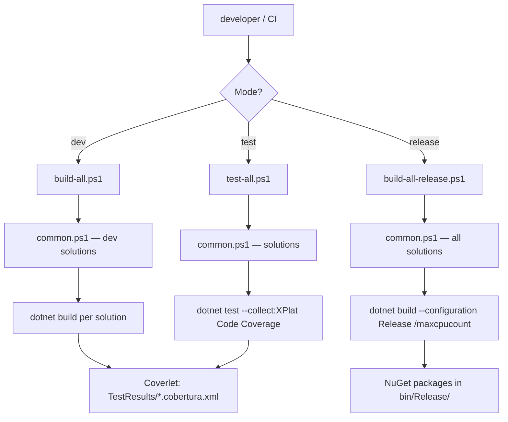

ABP's build pipeline is a collection of PowerShell scripts and MSBuild property files that coordinate building, testing, and publishing across 15+ solutions and hundreds of projects. Understanding this system is essential for contributing to the ABP framework itself or for setting up a monorepo that mirrors ABP's conventions.

---

## Repository layout — build artifacts

```
abp/
├── build/
│   ├── build-all.ps1          # Dev build — dotnet build all solutions
│   ├── build-all-release.ps1  # Release build — --configuration Release
│   ├── common.ps1             # Shared solution list + path helpers
│   └── test-all.ps1           # Run all tests with Coverlet coverage
├── common.props               # Version, package metadata, .abppkg items
├── Directory.Build.props      # IsTestProject detection, Coverlet injection
├── Directory.Packages.props   # Centralized package version management
└── NuGet.Config               # Feed configuration
```

---

## `build/common.ps1` — solution list

`common.ps1` is dot-sourced by every other build script. It defines the ordered list of solutions to build.

```powershell title="build/common.ps1"
$rootFolder = (Get-Item -Path "./" -Verbose).FullName

# Core development solutions (always included)
$solutionPaths = @(
    "../framework",
    "../modules/basic-theme",
    "../modules/users",
    "../modules/permission-management",
    "../modules/setting-management",
    "../modules/feature-management",
    "../modules/identity",
    "../modules/identityserver",
    "../modules/openiddict",
    "../modules/tenant-management",
    "../modules/audit-logging",
    "../modules/background-jobs",
    "../modules/account",
    "../modules/cms-kit",
    "../modules/blob-storing-database"
)

# Full build adds templates and additional modules
if ($full -eq "-f") {
    $solutionPaths += (
        "../modules/client-simulation",
        "../modules/virtual-file-explorer",
        "../modules/docs",
        "../modules/blogging",
        "../templates/module/aspnet-core",
        "../templates/app/aspnet-core",
        "../templates/console",
        "../templates/app-nolayers/aspnet-core"
    )
    if ($env:OS -eq "Windows_NT") {
        $solutionPaths += "../templates/wpf"
    }
}
```

---

## `build-all.ps1` — development build

```powershell title="build/build-all.ps1"
$full = $args[0]

. ".\common.ps1" $full

foreach ($solutionPath in $solutionPaths) {
    $solutionAbsPath = (Join-Path $rootFolder $solutionPath)
    Set-Location $solutionAbsPath
    dotnet build
    if (-Not $?) {
        Write-Host ("Build failed for the solution: " + $solutionPath)
        Set-Location $rootFolder
        exit $LASTEXITCODE
    }
}
```

Usage:

```powershell
# Development mode (core solutions only)
.\build-all.ps1

# Full build (all solutions including templates)
.\build-all.ps1 -f
```

---

## `build-all-release.ps1` — release build

```powershell title="build/build-all-release.ps1"
. ".\common.ps1" -f    # Always forces full solution list

foreach ($solutionPath in $solutionPaths) {
    $solutionAbsPath = (Join-Path $rootFolder $solutionPath)
    Set-Location $solutionAbsPath
    dotnet build --configuration Release -- /maxcpucount
    if (-Not $?) { exit $LASTEXITCODE }
}
```

Release builds always run the full solution list and enable parallel compilation (`/maxcpucount`).

---

## `test-all.ps1` — test runner with Coverlet

```powershell title="build/test-all.ps1"
. ".\common.ps1" $full

foreach ($solutionPath in $solutionPaths) {
    $solutionAbsPath = (Join-Path $rootFolder $solutionPath)
    Set-Location $solutionAbsPath
    # XPlat Code Coverage collector → Coverlet output per project
    dotnet test --no-build --no-restore --collect:"XPlat Code Coverage"
    if (-Not $?) {
        Write-Host ("Test failed for the solution: " + $solutionPath)
        exit $LASTEXITCODE
    }
}
```

`--collect:"XPlat Code Coverage"` invokes the Coverlet data collector. Coverage output is written to `TestResults/` in each test project as `coverage.cobertura.xml`.

---

## `common.props` — global MSBuild properties

Every `.csproj` in the ABP framework imports `common.props` via `Directory.Build.props` or explicit `Import`. It centralizes:

```xml title="common.props"
<Project>
  <PropertyGroup>
    <LangVersion>latest</LangVersion>

    <!-- Current ABP version — bumped for each release -->
    <Version>10.6.0-preview</Version>

    <!-- LeptonX commercial theme version — bumped separately -->
    <LeptonXVersion>5.6.0-preview</LeptonXVersion>

    <NoWarn>$(NoWarn);CS1591;CS0436</NoWarn>

    <!-- NuGet package metadata -->
    <PackageIconUrl>https://abp.io/assets/abp_nupkg.png</PackageIconUrl>
    <PackageProjectUrl>https://abp.io/</PackageProjectUrl>
    <PackageLicenseExpression>LGPL-3.0-only</PackageLicenseExpression>
    <RepositoryType>git</RepositoryType>
    <RepositoryUrl>https://github.com/abpframework/abp/</RepositoryUrl>
    <PackageReadmeFile>NuGet.md</PackageReadmeFile>
    <PackageTags>aspnetcore boilerplate framework web best-practices angular maui blazor mvc csharp webapp</PackageTags>

    <!-- PDB files embedded in nupkg for source-link debugging -->
    <AllowedOutputExtensionsInPackageBuildOutputFolder>
      $(AllowedOutputExtensionsInPackageBuildOutputFolder);.pdb
    </AllowedOutputExtensionsInPackageBuildOutputFolder>
  </PropertyGroup>

  <!-- Source Link (GitHub) for all packages -->
  <ItemGroup>
    <PackageReference Include="Microsoft.SourceLink.GitHub">
      <PrivateAssets>all</PrivateAssets>
      <IncludeAssets>runtime; build; native; contentfiles; analyzers</IncludeAssets>
    </PackageReference>
  </ItemGroup>
</Project>
```

---

## `Directory.Build.props` — test project detection

```xml title="Directory.Build.props"
<Project>
  <PropertyGroup>
    <!-- A project is a test project if its path contains 'test'
         AND its name ends with '.Tests' or '.TestBase' -->
    <IsTestProject Condition="
      $(MSBuildProjectFullPath.Contains('test')) and
      ($(MSBuildProjectName.EndsWith('.Tests')) or
       $(MSBuildProjectName.EndsWith('.TestBase')))
    ">true</IsTestProject>
  </PropertyGroup>

  <!-- Auto-inject Coverlet into all test projects -->
  <ItemGroup>
    <PackageReference
      Condition="'$(IsTestProject)' == 'true'"
      Include="coverlet.collector">
      <!-- Pin to 6.0.4 in templates (where version is strict) -->
      <Version Condition="$(MSBuildProjectFullPath.Contains('templates'))">6.0.4</Version>
      <PrivateAssets>all</PrivateAssets>
      <IncludeAssets>runtime; build; native; contentfiles; analyzers</IncludeAssets>
    </PackageReference>
  </ItemGroup>
</Project>
```

This means any project matching the naming convention automatically gets Coverlet without explicitly referencing it in its `.csproj`.

---

## `Directory.Packages.props` — centralized package management

The root `Directory.Packages.props` currently opts **out** of Centralized Package Management (CPM):

```xml title="Directory.Packages.props (root — applies to templates)"
<Project>
  <PropertyGroup>
    <ManagePackageVersionsCentrally>false</ManagePackageVersionsCentrally>
  </PropertyGroup>
</Project>
```

Individual solutions within `framework/` and `modules/` manage their own package versions via `PackageReference` version attributes. CPM (`ManagePackageVersionsCentrally=true`) is used selectively within sub-solutions that need it.

---

## `NuGet.Config` — feed configuration

```xml title="NuGet.Config"
<?xml version="1.0" encoding="utf-8"?>
<configuration>
    <packageSources>
        <add key="nuget.org" value="https://api.nuget.org/v3/index.json" />
    </packageSources>
</configuration>
```

Only `nuget.org` is configured in the open-source repo. Commercial projects add the ABP commercial NuGet feed (`https://nuget.abp.io/packages/`) in their own `NuGet.Config`.

---

## `.abppkg` — module package manifests

Every non-web ABP package includes a `.abppkg` JSON manifest file:

```json title="Example: Volo.Abp.AI.abppkg"
{
  "role": "lib.framework"
}
```

Common role values:

| Role | Meaning |
|---|---|
| `lib.framework` | Core framework library |
| `lib.module` | Feature module |
| `app` | Host / startup project |
| `module` | Reusable module package |

These manifests are embedded into NuGet packages via `common.props`:

```xml
<ItemGroup>
  <None Remove="*.abppkg" />
  <Content Include="*.abppkg">
    <Pack>true</Pack>
    <PackagePath>content\</PackagePath>
  </Content>
</ItemGroup>
```

---

## `.abppkg.analyze.json` — analysis metadata

A companion file that provides additional analysis hints to ABP tooling:

```json title="Example: Volo.Abp.ApiVersioning.Abstractions.abppkg.analyze.json"
{
  "role": "lib.framework"
}
```

These files are also packed into NuGet packages (only for non-web/non-Razor projects):

```xml
<ItemGroup Condition="'$(UsingMicrosoftNETSdkWeb)' != 'true' AND '$(UsingMicrosoftNETSdkRazor)' != 'true'">
  <None Remove="*.abppkg.analyze.json" />
  <Content Include="*.abppkg.analyze.json">
    <Pack>true</Pack>
    <PackagePath>content\</PackagePath>
  </Content>
</ItemGroup>
```

---

## FodyWeavers — IL weaving

Several ABP packages use [Fody](https://github.com/Fody/Fody) for post-compilation IL weaving. The configuration is in `FodyWeavers.xml` per project:

```xml title="FodyWeavers.xml — example"
<Weavers xmlns:xsi="http://www.w3.org/2001/XMLSchema-instance"
         xsi:noNamespaceSchemaLocation="FodyWeavers.xsd">
  <!-- Automatically set ConfigureAwait(false) on all awaits -->
  <ConfigureAwait ContinueOnCapturedContext="false" />
</Weavers>
```

The `ConfigureAwait` weaver is the most common usage — it eliminates the need to write `.ConfigureAwait(false)` on every `await` in library code, which is important for avoiding deadlocks when ABP is consumed in synchronous ASP.NET contexts.

---

## Tools directory

```
tools/
├── github-changelog-generator/   # Release note automation
├── localization-key-synchronizer/ # Sync localization keys across resources
├── nuget/                         # NuGet publishing helpers
└── smtp-prober-email-sender.exe   # SMTP smoke test utility
```

---

## Build pipeline overview



---

## Related pages

- [Configuration](./configuration) — `common.props` version propagation
- [Startup Templates](./startup-templates) — template inclusion in full build
- [ABP CLI](./abp-cli) — `abp build` command wrapping this system
