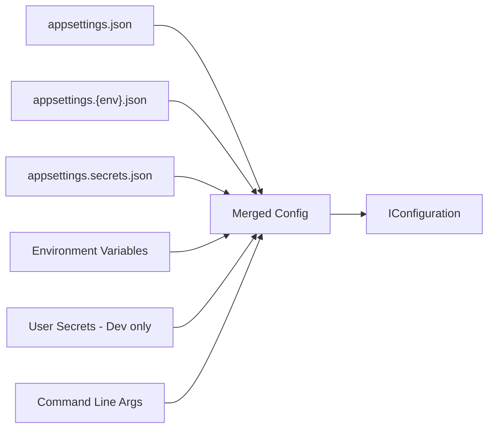

ABP builds directly on `Microsoft.Extensions.Configuration` and `Microsoft.Extensions.Options` without replacing them. The framework adds thin helpers (`ConfigurationHelper`, `AbpConfigurationBuilderOptions`, `AbpConfigurationExtensions`) to standardize how configuration is bootstrapped, and establishes conventions for how modules expose their `IOptions<T>` types to consuming applications.

---

## Configuration bootstrap — `ConfigurationHelper`

`ConfigurationHelper.BuildConfiguration()` is the canonical way to construct an `IConfigurationRoot` before the ABP host is fully initialized — typically in `Program.cs` or `DbMigrator` startup.

```csharp title="ConfigurationHelper.cs"
public static IConfigurationRoot BuildConfiguration(
    AbpConfigurationBuilderOptions? options = null,
    Action<IConfigurationBuilder>? builderAction = null)
{
    options ??= new AbpConfigurationBuilderOptions();

    if (options.BasePath.IsNullOrEmpty())
        options.BasePath = Directory.GetCurrentDirectory();

    var builder = new ConfigurationBuilder()
        .SetBasePath(options.BasePath!)
        // appsettings.json
        .AddJsonFile(options.FileName + ".json",
            optional: options.Optional,
            reloadOnChange: options.ReloadOnChange)
        // appsettings.secrets.json (always optional)
        .AddJsonFile(options.FileName + ".secrets.json",
            optional: true,
            reloadOnChange: options.ReloadOnChange);

    // appsettings.{Environment}.json
    if (!options.EnvironmentName.IsNullOrEmpty())
        builder = builder.AddJsonFile(
            $"{options.FileName}.{options.EnvironmentName}.json",
            optional: true,
            reloadOnChange: options.ReloadOnChange);

    // User secrets (Development only)
    if (options.EnvironmentName == "Development")
    {
        if (options.UserSecretsId != null)
            builder.AddUserSecrets(options.UserSecretsId);
        else if (options.UserSecretsAssembly != null)
            builder.AddUserSecrets(options.UserSecretsAssembly, true);
    }

    builder.AddEnvironmentVariables(options.EnvironmentVariablesPrefix);

    if (options.CommandLineArgs != null)
        builder.AddCommandLine(options.CommandLineArgs);

    builderAction?.Invoke(builder);  // caller-supplied customization

    return builder.Build();
}
```

---

## `AbpConfigurationBuilderOptions`

```csharp title="AbpConfigurationBuilderOptions.cs"
public class AbpConfigurationBuilderOptions
{
    // Assembly whose user-secrets-id attribute is read
    public Assembly? UserSecretsAssembly { get; set; }

    // Explicit user secrets ID (higher priority than UserSecretsAssembly)
    public string? UserSecretsId { get; set; }

    // Base file name — default "appsettings"
    public string FileName { get; set; } = "appsettings";

    // Whether appsettings.json absence is tolerated — default true
    public bool Optional { get; set; } = true;

    // Reload on file change — default true
    public bool ReloadOnChange { get; set; } = true;

    // "Development" | "Staging" | "Production" etc.
    public string? EnvironmentName { get; set; }

    // Override for working directory
    public string? BasePath { get; set; }

    // Env var prefix filter (e.g. "MYAPP_")
    public string? EnvironmentVariablesPrefix { get; set; }

    // Command-line arguments forwarded to AddCommandLine()
    public string[]? CommandLineArgs { get; set; }
}
```

**Typical usage in `DbMigrator`:**

```csharp title="DbMigratorHostedService.cs pattern"
var configuration = ConfigurationHelper.BuildConfiguration(
    new AbpConfigurationBuilderOptions
    {
        UserSecretsAssembly = typeof(DbMigratorModule).Assembly,
        EnvironmentName = Environment.GetEnvironmentVariable("DOTNET_ENVIRONMENT")
    });
```

---

## `AbpConfigurationExtensions`

```csharp title="AbpConfigurationExtensions.cs"
public static class AbpConfigurationExtensions
{
    // Adds appsettings.secrets.json — useful outside of ConfigurationHelper
    public static IConfigurationBuilder AddAppSettingsSecretsJson(
        this IConfigurationBuilder builder,
        bool optional = true,
        bool reloadOnChange = true,
        string path = AbpHostingHostBuilderExtensions.AppSettingsSecretJsonPath)
    {
        return builder.AddJsonFile(path: path, optional: optional,
                                    reloadOnChange: reloadOnChange);
    }
}
```

---

## `IAbpHostEnvironment`

```csharp
public interface IAbpHostEnvironment
{
    string? EnvironmentName { get; set; }
}

public class AbpHostEnvironment : IAbpHostEnvironment
{
    public string? EnvironmentName { get; set; }
}
```

`IAbpHostEnvironment` is registered as a singleton by the ABP framework and mirrors `IHostEnvironment.EnvironmentName`. It allows non-HTTP ABP components (background jobs, domain services) to query the current environment without depending on ASP.NET Core.

---

## Standard `appsettings.json` structure

ABP applications follow a predictable `appsettings.json` schema. Below is a comprehensive example:

```json title="appsettings.json — canonical ABP app"
{
  "ConnectionStrings": {
    "Default": "Server=localhost;Database=MyApp;User Id=sa;Password=pass;",
    // Per-tenant connection string override pattern (handled by ITenantStore)
    "MyApp_tenant-1": "Server=tenant1-db;Database=MyApp_T1;..."
  },

  "App": {
    "SelfUrl": "https://localhost:44300",
    "CorsOrigins": "https://localhost:4200,https://localhost:44301",
    "RedirectAllowedUrls": "https://localhost:4200"
  },

  "AuthServer": {
    "Authority": "https://localhost:44301",
    "RequireHttpsMetadata": false,
    "SwaggerClientId": "MyApp_Swagger"
  },

  "RemoteServices": {
    // Named remote API endpoints consumed via IHttpClientFactory
    "Default": {
      "BaseUrl": "https://localhost:44300/"
    },
    "AbpIdentity": {
      "BaseUrl": "https://localhost:44301/"
    }
  },

  "AbpMultiTenancy": {
    "IsEnabled": true
  },

  "Redis": {
    "Configuration": "127.0.0.1"
  },

  "AbpDistributedCache": {
    "KeyPrefix": "MyApp:",
    "HideErrors": true
  },

  "DistributedLock": {
    "Redis": {
      "Configuration": "127.0.0.1"
    }
  },

  "Settings": {
    // Override setting values at the global level
    "Abp.Localization.DefaultLanguage": "en"
  },

  "StringEncryption": {
    "DefaultPassPhrase": "change-this-secret"
  }
}
```

<Warning>
  Never commit real connection strings, pass-phrases, or API keys. Use `appsettings.secrets.json` (git-ignored), environment variables, or User Secrets for sensitive values.
</Warning>

---

## Multi-environment configuration



Files are loaded in the order shown; later sources override earlier ones. `appsettings.{env}.json` is only loaded when `EnvironmentName` is set.

---

## Module options pattern — `IOptions<T>`

Every ABP module that is configurable exposes a strongly-typed options class. The pattern:

### 1. Define the options class

```csharp title="AbpDistributedCacheOptions.cs — example"
public class AbpDistributedCacheOptions
{
    public bool HideErrors { get; set; } = true;
    public string KeyPrefix { get; set; }
    public DistributedCacheEntryOptions GlobalCacheEntryOptions { get; set; }
    public List<Func<string, DistributedCacheEntryOptions?>> CacheConfigurators { get; set; }
}
```

### 2. Bind from configuration in the module

```csharp
public override void ConfigureServices(ServiceConfigurationContext context)
{
    context.Services.Configure<AbpDistributedCacheOptions>(
        context.Services.GetConfiguration().GetSection("AbpDistributedCache"));
}
```

### 3. Consume via injection

```csharp
public class MyCacheService
{
    private readonly AbpDistributedCacheOptions _options;

    public MyCacheService(IOptions<AbpDistributedCacheOptions> options)
    {
        _options = options.Value;
    }
}
```

---

## `PreConfigure<T>()` vs `Configure<T>()`

ABP's module system adds `PreConfigure<T>()` on top of `Microsoft.Extensions.Options`:

| Method | Phase | Use case |
|---|---|---|
| `PreConfigure<T>(action)` | Before `ConfigureServices` | Modify options that are read **by other modules** during `ConfigureServices` |
| `Configure<T>(action)` | During `ConfigureServices` | Normal options configuration — the standard case |
| `PostConfigure<T>(action)` | After all `ConfigureServices` | Override values set by other modules |

```csharp
// In a module that configures BEFORE others read the options
public override void PreConfigureServices(ServiceConfigurationContext context)
{
    PreConfigure<AbpThemingOptions>(options =>
    {
        options.DefaultThemeName = BasicTheme.Name;
    });
}

// In a module that configures during the normal phase
public override void ConfigureServices(ServiceConfigurationContext context)
{
    Configure<AbpBundlingOptions>(options =>
    {
        options.StyleBundles.Add(StandardBundles.Styles.Global, ...);
    });
}
```

---

## Multi-tenancy configuration

`AbpMultiTenancyOptions` controls the core multi-tenancy behavior:

```csharp
public class AbpMultiTenancyOptions
{
    // Master switch — must be true for tenant resolution to activate
    public bool IsEnabled { get; set; }

    // Hybrid: shared DB with optional per-tenant override
    // Separate: always use a per-tenant DB
    public MultiTenancyDatabaseStyle DatabaseStyle { get; set; }
        = MultiTenancyDatabaseStyle.Hybrid;

    // Isolated: tenant users can't exist in another tenant
    // Shared: users are global
    public TenantUserSharingStrategy UserSharingStrategy { get; set; }
        = TenantUserSharingStrategy.Isolated;
}
```

Per-tenant connection strings are stored in the `ConnectionStrings` section with the pattern `ConnectionStrings:Default:{tenantId}` or resolved via `ITenantStore`.

---

## Environment variables

ABP respects standard .NET environment variable configuration:

| Variable | Effect |
|---|---|
| `DOTNET_ENVIRONMENT` | Sets the environment name (Development/Staging/Production) |
| `ASPNETCORE_ENVIRONMENT` | ASP.NET Core environment (same effect in web apps) |
| `ConnectionStrings__Default` | Override `ConnectionStrings.Default` (`__` = `:` in key path) |
| `App__SelfUrl` | Override any nested key with double-underscore separators |

With `EnvironmentVariablesPrefix = "MYAPP_"`, only variables starting with `MYAPP_` are loaded, stripped of the prefix:

```bash
MYAPP_ConnectionStrings__Default="Server=prod-db;..."
```

---

## Secrets management in Development

```csharp title="Program.cs — wire up user secrets"
var configuration = ConfigurationHelper.BuildConfiguration(
    new AbpConfigurationBuilderOptions
    {
        UserSecretsAssembly = typeof(Program).Assembly,
        EnvironmentName = "Development"
    });
```

```bash
# Set a secret without putting it in source control
dotnet user-secrets set "ConnectionStrings:Default" "Server=dev-db;..."
```

---

## Related pages

- [Build System](./build-system) — `common.props` version variables
- [ABP CLI](./abp-cli) — CLI reads `appsettings.json` for connection strings during `abp new --create-solution-folder`
- [Startup Templates](./startup-templates) — template `appsettings.json` placeholders
