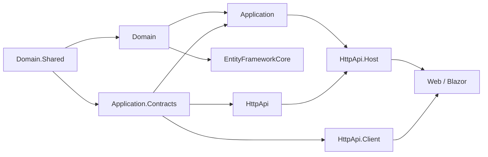

ABP provides a collection of startup templates that the CLI uses when you run `abp new`. Each template is a complete, working codebase that follows ABP conventions for layering, DI, and module system usage. Templates live in `templates/` at the repository root and are packaged into zip archives for distribution.

---

## Template inventory

<CardGroup cols={2}>
  <Card title="app" icon="layer-group">
    Full-stack layered application. Supports Angular, MVC/Razor Pages, and Blazor UIs. Multiple database providers. The standard starting point for new ABP projects.
  </Card>
  <Card title="app-nolayers" icon="square">
    Simplified single-project application. All concerns in one project — ideal for small apps and prototyping.
  </Card>
  <Card title="module" icon="puzzle-piece">
    Reusable ABP module package. Full layer structure: Domain, Application, HttpApi, EntityFrameworkCore, MongoDB, installer, host, and test projects.
  </Card>
  <Card title="console" icon="terminal">
    .NET Console application with ABP's module system and DI pre-configured.
  </Card>
  <Card title="maui" icon="mobile">
    .NET MAUI application with ABP's MAUI Blazor integration.
  </Card>
  <Card title="wpf" icon="window-maximize">
    WPF desktop application with ABP module system (Windows only).
  </Card>
</CardGroup>

---

## `app` template — layered full-stack

### Directory layout

```
templates/app/aspnet-core/
├── src/
│   ├── MyCompanyName.MyProjectName.Domain.Shared/
│   ├── MyCompanyName.MyProjectName.Domain/
│   ├── MyCompanyName.MyProjectName.Application.Contracts/
│   ├── MyCompanyName.MyProjectName.Application/
│   ├── MyCompanyName.MyProjectName.EntityFrameworkCore/
│   ├── MyCompanyName.MyProjectName.MongoDB/
│   ├── MyCompanyName.MyProjectName.HttpApi/
│   ├── MyCompanyName.MyProjectName.HttpApi.Client/
│   ├── MyCompanyName.MyProjectName.HttpApi.Host/
│   ├── MyCompanyName.MyProjectName.HttpApi.HostWithIds/
│   ├── MyCompanyName.MyProjectName.Web/
│   ├── MyCompanyName.MyProjectName.Web.Host/
│   ├── MyCompanyName.MyProjectName.Blazor/
│   ├── MyCompanyName.MyProjectName.Blazor.Client/
│   ├── MyCompanyName.MyProjectName.Blazor.Server/
│   ├── MyCompanyName.MyProjectName.Blazor.Server.Tiered/
│   ├── MyCompanyName.MyProjectName.Blazor.WebApp/
│   ├── MyCompanyName.MyProjectName.Blazor.WebApp.Client/
│   ├── MyCompanyName.MyProjectName.Blazor.WebApp.Tiered/
│   ├── MyCompanyName.MyProjectName.Blazor.WebApp.Tiered.Client/
│   ├── MyCompanyName.MyProjectName.AuthServer/
│   └── MyCompanyName.MyProjectName.DbMigrator/
└── test/
```

### Layer responsibilities

| Layer | Project suffix | Responsibility |
|---|---|---|
| Shared kernel | `.Domain.Shared` | Enums, consts, localization resources, shared DTOs |
| Domain | `.Domain` | Entities, aggregates, domain services, repository interfaces |
| Application Contracts | `.Application.Contracts` | DTOs, service interfaces, permissions |
| Application | `.Application` | Application service implementations |
| Infrastructure | `.EntityFrameworkCore` / `.MongoDB` | EF Core/MongoDB DbContext, migrations, repository implementations |
| HTTP API | `.HttpApi` | Controller wrappers (thin — delegates to Application) |
| HTTP API Client | `.HttpApi.Client` | Auto-generated C# client proxies (+ `generate-proxy.json`) |
| Host | `.HttpApi.Host` | ASP.NET Core startup, OpenIddict auth server integration |
| Web UI | `.Web` | Razor Pages UI |
| Blazor | `.Blazor*` | Blazor Server / WASM / WebApp variants |
| Auth Server | `.AuthServer` | Dedicated OpenIddict authorization server (tiered) |
| DB Migrator | `.DbMigrator` | Console app for running EF Core migrations |



### UI variants

The `abp new` command accepts a `-u` / `--ui` flag:

| Flag value | Generated UI project |
|---|---|
| `angular` | Angular SPA in a separate `/angular` folder |
| `mvc` | `.Web` Razor Pages project |
| `blazor` | `.Blazor` WebAssembly project |
| `blazor-server` | `.Blazor.Server` project |
| `blazor-webapp` | `.Blazor.WebApp` (Blazor Web App with auto render mode) |
| `none` | No UI — API-only |

---

## `app-nolayers` template — simplified

Single-project architecture. All ABP layers (Domain, Application, Infrastructure, HttpApi) are collapsed into one ASP.NET Core project.

```
templates/app-nolayers/aspnet-core/src/
└── MyCompanyName.MyProjectName/   # The single project
```

<Tip>
  Use `app-nolayers` for microservices with a small bounded context, internal tools, or proof-of-concept projects. Migrate to `app` if the codebase grows.
</Tip>

---

## `module` template — reusable module package

The module template produces a distributable ABP module — the same structure used by ABP's own modules (Identity, CMS Kit, etc.).

```
templates/module/aspnet-core/
├── src/
│   ├── MyCompanyName.MyProjectName.Domain.Shared/
│   ├── MyCompanyName.MyProjectName.Domain/
│   ├── MyCompanyName.MyProjectName.Application.Contracts/
│   ├── MyCompanyName.MyProjectName.Application/
│   ├── MyCompanyName.MyProjectName.EntityFrameworkCore/
│   ├── MyCompanyName.MyProjectName.MongoDB/
│   ├── MyCompanyName.MyProjectName.HttpApi/
│   ├── MyCompanyName.MyProjectName.HttpApi.Client/
│   ├── MyCompanyName.MyProjectName.Web/
│   ├── MyCompanyName.MyProjectName.Blazor/
│   ├── MyCompanyName.MyProjectName.Blazor.Server/
│   ├── MyCompanyName.MyProjectName.Blazor.WebAssembly/
│   ├── MyCompanyName.MyProjectName.Blazor.WebAssembly.Bundling/
│   └── MyCompanyName.MyProjectName.Installer/
├── host/                          # Integration test hosts
├── test/
├── database/
├── docker-compose.yml
└── MyCompanyName.MyProjectName.abpmdl  # Module descriptor
```

The `.abpmdl` and `.abpsln` files are ABP-specific solution descriptors used by the CLI and ABP Studio.

### Module installer project

`.Installer` is a special project that packages the module for `abp add-module`. It typically contains:

- EF Core migration scripts
- Data seed contributions
- npm pack references

---

## `console` template

Minimal .NET console app with ABP bootstrapped:

```csharp
// Program.cs pattern in console template
await AbpApplicationFactory
    .CreateAsync<ConsoleModule>(options =>
    {
        options.UseAutofac();
        options.Services.AddLogging(b => b.AddConsole());
    })
    .RunAsync();
```

---

## `maui` template

.NET MAUI Blazor Hybrid application with:
- ABP MAUI Blazor theming integration
- MAUI Blazor bundling contributors
- ABP localization and permission pipes wired for MAUI

---

## `wpf` template

WPF desktop application with ABP DI and module system. Generated only on Windows (skipped in cross-platform CI builds as reflected in `build/common.ps1`).

---

## Template versioning — `Directory.Packages.props`

Each template folder contains a `Directory.Packages.props` (or inherits from the repo root). In templates:

```xml title="templates/Directory.Packages.props"
<Project>
  <PropertyGroup>
    <!-- Disables CPM — templates pin versions in individual .csproj files -->
    <ManagePackageVersionsCentrally>false</ManagePackageVersionsCentrally>
  </PropertyGroup>
</Project>
```

Template `.csproj` files reference ABP packages with version variables that the CLI substitutes at project creation time (replacing `__version__` placeholders with the target ABP version).

Individual template solution files pin `common.props`:

```xml title="templates/app/aspnet-core/common.props"
<Project>
  <PropertyGroup>
    <AbpVersion>10.6.0-preview</AbpVersion>
    <!-- Used by all .csproj files in the template -->
  </PropertyGroup>
</Project>
```

---

## Template packaging — `zip-templates.ps1`

Templates are zipped for distribution by `templates/zip-templates.ps1`:

```powershell title="templates/zip-templates.ps1"
param([string]$version)
$folders = Get-ChildItem -Directory

foreach ($folder in $folders) {
    $zipFile = "./" + $folder.Name + "-" + $version + ".zip"

    if (Test-Path $zipFile) { Remove-Item $zipFile }

    Compress-Archive -Path "$($folder.FullName)\*" -DestinationPath $zipFile
}

Write-Host "All templates have been zipped."
```

The CLI downloads these zips from the ABP template server and caches them locally (see `AbpCliOptions.CacheTemplates`).

---

## Build inclusion

Templates are included in the full (`-f`) build pass. `build/common.ps1` adds template solutions when the `-f` flag is passed:

```powershell title="build/common.ps1 — full build paths"
if ($full -eq "-f") {
    $solutionPaths += (
        "../templates/module/aspnet-core",
        "../templates/app/aspnet-core",
        "../templates/console",
        "../templates/app-nolayers/aspnet-core"
        # + wpf on Windows only
    )
}
```

---

## Related pages

- [ABP CLI — `abp new`](./abp-cli)
- [Build System](./build-system)
- [Configuration](./configuration)
